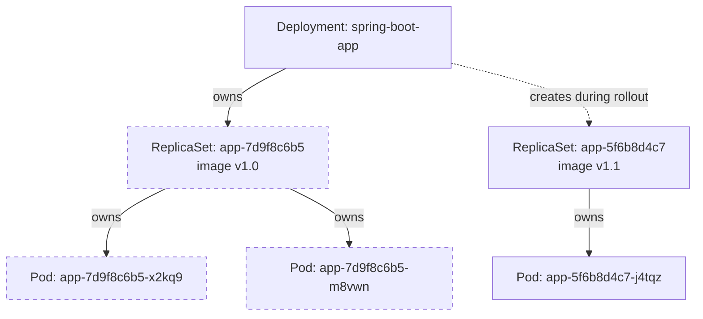

Every Spring Boot app you deploy to Kubernetes ends up running inside a Pod — but you will almost never create a Pod directly. Instead you'll write a Deployment, and Kubernetes builds a small ownership chain underneath it that gives you rolling updates, self-healing, and horizontal scaling for free. Understanding that chain is what lets you read `kubectl get pods` output and know *why* there are three pods named `hello-7d9f8c6b5-x2kq9` instead of one named `hello`.

> **Prerequisites:** [Kubernetes Architecture Fundamentals](/course/beginner/kubernetes-architecture-fundamentals/)

## The Pod: Kubernetes' atomic unit

A **Pod** is the smallest deployable unit in Kubernetes — not a container, a Pod. Most Pods run exactly one container (your Spring Boot app), but a Pod can hold multiple containers that are tightly coupled enough to always be scheduled together, share the same network namespace (same `localhost`), and share volumes.

- **Multi-container Pods**: a common pattern is your app container plus a sidecar — a log shipper, a service mesh proxy, a metrics exporter — that needs to live alongside it for its whole lifetime.
- **Init containers**: containers that run to completion *before* your app container starts, in order. Typical uses: waiting for a dependency to be reachable, running a database migration, populating a shared volume with configuration. If an init container fails, the Pod restarts the init container, not the main app — your app never starts until every init container succeeds.

```bash
# See both regular and init containers for a Pod
kubectl get pod <pod> -o jsonpath='{.spec.initContainers[*].name}{"\n"}{.spec.containers[*].name}'
```

A Pod is meant to be disposable. It gets an IP address when scheduled, but that IP is not stable — if the Pod dies, its replacement gets a *new* IP. This is exactly why you don't point other services at a Pod IP directly (that's what Services, covered next lesson, solve).

## The ownership chain: Deployment → ReplicaSet → Pod

You write a **Deployment**. Kubernetes creates a **ReplicaSet** on your behalf. The ReplicaSet creates **Pods**. Each layer has one job:

| Object | Job |
|---|---|
| **Deployment** | Declares the desired container image, replica count, and update strategy. Manages rollout history — this is what lets you roll back. |
| **ReplicaSet** | Ensures exactly N Pods matching a label selector exist right now. Has no concept of "versions" or rollout history — it's dumb and mechanical on purpose. |
| **Pod** | The actual running container(s). |

Why the extra ReplicaSet layer instead of the Deployment managing Pods directly? Because a **rolling update** is really "create a new ReplicaSet for the new version, scale it up gradually, scale the old ReplicaSet down to zero." The Deployment orchestrates that transition; each ReplicaSet only ever has to manage one version's worth of identical Pods.



Each object in the chain tracks its owner via `ownerReferences`, which is also how `kubectl delete deployment <name>` cascades down and deletes its ReplicaSets and Pods automatically. You can see the chain yourself:

```bash
kubectl get deployment hello -o jsonpath='{.spec.selector.matchLabels}'
kubectl get replicaset -l app=hello
kubectl get pods -l app=hello -o custom-columns='NAME:.metadata.name,OWNER:.metadata.ownerReferences[0].name'
```

## Rolling updates: maxSurge and maxUnavailable

When you change a Deployment's Pod template — most commonly, bump the container image tag — the default `RollingUpdate` strategy replaces old Pods with new ones gradually, not all at once, so your app stays available throughout.

Two fields control the pace:

- **`maxUnavailable`** — the maximum number (or percentage) of desired replicas that can be unavailable during the update. Higher = faster rollout, lower availability margin.
- **`maxSurge`** — the maximum number (or percentage) of *extra* Pods that can be created above the desired replica count during the update. Higher = faster rollout, more transient resource usage.

```yaml
apiVersion: apps/v1
kind: Deployment
metadata:
  name: hello
spec:
  replicas: 3
  strategy:
    type: RollingUpdate
    rollingUpdate:
      maxSurge: 1          # at most 4 pods total during rollout (3 + 1)
      maxUnavailable: 0    # never drop below 3 available — zero-downtime
  selector:
    matchLabels:
      app: hello
  template:
    metadata:
      labels:
        app: hello
    spec:
      containers:
        - name: hello
          image: springio/gs-spring-boot-docker:1.0
          ports:
            - containerPort: 8080
```

With `maxUnavailable: 0` and `maxSurge: 1`, Kubernetes creates one new Pod, waits for it to become **Ready** (this is where readiness probes matter — covered in [Intermediate](/course/intermediate/liveness-readiness-and-startup-probes/)), then kills one old Pod, and repeats until the rollout completes. If your new Pods never become Ready, the rollout stalls safely rather than taking down the old, working version — one of the biggest safety wins Kubernetes gives you over a naive "kill everything, start everything new" deploy script.

```bash
kubectl set image deployment/hello hello=springio/gs-spring-boot-docker:1.1
kubectl rollout status deployment/hello
kubectl rollout history deployment/hello
kubectl rollout undo deployment/hello              # roll back to the previous revision
```

## Lab

1. Write a Deployment manifest for a simple Spring Boot "hello world" image and apply it:
   ```bash
   cat <<'EOF' > deployment.yaml
   apiVersion: apps/v1
   kind: Deployment
   metadata:
     name: hello
     labels:
       app: hello
   spec:
     replicas: 3
     strategy:
       type: RollingUpdate
       rollingUpdate:
         maxSurge: 1
         maxUnavailable: 0
     selector:
       matchLabels:
         app: hello
     template:
       metadata:
         labels:
           app: hello
       spec:
         containers:
           - name: hello
             image: springio/gs-spring-boot-docker:latest
             ports:
               - containerPort: 8080
   EOF
   kubectl apply -f deployment.yaml
   ```
2. Watch the Deployment create its ReplicaSet and Pods in real time:
   ```bash
   kubectl get pods -l app=hello -w
   ```
   Leave this running in one terminal; press Ctrl+C once all 3 Pods show `Running`/`1/1 Ready`.
3. In a second terminal, confirm the ownership chain:
   ```bash
   kubectl get deployment hello
   kubectl get replicaset -l app=hello
   kubectl get pods -l app=hello -o custom-columns='NAME:.metadata.name,OWNER:.metadata.ownerReferences[0].name'
   ```
4. Scale it and watch the ReplicaSet controller react:
   ```bash
   kubectl scale deployment hello --replicas=5
   kubectl get pods -l app=hello -w
   ```
5. Trigger a rolling update by changing the image tag, and watch old and new ReplicaSets coexist briefly:
   ```bash
   kubectl set image deployment/hello hello=springio/gs-spring-boot-docker:latest
   kubectl get replicaset -l app=hello -w
   ```
   In another terminal: `kubectl rollout status deployment/hello`
6. Roll it back, just to see the mechanism works both directions:
   ```bash
   kubectl rollout undo deployment/hello
   kubectl rollout history deployment/hello
   ```

## Checkpoint

- [ ] I can explain why a Pod is disposable and why its IP address is not something to depend on.
- [ ] I can describe the Deployment → ReplicaSet → Pod ownership chain and why the ReplicaSet layer exists (version isolation during rollouts).
- [ ] I can explain the difference between `maxSurge` and `maxUnavailable`, and what `maxUnavailable: 0` guarantees.
- [ ] I ran a rolling update and watched old and new ReplicaSets coexist with `kubectl get replicaset -w`.
- [ ] I can roll back a Deployment with `kubectl rollout undo` and inspect history with `kubectl rollout history`.
