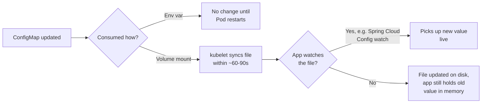

Baking `application-prod.yml` into your container image means rebuilding and re-pushing an image every time a database URL or feature flag changes — exactly the "config coupled to code" problem Spring's own externalized configuration was designed to solve, and Kubernetes gives you the cluster-native equivalent. This lesson covers ConfigMaps and Secrets: how to get configuration into a Pod without it living in your image, and the one gotcha (env var vs. volume mount) that causes more "why isn't my config updating" tickets than anything else at this level.

> **Prerequisites:** [Kubernetes Architecture Fundamentals](/course/beginner/kubernetes-architecture-fundamentals/), [Pods, ReplicaSets, and Deployments](/course/beginner/pods-replicasets-and-deployments/), [Services and Basic Networking](/course/beginner/services-and-basic-networking/)

## Externalizing config from the image

A **ConfigMap** holds non-sensitive key-value configuration data as a Kubernetes object, separate from your container image and separate from your Pod spec. A **Secret** holds the same shape of data but is intended for sensitive values (passwords, API keys, certificates) — structurally almost identical to a ConfigMap, base64-encoded at rest (not encrypted by default — treat it as obfuscated, not secure, unless your cluster has encryption-at-rest configured).

```bash
# Create a ConfigMap from literal key=value pairs
kubectl create configmap app-config \
  --from-literal=SPRING_PROFILES_ACTIVE=kubernetes \
  --from-literal=DB_URL=jdbc:postgresql://postgres-svc:5432/orders

# Create a ConfigMap from a whole application.yml file
kubectl create configmap app-config-file --from-file=application.yml

# Create a Secret the same two ways
kubectl create secret generic db-credentials \
  --from-literal=DB_USERNAME=orders_app \
  --from-literal=DB_PASSWORD='S3cr3t!'
```

```yaml
apiVersion: v1
kind: ConfigMap
metadata:
  name: app-config
data:
  SPRING_PROFILES_ACTIVE: "kubernetes"
  DB_URL: "jdbc:postgresql://postgres-svc:5432/orders"
```

## Two ways to consume config: env vars vs. volume mounts

You can hand a ConfigMap or Secret's data to a Pod in two fundamentally different ways, and the mechanism you pick changes how (and whether) updates propagate.

**As environment variables** — each key becomes an env var in the container. This is the natural fit for Spring Boot, since Spring's relaxed binding maps `SPRING_PROFILES_ACTIVE` and `DB_URL`-style env vars onto configuration properties automatically.

```yaml
apiVersion: apps/v1
kind: Deployment
metadata:
  name: hello
spec:
  template:
    spec:
      containers:
        - name: hello
          image: springio/gs-spring-boot-docker:latest
          envFrom:
            - configMapRef:
                name: app-config
          env:
            - name: DB_PASSWORD
              valueFrom:
                secretKeyRef:
                  name: db-credentials
                  key: DB_PASSWORD
```

**As a mounted volume** — each key becomes a file inside a directory in the container's filesystem, useful when your app expects an actual `application.yml` on disk (e.g., via `spring.config.location`) rather than individual properties.

```yaml
      containers:
        - name: hello
          image: springio/gs-spring-boot-docker:latest
          volumeMounts:
            - name: config-volume
              mountPath: /config
      volumes:
        - name: config-volume
          configMap:
            name: app-config-file
```

## The update-propagation difference — the most misdiagnosed config issue

This is the single detail worth memorizing from this lesson:

> **ConfigMaps/Secrets mounted as volumes auto-update** (the kubelet syncs changes to the mounted files, typically within 60-90 seconds, though your app still needs to notice and reload). **ConfigMaps/Secrets consumed as environment variables do NOT update without a Pod restart** — env vars are injected once, at container start, and never re-read.

If a teammate says "I updated the ConfigMap and the app still shows the old value," the first question is always: is it mounted as a volume or injected as env vars? If it's env vars, that's expected behavior, not a bug — the fix is a rolling restart (`kubectl rollout restart deployment/<name>`), not more debugging.



## Confirming what a Pod actually received

Don't trust what you *think* you deployed — verify what the Pod actually has, every time you're debugging a config issue:

```bash
# Confirm actual environment variables inside the running container
kubectl exec -it <pod> -n <ns> -- env | sort
kubectl exec -it <pod> -n <ns> -- env | grep -i spring

# Verify mounted ConfigMap/Secret content on disk
kubectl exec -it <pod> -n <ns> -- cat /config/application.yml
kubectl get configmap <cm-name> -n <ns> -o yaml
kubectl get secret <secret-name> -n <ns> -o jsonpath='{.data}' | jq 'map_values(@base64d)'

# Detect a stale mounted ConfigMap (check the file's modified time)
kubectl get configmap <cm-name> -n <ns> -o jsonpath='{.metadata.resourceVersion}'
kubectl exec -it <pod> -n <ns> -- stat /config/application.yml

# Diff your deployed manifest against what's actually live (drift detection)
kubectl diff -f deployment.yaml
```

If your organization uses Spring Cloud Config Server or Vault instead of native ConfigMaps/Secrets, the failure signature shows up in application logs rather than in `kubectl`:

```bash
kubectl logs <pod> -n <ns> --previous | grep -iE "Config Server|vault|Fetching config"
curl -s http://<config-server>:8888/<app-name>/<profile>
```

## Lab

1. Create a ConfigMap and a Secret for a sample app config:
   ```bash
   kubectl create configmap app-config \
     --from-literal=SPRING_PROFILES_ACTIVE=kubernetes \
     --from-literal=DB_URL=jdbc:postgresql://postgres-svc:5432/orders
   kubectl create secret generic db-credentials \
     --from-literal=DB_USERNAME=orders_app \
     --from-literal=DB_PASSWORD='ChangeMe123!'
   ```
2. Patch the `hello` Deployment from earlier lessons to consume both as environment variables:
   ```bash
   kubectl patch deployment hello --type=strategic -p '
   spec:
     template:
       spec:
         containers:
         - name: hello
           envFrom:
           - configMapRef:
               name: app-config
           env:
           - name: DB_PASSWORD
             valueFrom:
               secretKeyRef:
                 name: db-credentials
                 key: DB_PASSWORD
   '
   kubectl rollout status deployment/hello
   ```
3. Verify the running Pod actually received the values:
   ```bash
   POD=$(kubectl get pods -l app=hello -o jsonpath='{.items[0].metadata.name}')
   kubectl exec -it "$POD" -- env | grep -E "SPRING_PROFILES_ACTIVE|DB_URL|DB_PASSWORD"
   ```
4. Change the ConfigMap value and observe that the env var does **not** update without a restart:
   ```bash
   kubectl patch configmap app-config --type=merge -p '{"data":{"SPRING_PROFILES_ACTIVE":"production"}}'
   kubectl exec -it "$POD" -- env | grep SPRING_PROFILES_ACTIVE   # still shows "kubernetes"
   ```
5. Now force the propagation with a rolling restart, and confirm the new value shows up:
   ```bash
   kubectl rollout restart deployment/hello
   kubectl rollout status deployment/hello
   NEWPOD=$(kubectl get pods -l app=hello -o jsonpath='{.items[0].metadata.name}')
   kubectl exec -it "$NEWPOD" -- env | grep SPRING_PROFILES_ACTIVE   # now shows "production"
   ```
6. Repeat the exercise but mount the ConfigMap as a volume instead, to see the contrasting auto-update behavior:
   ```bash
   kubectl create configmap app-config-file --from-literal=application.yml='spring:
     profiles:
       active: kubernetes'
   ```
   Add a `volumeMounts`/`volumes` pair pointing at `app-config-file`, apply it, then edit the ConfigMap and `kubectl exec ... -- cat /config/application.yml` again after ~90 seconds without restarting the Pod — the file content changes on its own.

## Checkpoint

- [ ] I can create a ConfigMap and a Secret both from literals and from a file.
- [ ] I can explain the difference between consuming config as env vars vs. as a mounted volume.
- [ ] I know, without looking it up, that env-var-consumed config requires a Pod restart to pick up changes, while volume-mounted config updates automatically (with a delay).
- [ ] I verified actual live Pod environment variables with `kubectl exec ... -- env`, not just what I intended to deploy.
- [ ] I forced a config update to take effect using `kubectl rollout restart deployment/<name>`.
