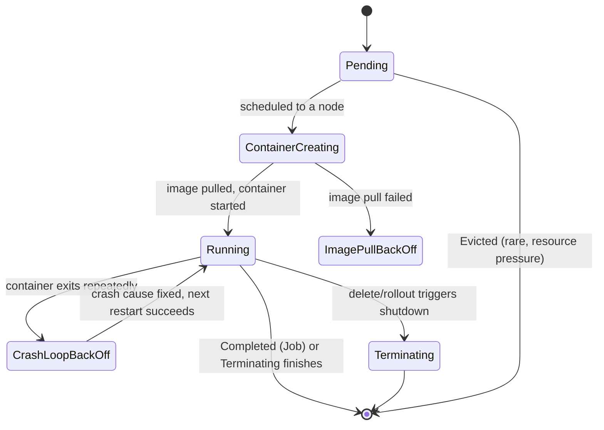
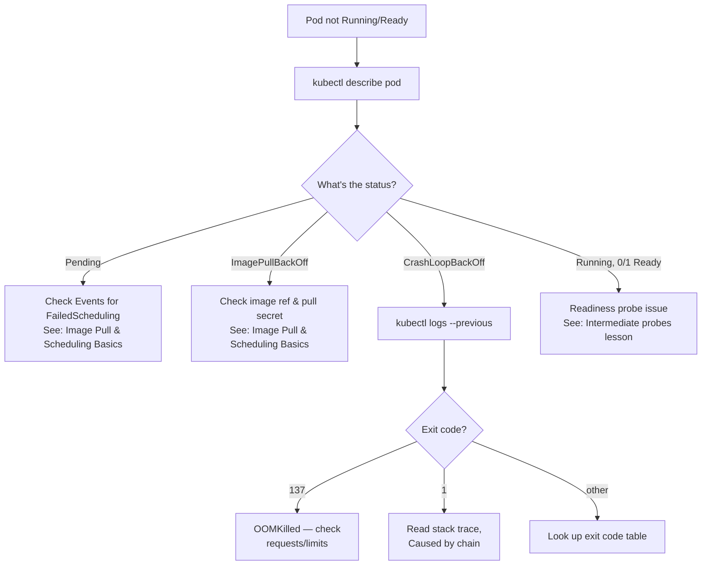

This is the single most important diagnostic skill in this entire course, and it's the one you'll use in every incident from here through Expert level: reading a Pod's status, logs, and events to figure out *why* it isn't healthy. Everything else in Kubernetes troubleshooting — probes, JVM tuning, networking, RBAC — eventually funnels back through the three commands this lesson teaches. Get comfortable here before moving on.

> **Prerequisites:** [Kubernetes Architecture Fundamentals](/course/beginner/kubernetes-architecture-fundamentals/), [Pods, ReplicaSets, and Deployments](/course/beginner/pods-replicasets-and-deployments/), [Services and Basic Networking](/course/beginner/services-and-basic-networking/), [ConfigMaps and Secrets Basics](/course/beginner/configmaps-and-secrets-basics/)

## The first 60 seconds of any investigation

Before drilling into one specific Pod, always establish whether a problem is isolated or cluster-wide — this single distinction changes where you look next. Run this whenever something seems off, regardless of the reported symptom:

```bash
# Cluster reachability & context sanity
kubectl config current-context
kubectl cluster-info
kubectl version --short

# Node health — the #1 root cause category for "everything is broken"
kubectl get nodes -o wide
kubectl top nodes                      # requires metrics-server
kubectl describe nodes | grep -A5 "Conditions:"

# Cluster-wide recent events, newest first
kubectl get events -A --sort-by='.lastTimestamp' | tail -50

# Any pods NOT Running/Completed, across all namespaces
kubectl get pods -A --field-selector=status.phase!=Running,status.phase!=Succeeded

# Namespace-scoped quick health (adjust namespace)
kubectl get all -n <namespace>
kubectl get pods -n <namespace> -o wide --show-labels
```

You're looking for: nodes in `NotReady` or under pressure (`MemoryPressure`, `DiskPressure`), a burst of `Warning` events (`FailedScheduling`, `BackOff`, `Unhealthy`), and whether the affected Pods are isolated to one Deployment/namespace (app-level issue) or spread across the whole cluster (points toward node/network/DNS infrastructure — covered in depth in [Expert](/course/expert/node-and-control-plane-internals/)).

## The status taxonomy

Once you've scoped the problem to specific Pods, `kubectl get pods` shows a status column. Here's what each value actually means and where the root cause usually lives:

| Status | Meaning | Typical root cause |
|---|---|---|
| `Pending` | Not scheduled yet | Insufficient resources, node selector/affinity mismatch, taints, PVC not bound |
| `ContainerCreating` (stuck) | Scheduled, image/volume/CNI setup in progress | Image pull slow/failing, volume mount failure, CNI plugin issue |
| `ImagePullBackOff` / `ErrImagePull` | Can't pull image | Wrong tag, private registry auth, network egress blocked |
| `CrashLoopBackOff` | Container starts and exits repeatedly | App crash on startup, failed dependency, misconfig, OOM |
| `Error` / `Completed` (unexpected) | Container exited | Check the exit code (see below) |
| `Running` but `0/1 Ready` | Container up, readiness probe failing | App slow to start, wrong probe path/port, dependency not ready |
| `Terminating` (stuck) | Won't finish shutdown | Finalizers stuck, PreStop hook hanging, non-graceful SIGTERM handling in the JVM |
| `Evicted` | Node reclaimed resources | Node under memory/disk pressure, Pod exceeded ephemeral storage |
| `Unknown` | kubelet not reporting | Node unreachable/crashed |

`ImagePullBackOff`/`ErrImagePull` and `Pending`-from-scheduling get their own lesson next — [Image Pull and Scheduling Basics](/course/beginner/image-pull-and-scheduling-basics/) — since they're common enough at this level to deserve dedicated walkthroughs.



## The triage trio: describe, logs, events

Three commands answer nearly every "why is this Pod broken" question. Run them in this order.

**`kubectl describe pod`** — always first. Shows the Pod's resource requests, volumes, conditions, container state/last-state, and a chronological Events table at the bottom.

```bash
kubectl describe pod <pod> -n <ns>
```

**`kubectl logs`** — the container's stdout/stderr. For a crashing container, `--previous` is critical: it gets logs from the instance that just died, not the freshly restarted (and likely still-empty) one.

```bash
kubectl logs <pod> -n <ns>
kubectl logs <pod> -n <ns> --previous
kubectl logs <pod> -n <ns> -c <container-name>            # multi-container pods
kubectl logs <pod> -n <ns> --previous -c <container-name>
kubectl logs <pod> -n <ns> --since=10m
kubectl logs <pod> -n <ns> -f --tail=200                   # live tail

# All containers in a pod at once, prefixed by container name
kubectl logs <pod> -n <ns> --all-containers=true --prefix=true

# Init container specific
kubectl get pod <pod> -n <ns> -o jsonpath='{.status.initContainerStatuses}'
kubectl logs <pod> -n <ns> -c <init-container-name>
```

**`kubectl get events`** — the kubelet and controllers narrating what they did, in order, each with a count if it repeated (`x14 over 22m`).

```bash
kubectl get events -n <ns> --field-selector involvedObject.name=<pod> --sort-by='.lastTimestamp'
```

Two more commands round out the trio for deeper inspection:

```bash
# Full pod manifest as actually scheduled — compare against your source YAML/Helm values
kubectl get pod <pod> -n <ns> -o yaml

# Watch a pod transition live while reproducing the issue
kubectl get pod <pod> -n <ns> -w
```

## Reading exit codes: `describe pod` → Last State

When a container has exited, `kubectl describe pod`'s `Last State` block tells you the exit code — the single most useful field for restart diagnosis in all of Kubernetes.

| Exit Code | Meaning | Action |
|---|---|---|
| 0 | Clean exit | Check if it's a Job/CronJob expected to complete, or the app is exiting unexpectedly on a success path |
| 1 | General application error | Check app logs for an uncaught exception |
| 2 | Misuse of shell command | Check container `command`/`args`/entrypoint script |
| 126 | Command not executable | Permissions issue on entrypoint |
| 127 | Command not found | Wrong binary path, broken image build |
| 137 | SIGKILL (128+9) | **OOMKilled** or manual `kill -9` — confirm via the reason field, see below |
| 139 | SIGSEGV (128+11) | Native crash — JNI library, glibc/musl mismatch (Alpine images), corrupted JAR |
| 143 | SIGTERM (128+15) | Graceful shutdown requested — check whether the app handles SIGTERM properly |

```bash
kubectl describe pod <pod> -n <ns> | grep -A5 "Last State"
kubectl get pod <pod> -n <ns> -o jsonpath='{.status.containerStatuses[0].lastState.terminated.reason}'
```

## Restart counts: how much, and where

Before root-causing *why* a container is crashing, first establish *how much* and *where* it's happening — a single flaky Pod, an entire Deployment, or a cluster-wide pattern point to very different causes.

```bash
kubectl get pods -n <ns>
```
The `RESTARTS` column sometimes prints as `5 (2d ago)` — 5 total restarts, most recent one 2 days ago. A high count with an old timestamp is a **resolved/historical** issue; a low count with a recent timestamp is **active**. Don't conflate the two.

```bash
kubectl get pods -n <ns> --sort-by='.status.containerStatuses[0].restartCount'
```
Sorts ascending, so the worst offenders land at the bottom of a scrolled terminal — easy to spot at a glance.

For the specific pod you're investigating, get the full restart picture in one shot:

```bash
kubectl describe pod <pod> -n <ns>
# Look at: Containers > <name> > State, Last State, Restart Count, and the Events table
```

`Last State` is the exit status of the **previous** container instance — `Reason: OOMKilled`, `Reason: Error`, `Reason: Completed`, with an exit code and timestamps. The `Events` table below it is the kubelet's own narration (`Back-off restarting failed container`, `Liveness probe failed`), each with a count and timestamp, telling you restart frequency without a separate query.

```bash
# Just the numeric restart count(s), for scripting
kubectl get pod <pod> -n <ns> -o jsonpath='{.status.containerStatuses[*].restartCount}'

# A clean table: container name / restart count / last termination reason
kubectl get pod <pod> -n <ns> -o jsonpath='{range .status.containerStatuses[*]}{.name}{"\t"}{.restartCount}{"\t"}{.lastState.terminated.reason}{"\n"}{end}'
```

> Checking restarts across *every* replica of a Deployment at once, and trending restarts over time with Prometheus, is genuinely useful but goes beyond single-pod triage — see [Intermediate: Restart Patterns Across Deployments](/course/intermediate/restart-troubleshooting-across-a-deployment/) when you're ready for that.

## OOMKilled: the basics

Exit code 137 with `Reason: OOMKilled` in `Last State` means the kernel's cgroup memory controller killed the container for exceeding its memory limit. At this level, treat it as a resource ceiling problem, not automatically a memory leak — a Java process that runs fine on your laptop can still get OOMKilled in a container simply because its configured memory `limit` is set too low, or because the JVM isn't aware of the container's memory ceiling at all.

```bash
# Confirm OOMKilled explicitly
kubectl describe pod <pod> -n <ns> | grep -A5 "Last State"
kubectl get pod <pod> -n <ns> -o jsonpath='{.status.containerStatuses[0].lastState.terminated.reason}'

# Compare the limit you set against actual usage right before the kill
kubectl describe pod <pod> -n <ns> | grep -A10 Limits
kubectl top pod <pod> -n <ns> --containers
```

The full diagnostic workflow for OOMKilled — checking JVM heap flags against the cgroup limit, native memory tracking, distinguishing a leak from an undersized limit — is covered with resource requests/limits in [Resource Requests and Limits Basics](/course/beginner/resource-requests-and-limits-basics/), and the deep JVM-level analysis (heap dumps, off-heap accounting) lives in [Advanced](/course/advanced/heap-dumps-and-memory-leaks/).

## Putting it together: a triage flow



## Lab

1. Deploy a working baseline so you have a known-good reference point:
   ```bash
   kubectl apply -f deployment.yaml
   kubectl rollout status deployment/hello
   ```
2. Intentionally break it with a wrong image tag, and diagnose using only `describe`/`logs`/`events` — no guessing:
   ```bash
   kubectl set image deployment/hello hello=springio/gs-spring-boot-docker:does-not-exist
   kubectl get pods -l app=hello
   kubectl describe pod <the-new-pod> | grep -A10 Events
   ```
   Confirm the status is `ImagePullBackOff` and identify the exact reason string from the Events table.
3. Fix the image, then break it a different way — a bad env var that causes the app to crash on startup:
   ```bash
   kubectl set image deployment/hello hello=springio/gs-spring-boot-docker:latest
   kubectl set env deployment/hello SPRING_DATASOURCE_URL=jdbc:postgresql://does-not-exist:5432/db
   kubectl get pods -l app=hello -w
   ```
   Once a Pod shows `CrashLoopBackOff`, run:
   ```bash
   kubectl logs <pod> --previous | tail -100
   kubectl describe pod <pod> | grep -A5 "Last State"
   ```
4. Use `--sort-by` and `describe` together to identify which specific replica is restarting and why, in a Deployment with multiple replicas:
   ```bash
   kubectl get pods -l app=hello --sort-by='.status.containerStatuses[0].restartCount'
   kubectl describe pod <highest-restart-pod> | grep -A5 "Last State"
   ```
5. Clean up the broken env var and confirm recovery:
   ```bash
   kubectl set env deployment/hello SPRING_DATASOURCE_URL-
   kubectl rollout status deployment/hello
   ```

## Checkpoint

- [ ] I can run the "first 60 seconds" cluster health block from memory and explain what each command rules in or out.
- [ ] I can list at least six Pod statuses from the taxonomy table and their typical root cause.
- [ ] I used `describe`, `logs --previous`, and `get events` together to diagnose a broken deployment without looking at source code.
- [ ] I can read the `RESTARTS` column correctly, including the `N (Xd ago)` format, and distinguish an active problem from a historical one.
- [ ] I can explain what exit code 137 means and how to confirm `OOMKilled` via `Last State`.
