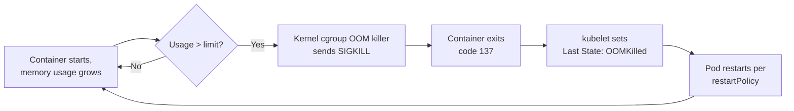

A Spring Boot app with no resource requests or limits set is a landmine: it schedules fine on an empty test cluster and then gets OOM-killed or starves its neighbors the moment it lands on a busy node. This lesson explains why requests and limits exist, how they influence two completely different things (scheduling and OOM behavior), and walks through deliberately causing — and reading — an `OOMKilled` event from a limit that's too low.

> **Prerequisites:** [Kubernetes Architecture Fundamentals](/course/beginner/kubernetes-architecture-fundamentals/), [Pods, ReplicaSets, and Deployments](/course/beginner/pods-replicasets-and-deployments/), [Services and Basic Networking](/course/beginner/services-and-basic-networking/), [ConfigMaps and Secrets Basics](/course/beginner/configmaps-and-secrets-basics/), [Reading Pod Status and Logs](/course/beginner/reading-pod-status-and-logs/)

## Why requests and limits exist

Kubernetes tracks two separate numbers per container, for both CPU and memory:

- **Requests** — what the container is guaranteed to get, and what the **scheduler** uses to decide which node has room for this Pod. The scheduler sums up all requests already placed on a node and only schedules a new Pod if the node has enough unclaimed capacity left. Requests never throttle or kill anything directly — they're a scheduling-time reservation.
- **Limits** — the hard ceiling a container is not allowed to exceed at runtime, enforced by the kernel via cgroups. Exceed the **memory** limit and the kernel kills the process (`OOMKilled`). Exceed the **CPU** limit and the kernel throttles it (slows it down) rather than killing it.

```yaml
resources:
  requests:
    memory: "512Mi"
    cpu: "250m"
  limits:
    memory: "512Mi"
    cpu: "1000m"
```

Without requests set at all, the scheduler treats a Pod as needing essentially nothing, and it can land on a node that's already fully committed — leading to unpredictable evictions and CPU starvation once real traffic hits. Without limits set, one misbehaving Pod (a slow memory leak, a runaway thread) can consume an entire node's memory and take down every other Pod scheduled there. Setting both is not optional for anything beyond local experimentation.

## How this plays out for a Spring Boot container specifically

The JVM adds a wrinkle that a generic "just set limits" explanation misses: the JVM's own heap sizing has to fit *inside* whatever memory limit you give the container, with room to spare for everything that isn't heap.

- If `-Xmx` (or the JVM's container-aware auto-sizing, `-XX:MaxRAMPercentage`, on modern JVMs) is set higher than the container's memory limit, or the JVM is old enough not to respect cgroup limits at all, the JVM will happily try to grow past the ceiling — and the kernel kills the container long before you'd see a `java.lang.OutOfMemoryError` in application logs.
- Even with heap correctly sized, off-heap memory — thread stacks, metaspace, direct buffers used by Netty/Kafka clients, JIT-compiled code cache, native libraries — all counts against the same container memory limit. A limit set to "just enough for heap" with no headroom for these will get killed even though heap usage alone looks fine.

This is why the practical guidance is: set the memory **limit** with real headroom above your expected JVM heap + off-heap usage, not the bare minimum you measured once in a quiet environment.

## Watching OOMKilled happen from a limit that's too low



```bash
# Deploy with no limits at all first, and confirm the scheduler placed it fine
kubectl describe pod <pod> -n <ns> | grep -A10 Limits

# Now add a memory limit that's deliberately too low and reapply
kubectl set resources deployment/hello -c=hello --limits=memory=32Mi

# Watch it get killed
kubectl get pods -l app=hello -w

# Confirm the reason
kubectl describe pod <pod> -n <ns> | grep -A5 "Last State"
kubectl get pod <pod> -n <ns> -o jsonpath='{.status.containerStatuses[0].lastState.terminated.reason}'
```

Once you've confirmed `OOMKilled`, the same commands from the previous lesson apply to size things correctly:

```bash
# Requests/limits vs actual usage right now
kubectl describe pod <pod> -n <ns> | grep -A10 Limits
kubectl top pod <pod> -n <ns> --containers
```

Raise the limit gradually — using `kubectl top pod --containers` to see steady-state usage under load — until the container stops getting killed, then add roughly 25-50% headroom above that observed steady state for burst tolerance. Deep JVM-level diagnosis (`jcmd VM.native_memory`, comparing `-Xmx` against the cgroup value seen from inside the container, capturing a heap dump before the next kill) is covered in [Intermediate: OOMKilled Deep Dive and Heap Dumps](/course/advanced/heap-dumps-and-memory-leaks/) — this lesson is deliberately scoped to recognizing and reproducing the basic failure, not full root-causing.

## A note on CPU limits (preview of a later gotcha)

Unlike memory, an undersized **CPU** limit doesn't kill your Pod — it throttles it, which shows up as latency spikes and sluggishness rather than crashes, and is easy to misdiagnose as a GC problem. That deeper investigation (`cpu.stat`, `nr_throttled`) belongs in [GC Tuning and CPU Throttling](/course/advanced/gc-tuning-and-cpu-throttling/) once you're comfortable with JVM GC behavior; for now, just know that CPU limits and memory limits fail in very different, non-interchangeable ways.

## Lab

1. Deploy `hello` with no resource requests or limits at all, and confirm it schedules and runs fine:
   ```bash
   kubectl set resources deployment/hello -c=hello --requests= --limits=
   kubectl get pods -l app=hello
   kubectl describe pod <pod> | grep -A5 Limits    # should show none set
   ```
2. Add a realistic request and limit, and redeploy:
   ```bash
   kubectl set resources deployment/hello -c=hello --requests=cpu=250m,memory=256Mi --limits=cpu=500m,memory=256Mi
   kubectl rollout status deployment/hello
   kubectl describe pod <pod> | grep -A10 Limits
   ```
3. Now deliberately set the memory limit far too low and watch the container get OOMKilled:
   ```bash
   kubectl set resources deployment/hello -c=hello --limits=memory=20Mi
   kubectl get pods -l app=hello -w
   ```
4. Confirm the failure reason with the diagnostic commands:
   ```bash
   kubectl describe pod <pod> | grep -A5 "Last State"
   kubectl get pod <pod> -o jsonpath='{.status.containerStatuses[0].lastState.terminated.reason}'
   ```
5. Fix it by raising the limit back to a sane value, and confirm the crash loop stops:
   ```bash
   kubectl set resources deployment/hello -c=hello --limits=memory=256Mi
   kubectl rollout status deployment/hello
   kubectl get pods -l app=hello -w
   ```
6. Compare actual usage to your final requests/limits to sanity-check headroom:
   ```bash
   kubectl top pod -l app=hello --containers
   ```

## Checkpoint

- [ ] I can explain the difference between what requests do (scheduling) and what limits do (runtime enforcement).
- [ ] I can explain why an undersized memory limit kills a container (`OOMKilled`) while an undersized CPU limit only throttles it.
- [ ] I understand why JVM heap sizing needs headroom below the container's memory limit, not equal to it.
- [ ] I deliberately caused an `OOMKilled` event with a too-low memory limit and confirmed the reason via `describe pod` and `Last State`.
- [ ] I used `kubectl top pod --containers` to compare actual usage against configured requests/limits.
