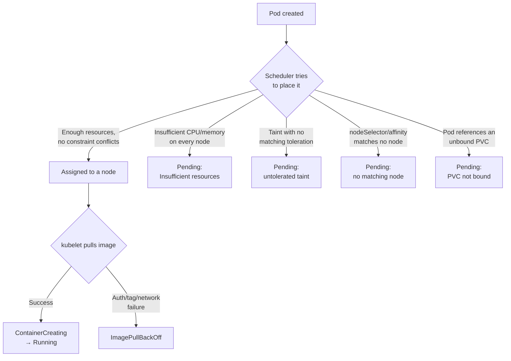

`ImagePullBackOff` and a Pod stuck in `Pending` are the two failures nearly every developer hits in their very first week of deploying to Kubernetes — usually from a typo'd image tag or a private registry credential that didn't make it into the cluster. Neither is a JVM problem, a networking problem, or a code problem; they happen before your Spring Boot application ever starts. This lesson gives you the specific commands to diagnose both quickly instead of guessing.

> **Prerequisites:** [Kubernetes Architecture Fundamentals](/course/beginner/kubernetes-architecture-fundamentals/), [Pods, ReplicaSets, and Deployments](/course/beginner/pods-replicasets-and-deployments/), [Services and Basic Networking](/course/beginner/services-and-basic-networking/), [ConfigMaps and Secrets Basics](/course/beginner/configmaps-and-secrets-basics/), [Reading Pod Status and Logs](/course/beginner/reading-pod-status-and-logs/), [Resource Requests and Limits Basics](/course/beginner/resource-requests-and-limits-basics/)

## ImagePullBackOff / ErrImagePull

This status means the kubelet on the assigned node tried to pull the container image and failed. `ErrImagePull` is the immediate failure; `ImagePullBackOff` is Kubernetes backing off and retrying with increasing delay after repeated failures — same underlying problem, different point in the retry cycle.

Common causes, roughly in order of frequency:
- Wrong image name or tag (typo, or a tag that was never pushed)
- Private registry requiring authentication, with no (or the wrong) pull secret attached to the Pod/ServiceAccount
- Network egress to the registry blocked (firewall, proxy, air-gapped cluster)

```bash
kubectl describe pod <pod> -n <ns> | grep -A10 Events

# Verify the exact image reference and any pull secrets attached
kubectl get pod <pod> -n <ns> -o jsonpath='{.spec.containers[*].image}'
kubectl get pod <pod> -n <ns> -o jsonpath='{.spec.imagePullSecrets}'

# Test registry auth manually from a throwaway debug pod
kubectl run debug-pull --rm -it --image=<same-image> --restart=Never -n <ns> -- sh

# Inspect the pull secret's actual content (base64-encoded docker config)
kubectl get secret <pull-secret> -n <ns> -o jsonpath='{.data.\.dockerconfigjson}' | base64 -d
```

The `Events` output from `describe pod` will spell out the exact failure — `manifest unknown` (bad tag), `unauthorized`/`pull access denied` (auth), or a raw connection timeout (network/egress) — so always read that message literally before assuming which of the three it is.

## Pending pods (scheduling failures)

`Pending` means the scheduler hasn't been able to assign the Pod to any node yet. This is a *scheduling* decision problem, not a runtime problem — the container hasn't started because it has nowhere to start.

```bash
kubectl describe pod <pod> -n <ns>     # look for a "FailedScheduling" event with a specific reason

# Check resource pressure across nodes — most common cause
kubectl describe nodes | grep -A5 "Allocated resources"

# Check taints vs the pod's tolerations
kubectl get nodes -o json | jq '.items[].spec.taints'
kubectl get pod <pod> -n <ns> -o jsonpath='{.spec.tolerations}'

# Check node affinity / selector match
kubectl get pod <pod> -n <ns> -o jsonpath='{.spec.nodeSelector}'
kubectl get pod <pod> -n <ns> -o jsonpath='{.spec.affinity}'
kubectl get nodes --show-labels

# A PVC that hasn't bound yet also blocks scheduling
kubectl get pvc -n <ns>
```

The `FailedScheduling` event message is specific and worth reading carefully — it typically says exactly which constraint failed, e.g. `0/3 nodes are available: 3 Insufficient memory` (every node's unclaimed capacity is smaller than this Pod's requests) or `0/3 nodes are available: 3 node(s) had taint {dedicated: gpu}, that the pod didn't tolerate` (a taint/toleration mismatch).



Taints/tolerations and node affinity are typically cluster-operator concerns rather than something you'll configure often as an application developer, but recognizing them in a `FailedScheduling` message is essential so you don't waste time debugging your Deployment YAML when the actual fix is a cluster-level toleration or a capacity problem someone else needs to address.

## Lab

1. Trigger `ImagePullBackOff` deliberately with a nonexistent tag, and read the exact Events message:
   ```bash
   kubectl set image deployment/hello hello=springio/gs-spring-boot-docker:this-tag-does-not-exist
   kubectl get pods -l app=hello
   kubectl describe pod <the-pending-pod> | grep -A10 Events
   ```
2. Confirm the image reference kubectl actually sent, then fix it:
   ```bash
   kubectl get pod <pod> -o jsonpath='{.spec.containers[*].image}'
   kubectl set image deployment/hello hello=springio/gs-spring-boot-docker:latest
   kubectl rollout status deployment/hello
   ```
3. Simulate a private-registry auth failure by pointing at a private-looking image with no pull secret configured, and observe the `ErrImagePull` reason mentions authentication rather than a missing tag:
   ```bash
   kubectl set image deployment/hello hello=my-private-registry.example.com/hello:1.0
   kubectl describe pod <pod> | grep -A10 Events
   kubectl set image deployment/hello hello=springio/gs-spring-boot-docker:latest   # revert
   ```
4. Trigger a scheduling failure by requesting more memory than any node has available:
   ```bash
   kubectl set resources deployment/hello -c=hello --requests=memory=500Gi
   kubectl get pods -l app=hello
   kubectl describe pod <the-pending-pod> | grep -A5 Events
   ```
   You should see a `FailedScheduling` event citing `Insufficient memory`.
5. Fix the resource request back to something reasonable and confirm scheduling succeeds:
   ```bash
   kubectl set resources deployment/hello -c=hello --requests=cpu=250m,memory=256Mi --limits=cpu=500m,memory=256Mi
   kubectl get pods -l app=hello -w
   ```
6. Inspect your node's taints and labels just to see what's normally there:
   ```bash
   kubectl get nodes -o json | jq '.items[].spec.taints'
   kubectl get nodes --show-labels
   ```

## Checkpoint

- [ ] I can distinguish `ImagePullBackOff`/`ErrImagePull` (image can't be fetched) from `Pending` (can't be scheduled at all) by what phase of Pod startup they occur in.
- [ ] I can find the exact image reference and any pull secrets a Pod was configured with via `kubectl get pod -o jsonpath`.
- [ ] I triggered and read a `FailedScheduling` event caused by insufficient resources.
- [ ] I can explain, at a high level, what taints/tolerations and node affinity/selectors do to scheduling decisions.
- [ ] I know that a `Pending` PVC can also block a Pod from scheduling, even if compute resources are fine.
