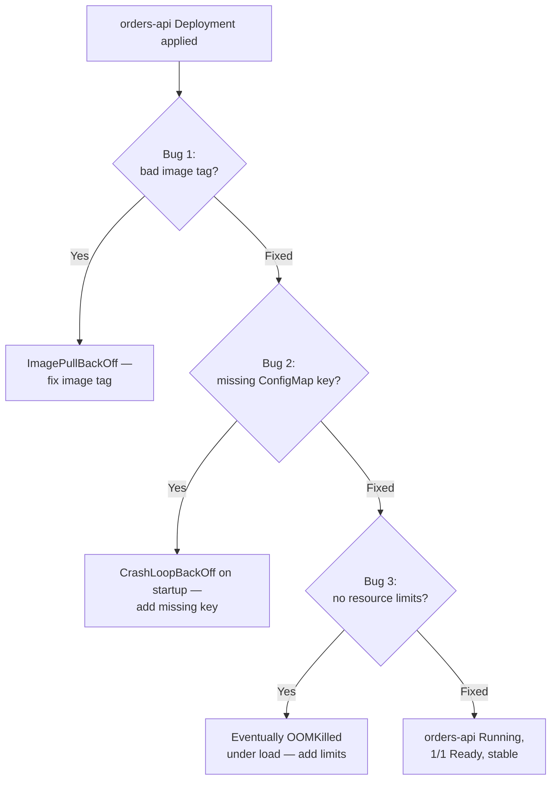

This is the Level 1 capstone: a single broken Spring Boot Deployment with three independent, stacked bugs, and your job is to find and fix all three using only `kubectl` diagnostics — no reading or changing application source code. Every technique you need was covered in the previous seven lessons; this lesson is where they come together under something closer to real incident conditions, where you don't know in advance what's wrong or how many things are broken.

> **Prerequisites:** All previous Beginner lessons — [Kubernetes Architecture Fundamentals](/course/beginner/kubernetes-architecture-fundamentals/) through [Image Pull and Scheduling Basics](/course/beginner/image-pull-and-scheduling-basics/). If any of the commands below feel unfamiliar, go back to the relevant lesson before continuing.

## The scenario

You've inherited a Deployment for a Spring Boot service called `orders-api`. It was working. Someone made a change before going on vacation, and now it isn't. You have no context beyond what `kubectl` can tell you. There are exactly three bugs, and they are independent of each other — fixing one won't reveal or resolve the others, and you can find them in any order.



## Setup: build the broken environment

Run this yourself to create the exact scenario. (If you're an instructor or pairing with someone, have one person run this setup and have the other diagnose blind — that's closer to a real incident.)

```bash
kubectl create namespace capstone
kubectl config set-context --current --namespace=capstone

# The ConfigMap the app depends on — deliberately missing a key it needs
kubectl create configmap orders-config \
  --from-literal=SPRING_PROFILES_ACTIVE=kubernetes
  # NOTE: intentionally missing DB_URL, which the app requires to start

cat <<'EOF' > orders-api-deployment.yaml
apiVersion: apps/v1
kind: Deployment
metadata:
  name: orders-api
  labels:
    app: orders-api
spec:
  replicas: 2
  selector:
    matchLabels:
      app: orders-api
  template:
    metadata:
      labels:
        app: orders-api
    spec:
      containers:
        - name: orders-api
          image: springio/gs-spring-boot-docker:1.0-does-not-exist
          ports:
            - containerPort: 8080
          envFrom:
            - configMapRef:
                name: orders-config
          env:
            - name: DB_URL
              valueFrom:
                configMapKeyRef:
                  name: orders-config
                  key: DB_URL
          # NOTE: no resources block at all — intentional
EOF

kubectl apply -f orders-api-deployment.yaml
```

### The three intentional bugs

1. **Bad image tag** — `springio/gs-spring-boot-docker:1.0-does-not-exist` doesn't exist in the registry, so the Pod never gets past `ImagePullBackOff`.
2. **Missing ConfigMap key** — the Pod spec references `DB_URL` from `orders-config`, but the ConfigMap was created without that key, so once the image is fixed, the Pod will fail to start (`CreateContainerConfigError`, since Kubernetes can't resolve the key reference at all — this fails even before the app's own logs run).
3. **No resource limits** — the Deployment has no `resources` block, so the Pod schedules and (once the first two bugs are fixed) runs, but is vulnerable to being OOMKilled or starving neighbors under any real memory pressure, and gives you no signal that it's under-provisioned until it's too late.

You are not told which order these were introduced or which one `kubectl get pods` will show first — that's realistic. Diagnose them the way the status taxonomy naturally surfaces them.

## Expected troubleshooting flow

This is the flow a methodical diagnosis follows — don't peek until you've tried it yourself, but use this to check your approach afterward.

### Step 1 — get the lay of the land

```bash
kubectl get pods -l app=orders-api
kubectl get all -n capstone
```

You should see Pods stuck, likely in `ImagePullBackOff` — that's bug #1, and it's the one that surfaces first since it happens before the container ever starts.

### Step 2 — diagnose and fix bug #1 (bad image)

```bash
kubectl describe pod -l app=orders-api | grep -A10 Events
kubectl get pod -l app=orders-api -o jsonpath='{.items[0].spec.containers[0].image}'
```

The Events output should show something like `Failed to pull image ... manifest unknown`. Fix it:

```bash
kubectl set image deployment/orders-api orders-api=springio/gs-spring-boot-docker:latest
kubectl get pods -l app=orders-api -w
```

### Step 3 — diagnose and fix bug #2 (missing ConfigMap key)

After the image fix, Pods should now show a new failure — likely `CreateContainerConfigError` rather than `CrashLoopBackOff`, since a missing `configMapKeyRef` key is caught before the container even starts:

```bash
kubectl describe pod -l app=orders-api | grep -A10 Events
```

Look for an event like `couldn't find key DB_URL in ConfigMap capstone/orders-config`. Confirm what the ConfigMap actually has:

```bash
kubectl get configmap orders-config -o yaml
```

Fix it by adding the missing key:

```bash
kubectl patch configmap orders-config --type=merge -p '{"data":{"DB_URL":"jdbc:postgresql://postgres-svc:5432/orders"}}'
kubectl rollout restart deployment/orders-api
kubectl rollout status deployment/orders-api
```

Remember from [ConfigMaps and Secrets Basics](/course/beginner/configmaps-and-secrets-basics/): since `DB_URL` is consumed as an env var, updating the ConfigMap alone isn't enough — the rollout restart is required to pick it up.

### Step 4 — diagnose and fix bug #3 (missing resource limits)

This one won't show up as a crash — it's a latent risk, and part of the exercise is recognizing that "no errors right now" doesn't mean "correctly configured":

```bash
kubectl describe pod -l app=orders-api | grep -A10 Limits
```

If this prints nothing under `Limits:`/`Requests:`, that confirms the gap. Fix it proactively, before it causes an incident:

```bash
kubectl set resources deployment/orders-api -c=orders-api --requests=cpu=250m,memory=256Mi --limits=cpu=500m,memory=256Mi
kubectl rollout status deployment/orders-api
```

### Step 5 — verify full recovery

```bash
kubectl get pods -l app=orders-api
kubectl get deployment orders-api
kubectl describe pod -l app=orders-api | grep -A10 Limits
```

All Pods should show `Running`, `2/2` (or however many replicas) `Ready`, zero recent restarts, and a populated `Limits`/`Requests` block. That's the definition of done for this capstone — not "no error visible," but "verified healthy across status, config, and resourcing."

## Why this exercise matters beyond the lab

Real incidents are rarely one clean bug. They're usually a stack of small, independent issues that each look like "the" problem until you fix it and find the next one underneath — exactly what you just did here. The discipline this capstone is building is: fix one thing at a time, re-verify from scratch after each fix (don't assume the next symptom is related to the one you just fixed), and don't declare victory until you've checked configuration and resourcing, not just "is it Running." This same discipline scales directly into [Intermediate](/course/intermediate/liveness-readiness-and-startup-probes/) and beyond, where the bugs get subtler but the process is identical.

## Checkpoint

- [ ] I found and fixed the bad image tag using only `describe pod` Events output, without being told the tag was wrong in advance.
- [ ] I found the missing ConfigMap key from a `CreateContainerConfigError`/Events message, and correctly used a rollout restart (not just a ConfigMap edit) to apply the fix.
- [ ] I identified the missing resource limits proactively, even though they weren't causing a visible crash at the time.
- [ ] I can explain why "no restarts right now" is not sufficient evidence that a Deployment is correctly configured.
- [ ] I verified full recovery across three dimensions — pod status, config content, and resource limits — rather than stopping at the first green checkmark.
