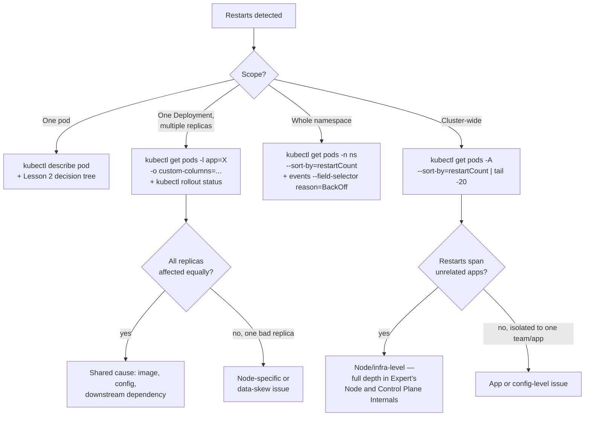

## What this lesson teaches

The Beginner level taught you how to read a single pod's restart count and `Last State`. In real microservices deployments, that's not enough — you need to know whether a restart is isolated to one bad replica, spreading across an entire Deployment, or a cluster-wide pattern, because each of those points to a completely different root cause (one flaky pod vs. a bad rollout vs. node-level infrastructure trouble). This lesson teaches the scoping commands that answer "how much and where" before you spend time on "why," plus how to see a restart *trend* over time rather than just the current count `kubectl` shows you.

> **Prerequisites:** This lesson assumes you've completed [CrashLoopBackOff and Exit Code Deep Dive](/course/intermediate/crashloopbackoff-and-exit-codes/) — you should already be comfortable diagnosing a single pod's restart reason before scaling that skill up to a whole Deployment or cluster.

## Core concepts

### Why scope before you root-cause

One flaky pod vs. an entire deployment vs. a namespace-wide pattern point to very different root causes. A single pod restarting on one node → suspect that node or a data skew issue. Every replica of a Deployment restarting → suspect the image, config, or a downstream dependency shared by all replicas. Restarts across many unrelated Deployments in a namespace or cluster → suspect node-level infrastructure, a shared dependency (DNS, a database, a message broker), or a cluster-wide resource pressure event.

### Restart counts across a Deployment (all replicas at once)

```bash
kubectl get pods -n <ns> -l app=<app-label>
```
Lists only the pods belonging to a specific Deployment (via its label selector), so you see restart counts across all replicas side by side instead of per-pod lookups. Find the correct label/value first with:
```bash
kubectl get deployment <deploy> -n <ns> -o jsonpath='{.spec.selector.matchLabels}'
```
`-l` also supports set-based syntax, e.g. `-l 'app in (svc-a,svc-b)'`.

```bash
kubectl get pods -n <ns> -l app=<app-label> -o custom-columns='NAME:.metadata.name,NODE:.spec.nodeName,RESTARTS:.status.containerStatuses[0].restartCount,REASON:.status.containerStatuses[0].lastState.terminated.reason'
```
Builds a custom table for just this Deployment's pods showing name, node, restart count, and last crash reason — the single most useful command when a Deployment has one bad replica among many healthy ones (e.g., a pod pinned to a bad node). `-o custom-columns='HEADER:<jsonpath>,...'` defines arbitrary output columns; unlike `-o jsonpath` this keeps a readable table format instead of one flat string.

```bash
kubectl rollout status deployment/<deploy> -n <ns>
```
Reports whether a Deployment's rollout has fully completed — if pods are stuck restarting mid-rollout, this command hangs or reports `Waiting for deployment "<deploy>" rollout to finish` instead of completing, which itself is diagnostic signal that new-revision pods aren't passing their readiness probe. Add `--timeout=30s` to avoid hanging indefinitely during an incident so you can move on to the next check.

```bash
kubectl describe deployment <deploy> -n <ns>
```
Shows the Deployment's `Conditions` (e.g. `Progressing: False`, `Replicas: 3 desired | 1 updated | 3 total | 1 available`) and its own Events (`ReplicaSetUpdated`, `ScalingReplicaSet`) — a level up from individual pod restarts, useful to see if the controller itself considers the rollout degraded.

### Scoping to namespace and cluster-wide

```bash
kubectl get pods -n <ns> --sort-by='.status.containerStatuses[0].restartCount'
```
Sorts pods by restart count ascending, so the worst offenders appear at the bottom of the list. Note: `.status.containerStatuses[0]` only reflects container index 0, so for multi-container pods cross-check with `-o json` if a sidecar might be the one restarting.

```bash
kubectl get pods --all-namespaces --sort-by='.status.containerStatuses[0].restartCount' | tail -20
```
Cluster-wide view of the 20 highest-restart-count pods across every namespace — the fastest way to answer "is this isolated to my service or happening everywhere?" during an incident. `--all-namespaces` (or `-A`) ignores namespace scoping entirely. `tail -20` is shell, not kubectl — since `--sort-by` is ascending only, the highest counts land at the bottom of the output.

```bash
kubectl get pods -n <ns> --field-selector=status.phase=Running -o json | \
  jq -r '.items[] | select(.status.containerStatuses[]?.restartCount > 0) | "\(.metadata.name)\t\(.status.containerStatuses[0].restartCount)"'
```
Prints only pod name + restart count for pods with at least one restart, skipping healthy pods entirely — much faster to scan than the full `kubectl get pods` table in a namespace with hundreds of pods. `--field-selector=status.phase=Running` is a server-side filter (combine multiple selectors with commas, e.g. `status.phase=Running,spec.restartPolicy=Always`); `-o json` gives `jq` full nested-field access; `jq -r` (raw output) strips the surrounding quotes jq would otherwise add.

```bash
kubectl get events -n <ns> --field-selector reason=BackOff --sort-by='.lastTimestamp'
```
Lists only `BackOff` events (emitted each time Kubernetes delays a restart after a crash) in chronological order — a restart timeline without touching pod objects at all. Other useful `reason` values: `Unhealthy` (probe failures), `Killing` (container being terminated), `Created`/`Started` (to see the corresponding restart). `--sort-by='.lastTimestamp'` orders oldest-to-newest so you can see restart frequency/acceleration over the incident window.

### Restart trend over time (not just current count)

`kubectl` alone only exposes the *current* restart count — it has no built-in history. To see a **trend** (is it getting worse, or was it a one-time blip three days ago?), you need one of two approaches.

**Option 1: Prometheus (if kube-state-metrics is installed) — the standard approach.**

```promql
# rate of restarts over the last 15 minutes, per pod
increase(kube_pod_container_status_restarts_total{namespace="<ns>"}[15m]) > 0
```

`kube_pod_container_status_restarts_total` is a monotonically increasing counter exported by `kube-state-metrics`. `increase(...[15m])` computes how many restarts happened specifically within the trailing 15-minute window, so you can tell "3 restarts total, all 3 in the last 15 minutes" (active crash loop, urgent) from "3 restarts total, last one 6 days ago" (stale, low priority). Deeper PromQL patterns for this are covered in the [Advanced observability lessons](/course/advanced/observability-metrics-logs-traces/).

**Option 2: event history (short retention, usually 1h, but free and always available).**

```bash
kubectl get events -n <ns> --field-selector involvedObject.name=<pod> --sort-by='.lastTimestamp'
```

Read the repeated `BackOff`/`Killing`/`Started` cycle to reconstruct a timeline; the `Count` column on each event line (e.g. `Back-off restarting failed container   x9`) tells you how many times that *specific* event has recurred since it was first seen (`First seen`/`Last seen` fields), which approximates a trend without needing Prometheus.

> **Why events aren't enough alone:** the Kubernetes API server prunes Events after a retention window (`--event-ttl`, default 1h on most clusters). For any restart pattern older than that, `kube_pod_container_status_restarts_total` in Prometheus (or your logging/metrics backend) is the only reliable source.

### Choosing the right scope for the situation



If restarts span unrelated apps cluster-wide, you're looking at a node or control-plane problem rather than anything the affected apps did — the full diagnostic workflow for that (kubelet/containerd health, node conditions, eviction manager behavior) is taught in Expert's [Node and Control Plane Internals](/course/expert/node-and-control-plane-internals/), several levels ahead of where you are now. For today, it's enough to recognize the pattern and rule your own app out.

## Lab

Practice scoping restarts across a Deployment on a local `kind` cluster.

1. **Deploy 4 replicas where one is deliberately misconfigured** to simulate a bad-replica scenario:
   ```bash
   kubectl create namespace restart-lab
   kubectl create deployment scope-demo --image=<your-spring-boot-image> --replicas=4 -n restart-lab
   ```

2. **Force one replica onto a bad state** by patching just one pod's container with a resource limit too low to survive startup (simulating "one node/replica is different"):
   ```bash
   kubectl get pods -n restart-lab -l app=scope-demo
   # pick one pod name, then delete it and let it reschedule, or edit the deployment temporarily
   # to add a low memory limit, apply, then revert after observing:
   kubectl set resources deployment/scope-demo -n restart-lab \
     --limits=memory=64Mi --requests=memory=64Mi
   ```

3. **Scope the restarts across the Deployment:**
   ```bash
   kubectl get pods -n restart-lab -l app=scope-demo \
     -o custom-columns='NAME:.metadata.name,NODE:.spec.nodeName,RESTARTS:.status.containerStatuses[0].restartCount,REASON:.status.containerStatuses[0].lastState.terminated.reason'
   ```
   Confirm you can see restart count and reason side-by-side for all 4 replicas in one table.

4. **Check rollout health at the Deployment level:**
   ```bash
   kubectl rollout status deployment/scope-demo -n restart-lab --timeout=30s
   kubectl describe deployment scope-demo -n restart-lab | grep -A5 Conditions
   ```

5. **Build a restart timeline from events:**
   ```bash
   kubectl get events -n restart-lab --field-selector reason=BackOff --sort-by='.lastTimestamp'
   ```

6. **Revert the resource limits and confirm recovery:**
   ```bash
   kubectl set resources deployment/scope-demo -n restart-lab \
     --limits=memory=512Mi --requests=memory=256Mi
   kubectl rollout status deployment/scope-demo -n restart-lab
   ```

7. **Clean up:**
   ```bash
   kubectl delete namespace restart-lab
   ```

If you have Prometheus/kube-state-metrics available in your lab cluster, also run the `increase(kube_pod_container_status_restarts_total{namespace="restart-lab"}[15m]) > 0` query in the Prometheus UI and compare it against the event-based timeline you built in step 5.

## Checkpoint

- [ ] I can explain why you should scope a restart pattern (pod/Deployment/namespace/cluster) before root-causing it.
- [ ] I can produce a one-shot table of name/node/restarts/reason for every replica in a Deployment.
- [ ] I know the difference between `kubectl rollout status` hanging vs completing, and what a hang implies.
- [ ] I can explain why Kubernetes Events alone are insufficient for a restart trend older than the cluster's `--event-ttl`.
- [ ] I ran the lab and correctly identified which replica was misbehaving using `custom-columns`, not by eyeballing `kubectl get pods`.
