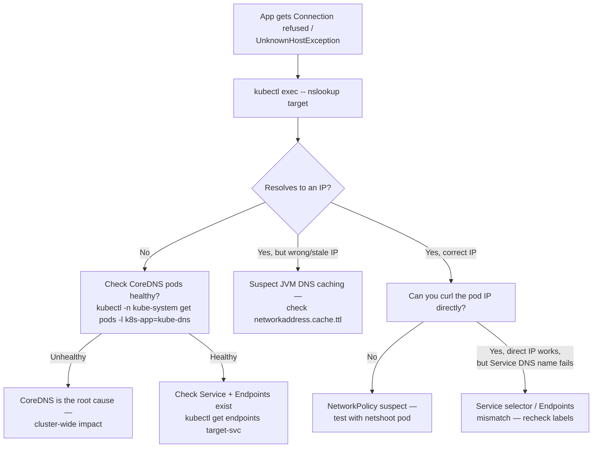

## What this lesson teaches

In Beginner you learned the basics of Service discovery — that `<svc>.<ns>.svc.cluster.local` resolves via CoreDNS and how to check a Service selector against pod labels. This lesson goes deeper into two things Beginner didn't cover: how CoreDNS itself works as a piece of cluster infrastructure you can inspect and debug, and — critically for Java developers — why the JVM's own DNS caching behavior can cause your app to keep talking to a pod IP that no longer exists, long after Kubernetes has moved on. You'll also learn how `NetworkPolicy` resources can silently block traffic that looks like a DNS or connectivity bug but is actually a firewall rule.

> **Prerequisites:** This lesson assumes you've completed [Restart Troubleshooting Across a Deployment](/course/intermediate/restart-troubleshooting-across-a-deployment/) and already know the basic Service/DNS discovery model and the layered checklist (pod → CoreDNS → Service → Endpoints → pod IP) from [Services and Basic Networking](/course/beginner/services-and-basic-networking/) in Beginner.

## Core concepts

### CoreDNS architecture, briefly

Every DNS query from a pod (`nslookup my-service.my-ns.svc.cluster.local`) is served by CoreDNS pods running in `kube-system`, fronted by their own `kube-dns` Service. CoreDNS itself reads Kubernetes API state (Services, Endpoints/EndpointSlices) to build DNS responses dynamically — it isn't a static zone file. That means a CoreDNS problem can look exactly like a Service/Endpoints problem, and you need to check both:

```bash
# Is CoreDNS healthy cluster-wide?
kubectl -n kube-system get pods -l k8s-app=kube-dns
kubectl -n kube-system logs -l k8s-app=kube-dns --tail=100
kubectl -n kube-system get svc kube-dns
```

If CoreDNS pods are crash-looping, unhealthy, or under-resourced, *every* service in the cluster experiences intermittent or total DNS failure — this is a cluster-wide-suspect scenario per the scoping approach from the previous lesson, not a single-app bug.

### NetworkPolicy blocking traffic

A `NetworkPolicy` resource restricts which pods can talk to which other pods (and on which ports/protocols) at the network level — independent of DNS and independent of the Service object entirely. This produces a specific, confusing failure signature: DNS resolves fine (you get a pod IP or ClusterIP back), but the actual TCP connection times out or is refused, because a `NetworkPolicy` is silently dropping the packets.

```bash
kubectl get networkpolicy -n <ns>
kubectl describe networkpolicy <policy> -n <ns>

# Test with a temporary unrestricted pod in the same namespace
kubectl run netshoot --rm -it --image=nicolaka/netshoot -n <ns> -- bash
# inside: curl, dig, nc, tcpdump, mtr all available
```

Key things to check in `describe networkpolicy` output:
- **`podSelector`** — which pods this policy applies to (an empty selector `{}` means "all pods in this namespace").
- **`policyTypes`** — `Ingress`, `Egress`, or both. A policy with only `Ingress` rules does not restrict egress traffic from the selected pods, and vice versa.
- **`ingress`/`egress` rules** — each rule is an allow-list; if a pod is selected by *any* `NetworkPolicy` for a given direction, all traffic in that direction is denied by default except what's explicitly allowed. This trips up teams who add a second, narrower `NetworkPolicy` for a new use case and unintentionally cut off traffic that a different policy used to implicitly allow.

The `netshoot` pod above is the fastest way to test in isolation: if `netshoot` (which has no `NetworkPolicy` label match, typically) can reach a target but your labeled application pod can't, you've confirmed the block is policy-based, not DNS or Service related.

### DNS resolution latency and caching — the Java-specific gotcha

Java's JVM caches successful DNS lookups **forever** by default (`networkaddress.cache.ttl=-1`) unless explicitly overridden. In a static, non-containerized world this was harmless. In Kubernetes, pod IPs churn constantly — rolling deploys, autoscaling, node evictions, Service endpoint changes — and a JVM that resolved a backend hostname once at startup and cached it forever will keep sending traffic to a pod IP that Kubernetes tore down hours ago, resulting in intermittent `Connection refused`/timeout errors that look like a networking or Service problem but are actually a stale JVM-internal cache.

```bash
# Check effective setting
kubectl exec -it <pod> -n <ns> -- jcmd 1 VM.system_properties | grep networkaddress
```

Fix: set explicitly in JVM args, or rely on Spring Boot's default for embedded servers (but verify separately for custom HTTP clients / connection pools, which may not inherit it):

```
-Dnetworkaddress.cache.ttl=30 -Dnetworkaddress.cache.negative.ttl=5
```

`networkaddress.cache.ttl` controls how long successful lookups are cached (in seconds); `networkaddress.cache.negative.ttl` controls how long *failed* lookups are cached — a high negative TTL means a transient DNS blip during pod startup can cause a Java app to refuse to even retry resolving a hostname for an extended period.

### `ndots` and why every external lookup pays a tax

Kubernetes configures every pod's `/etc/resolv.conf` with a search-domain list and an `ndots` option, default `ndots:5`:

```bash
kubectl get pod <pod> -n <ns> -o jsonpath='{.spec.dnsConfig}'
kubectl exec -it <pod> -n <ns> -- cat /etc/resolv.conf   # check 'options ndots:5'
```

`ndots:5` means: if a hostname has fewer than 5 dots in it, the resolver tries each configured search domain *before* trying the name as an absolute (fully-qualified) lookup. A typical external hostname like `api.stripe.com` has only 2 dots, so it's below the threshold — the resolver tries `api.stripe.com.<ns>.svc.cluster.local`, `api.stripe.com.svc.cluster.local`, `api.stripe.com.cluster.local`, and possibly the node's own search domains, *each one a full round trip that fails*, before finally trying `api.stripe.com.` as absolute and succeeding. For Java apps making frequent outbound calls to external SaaS APIs, this adds several unnecessary DNS round trips per unique hostname (mitigated somewhat by OS/JVM-level caching once the first successful lookup happens, but still adds latency on cold lookups and amplifies load on CoreDNS).

Mitigations: use a trailing dot on fully-qualified external hostnames (`api.stripe.com.`) to force absolute lookup — often impractical to guarantee across all client code — or set `dnsConfig.options` explicitly on the pod spec to lower `ndots` for workloads that mostly call external services:

```yaml
dnsConfig:
  options:
    - name: ndots
      value: "2"
```

Lowering `ndots` cluster-wide is risky if the workload also depends heavily on short in-cluster Service names (e.g. `my-service` with zero dots) — those still need the search-domain expansion to resolve, so this is a per-workload tuning decision, not a blanket cluster default.

### DNS troubleshooting flow end-to-end



## Lab

Reproduce a NetworkPolicy block and a JVM DNS-caching-style symptom on a local `kind` cluster. (`kind`'s default CNI, kindnet, does not enforce `NetworkPolicy` — install Calico or Cilium in your `kind` cluster first, or use `minikube start --cni=calico`, for this lab to actually enforce the policy.)

1. **Set up:**
   ```bash
   kubectl create namespace dns-lab
   kubectl create deployment backend --image=<your-spring-boot-image> -n dns-lab
   kubectl expose deployment backend --port=8080 -n dns-lab
   kubectl run client --image=nicolaka/netshoot -n dns-lab -- sleep 3600
   ```

2. **Confirm baseline connectivity works:**
   ```bash
   kubectl exec -it client -n dns-lab -- curl -sv http://backend.dns-lab.svc.cluster.local:8080/actuator/health
   ```

3. **Apply a deny-all-ingress NetworkPolicy on the backend:**
   ```yaml
   # deny-backend.yaml
   apiVersion: networking.k8s.io/v1
   kind: NetworkPolicy
   metadata:
     name: deny-backend-ingress
     namespace: dns-lab
   spec:
     podSelector:
       matchLabels:
         app: backend
     policyTypes:
       - Ingress
     ingress: []
   ```
   ```bash
   kubectl apply -f deny-backend.yaml
   ```

4. **Observe the failure signature — DNS still resolves, but the connection is blocked:**
   ```bash
   kubectl exec -it client -n dns-lab -- nslookup backend.dns-lab.svc.cluster.local
   kubectl exec -it client -n dns-lab -- curl -sv --max-time 5 http://backend.dns-lab.svc.cluster.local:8080/actuator/health
   ```
   Confirm `nslookup` succeeds but `curl` times out — proving this is a NetworkPolicy issue, not a DNS issue.

5. **Diagnose it properly:**
   ```bash
   kubectl get networkpolicy -n dns-lab
   kubectl describe networkpolicy deny-backend-ingress -n dns-lab
   ```

6. **Fix by allowing traffic from the client's namespace:**
   ```yaml
   # allow-backend.yaml
   apiVersion: networking.k8s.io/v1
   kind: NetworkPolicy
   metadata:
     name: allow-backend-ingress
     namespace: dns-lab
   spec:
     podSelector:
       matchLabels:
         app: backend
     policyTypes:
       - Ingress
     ingress:
       - from:
           - namespaceSelector: {}
   ```
   ```bash
   kubectl delete -f deny-backend.yaml
   kubectl apply -f allow-backend.yaml
   kubectl exec -it client -n dns-lab -- curl -sv --max-time 5 http://backend.dns-lab.svc.cluster.local:8080/actuator/health
   ```

7. **Inspect `ndots` and JVM DNS caching properties on the backend:**
   ```bash
   kubectl exec -it -n dns-lab deploy/backend -- cat /etc/resolv.conf
   kubectl exec -it -n dns-lab deploy/backend -- jcmd 1 VM.system_properties | grep networkaddress
   ```

8. **Clean up:**
   ```bash
   kubectl delete namespace dns-lab
   ```

## Checkpoint

- [ ] I can explain why a `NetworkPolicy` block produces "DNS resolves, connection fails" rather than a DNS error.
- [ ] I know which `kubectl` commands confirm CoreDNS itself (not just my Service) is healthy.
- [ ] I can explain why the JVM's default `networkaddress.cache.ttl=-1` is dangerous specifically in Kubernetes, and how to override it.
- [ ] I understand what `ndots:5` does to an external hostname lookup and when it's worth tuning per-workload.
- [ ] I reproduced a NetworkPolicy-blocked connection in the lab and fixed it with a correctly scoped `ingress` rule.
