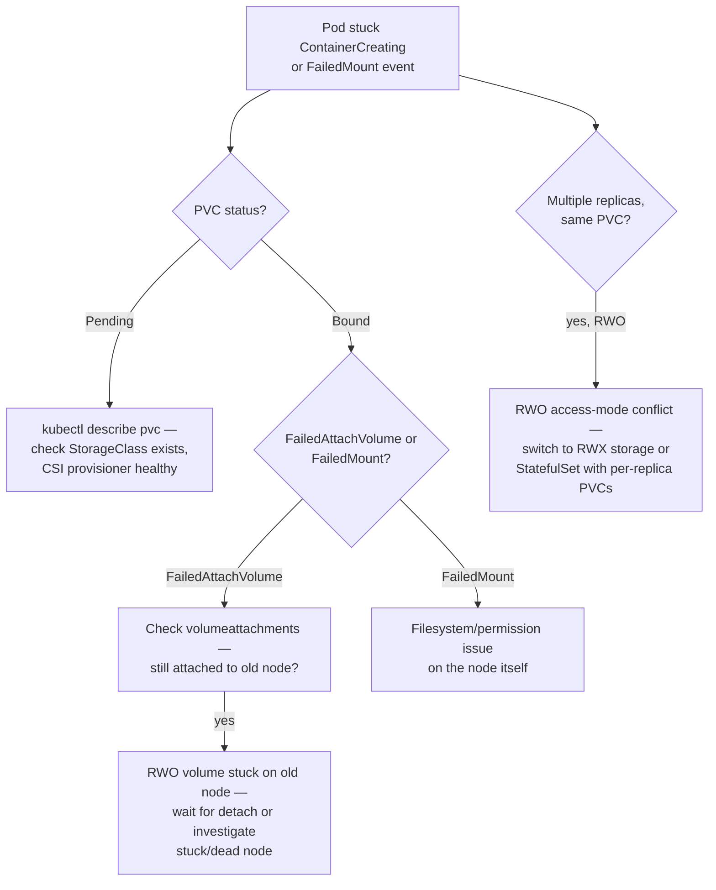

## What this lesson teaches

Everything up to this point has assumed stateless Spring Boot pods — kill one, start another, nothing is lost. Real systems eventually need durable storage: an embedded database replaced by a real one backed by a disk, a file-processing service that needs a shared working directory, or a cache that shouldn't cold-start on every restart. This lesson teaches the PV/PVC/StorageClass model that underlies all durable storage in Kubernetes, the RWO-vs-RWX access-mode distinction that trips up nearly everyone the first time they try to scale a stateful workload horizontally, and how to diagnose the mount failures and disk-pressure evictions that are unique to stateful pods.

> **Prerequisites:** This lesson assumes you've completed [ConfigMap and Secret Propagation](/course/intermediate/configmap-secret-propagation/). No prior storage-specific knowledge is assumed beyond the general pod/Deployment model from Beginner.

## Core concepts

### PV, PVC, and StorageClass — how they relate

- **PersistentVolume (PV)** — a piece of actual storage in the cluster (an EBS volume, a GCE PD, an NFS share, a local disk), represented as a cluster-scoped Kubernetes object. Usually you don't create these by hand in a modern cluster.
- **PersistentVolumeClaim (PVC)** — a namespaced *request* for storage ("give me 10Gi, RWO, at least this fast") that a pod references. This is what application manifests actually declare.
- **StorageClass** — a template that tells Kubernetes *how* to dynamically provision a PV when a PVC asks for one — which storage backend/CSI driver to use, what disk type, what reclaim policy. Without dynamic provisioning (i.e., in older/manual setups), an administrator would need to pre-create matching PVs by hand; almost all modern clusters use a default `StorageClass` so a PVC alone is enough to get a disk.

```bash
kubectl get pv,pvc -n <ns>
kubectl describe pvc <pvc-name> -n <ns>
kubectl describe pv <pv-name>

# StorageClass and provisioner health
kubectl get storageclass
kubectl describe storageclass <sc-name>
kubectl -n kube-system get pods -l app=ebs-csi-controller     # example: AWS EBS CSI driver
kubectl -n kube-system logs -l app=ebs-csi-controller -c csi-provisioner --tail=100
```

A PVC stuck in `Pending` almost always means one of: no `StorageClass` matches what was requested, the CSI provisioner controller itself is unhealthy, or (in cloud environments) the requested zone/node topology can't be satisfied.

### RWO vs RWX — the access mode that determines your scaling ceiling

| Access mode | Meaning | Typical backing storage |
|---|---|---|
| `ReadWriteOnce` (RWO) | Volume can be mounted read-write by **a single node** at a time | Cloud block storage (EBS, GCE PD, Azure Disk) — by far the most common and cheapest |
| `ReadOnlyMany` (ROX) | Volume can be mounted read-only by many nodes simultaneously | Rarely used alone; sometimes for shared static assets |
| `ReadWriteMany` (RWX) | Volume can be mounted read-write by many nodes simultaneously | NFS, CephFS, cloud file-storage services (EFS, Filestore, Azure Files) — generally slower and pricier than block storage |
| `ReadWriteOncePod` (RWOP) | Volume can be mounted read-write by a single **pod** (stricter than RWO, which is single-*node*) | Newer CSI drivers; use when you need to guarantee exclusivity even across pods on the same node |

The RWO trap: if your Spring Boot workload uses an RWO-backed PVC and you try to scale the Deployment to more than one replica, only one pod can actually mount the volume — the others sit in `ContainerCreating` waiting for a mount that will never succeed while another pod holds it. This is the single most common storage scaling mistake: RWO is fine for a single-instance stateful component but does not horizontally scale the way a stateless Deployment does. If multiple replicas genuinely need concurrent write access to the *same* volume, you need RWX-capable storage; if each replica instead needs its *own* independent volume (the far more common and performant pattern — e.g., each replica of a StatefulSet gets its own disk), that's what StatefulSets solve natively.

### StatefulSets, briefly

A `StatefulSet` is the workload controller for stateful applications, differing from a `Deployment` in three ways that matter here:

1. **Stable, unique network identity** — pods get predictable names (`app-0`, `app-1`, `app-2`) instead of random suffixes, and stable DNS via a headless Service.
2. **Stable storage per replica** — each replica gets its *own* PVC, created from a `volumeClaimTemplate`, that follows that specific ordinal pod across rescheduling (`app-0` always reattaches to the same PVC, never `app-1`'s).
3. **Ordered, graceful deployment and scaling** — pods are created/updated/deleted in strict ordinal order (0, 1, 2, ...), one at a time by default, rather than all at once.

```yaml
apiVersion: apps/v1
kind: StatefulSet
metadata:
  name: file-writer
spec:
  serviceName: file-writer
  replicas: 3
  selector:
    matchLabels: { app: file-writer }
  template:
    metadata:
      labels: { app: file-writer }
    spec:
      containers:
        - name: app
          image: <your-spring-boot-image>
          volumeMounts:
            - name: data
              mountPath: /data
  volumeClaimTemplates:
    - metadata:
        name: data
      spec:
        accessModes: ["ReadWriteOnce"]
        resources:
          requests:
            storage: 5Gi
```

Each of `file-writer-0`, `file-writer-1`, `file-writer-2` gets its own independently provisioned 5Gi PVC — this is usually what you actually want instead of forcing RWX for a "shared" volume that doesn't really need concurrent writers to the same files.

### Diagnosing mount failures

```bash
# Mount failures — check pod events for "FailedMount" / "FailedAttachVolume"
kubectl describe pod <pod> -n <ns> | grep -A5 -i mount
```

`FailedAttachVolume` typically means the underlying cloud API couldn't attach the disk (often because it's still attached to a different node from a previous scheduling, especially after an unclean node failure). `FailedMount` typically means the attach succeeded but the actual filesystem mount inside the node/container failed (permissions, filesystem corruption, wrong fstype).

Read-write-once (RWO) volume stuck on the wrong node during rescheduling is a specific, common variant of this:

```bash
kubectl get pod <pod> -n <ns> -o wide      # note current node
kubectl get volumeattachments | grep <pv-name>
```

If `volumeattachments` shows the PV still attached to the *old* node while the pod has been rescheduled to a *new* node, the CSI driver hasn't finished detaching yet — this resolves itself once the detach completes, but can take longer than expected during a node failure (the old node isn't around to gracefully release the volume, so the control plane has to wait out a timeout before force-detaching).

### Disk pressure and ephemeral storage

Beyond the PV/PVC-backed persistent storage, pods also consume **ephemeral storage** on the node itself (container writable layer, `emptyDir` volumes without a size limit, logs). Running out of this causes node-level `DiskPressure` and pod eviction — a failure mode that looks unrelated to your PVCs but is still a storage problem:

```bash
# Check actual disk usage inside the pod (common cause of app slowness/crashes)
kubectl exec -it <pod> -n <ns> -- df -h
kubectl exec -it <pod> -n <ns> -- du -sh /app/* 2>/dev/null | sort -rh | head -10

# Ephemeral storage pressure causing eviction
kubectl describe node <node> | grep -A5 "ephemeral-storage"
kubectl get pod <pod> -n <ns> -o jsonpath='{.status.reason}'   # "Evicted"
```

A pod with `status.reason: Evicted` (rather than `CrashLoopBackOff` or `OOMKilled`) that also shows heavy local disk usage from `du` is a disk-pressure eviction, not an application crash — this is easy to conflate with the exit-code-driven crash categories from the [CrashLoopBackOff lesson](/course/intermediate/crashloopbackoff-and-exit-codes/) if you don't specifically check `status.reason`.

### Storage troubleshooting flow



## Lab

Reproduce a `FailedMount`/RWO conflict and a StatefulSet with per-replica storage on a local `kind` cluster. (`kind` ships a default `StorageClass` backed by `local-path-provisioner`, which supports dynamic provisioning but is inherently single-node/RWO-only — perfect for demonstrating the RWO conflict.)

1. **Confirm the default StorageClass exists:**
   ```bash
   kubectl get storageclass
   ```

2. **Create a namespace and a PVC:**
   ```bash
   kubectl create namespace storage-lab
   ```
   ```yaml
   # pvc.yaml
   apiVersion: v1
   kind: PersistentVolumeClaim
   metadata:
     name: shared-data
     namespace: storage-lab
   spec:
     accessModes: ["ReadWriteOnce"]
     resources:
       requests:
         storage: 1Gi
   ```
   ```bash
   kubectl apply -f pvc.yaml
   kubectl get pvc -n storage-lab -w
   ```
   Wait for it to reach `Bound`.

3. **Deploy a single-replica pod using the PVC and confirm it mounts fine:**
   ```yaml
   # single-writer.yaml
   apiVersion: v1
   kind: Pod
   metadata:
     name: writer-1
     namespace: storage-lab
   spec:
     containers:
       - name: app
         image: busybox
         command: ["sh", "-c", "echo hello > /data/file.txt && sleep 3600"]
         volumeMounts:
           - name: data
             mountPath: /data
     volumes:
       - name: data
         persistentVolumeClaim:
           claimName: shared-data
   ```
   ```bash
   kubectl apply -f single-writer.yaml
   kubectl get pod writer-1 -n storage-lab -w
   ```

4. **Try to mount the SAME RWO PVC from a second pod simultaneously and observe the failure:**
   ```yaml
   # second-writer.yaml
   apiVersion: v1
   kind: Pod
   metadata:
     name: writer-2
     namespace: storage-lab
   spec:
     containers:
       - name: app
         image: busybox
         command: ["sh", "-c", "sleep 3600"]
         volumeMounts:
           - name: data
             mountPath: /data
     volumes:
       - name: data
         persistentVolumeClaim:
           claimName: shared-data
   ```
   ```bash
   kubectl apply -f second-writer.yaml
   kubectl describe pod writer-2 -n storage-lab | grep -A5 -i mount
   ```
   Confirm `writer-2` is stuck with a mount-related event (behavior depends on your CSI driver — with `local-path-provisioner` it commonly manifests as a scheduling/multi-attach conflict since the volume is node-local).

5. **Clean up the two-pod conflict and build a proper StatefulSet instead:**
   ```bash
   kubectl delete pod writer-1 writer-2 -n storage-lab
   kubectl delete pvc shared-data -n storage-lab
   ```
   ```yaml
   # statefulset.yaml
   apiVersion: apps/v1
   kind: StatefulSet
   metadata:
     name: file-writer
     namespace: storage-lab
   spec:
     serviceName: file-writer
     replicas: 3
     selector:
       matchLabels: { app: file-writer }
     template:
       metadata:
         labels: { app: file-writer }
       spec:
         containers:
           - name: app
             image: busybox
             command: ["sh", "-c", "echo $HOSTNAME > /data/id.txt && sleep 3600"]
             volumeMounts:
               - name: data
                 mountPath: /data
     volumeClaimTemplates:
       - metadata:
           name: data
         spec:
           accessModes: ["ReadWriteOnce"]
           resources:
             requests:
               storage: 1Gi
   ```
   ```bash
   kubectl apply -f statefulset.yaml
   kubectl get pods -n storage-lab -w
   kubectl get pvc -n storage-lab
   ```
   Confirm each of `file-writer-0/1/2` gets its own independently `Bound` PVC, and each pod can write to `/data` without conflict.

6. **Clean up:**
   ```bash
   kubectl delete namespace storage-lab
   ```

## Checkpoint

- [ ] I can explain the relationship between PV, PVC, and StorageClass in one sentence each.
- [ ] I can explain why an RWO PVC cannot simply be shared across multiple replicas of a Deployment.
- [ ] I know the three things a StatefulSet gives you that a Deployment doesn't.
- [ ] I can distinguish a `FailedAttachVolume` event from a `FailedMount` event and what each implies.
- [ ] I reproduced an RWO multi-mount conflict in the lab and resolved it correctly with a StatefulSet's per-replica `volumeClaimTemplates`.
