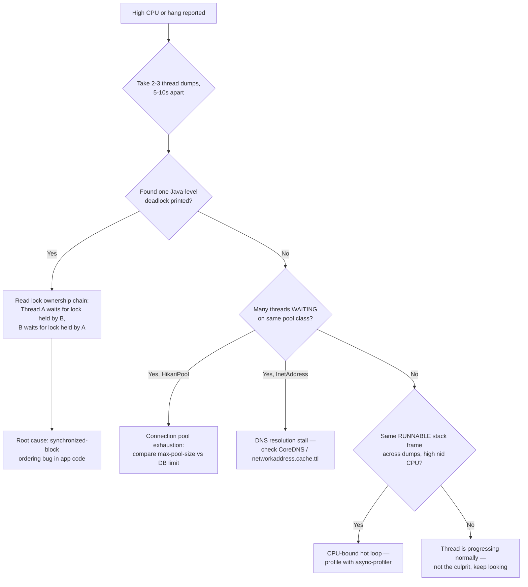

Welcome to Advanced. Everything from here on assumes you can already get a shell into a pod, port-forward, and read `kubectl describe` output in your sleep — this level is about what happens *inside* the JVM once you're in there, starting with the single highest-leverage skill for any "app is hung" or "app is burning CPU" page: reading a thread dump. For a Java or Spring Boot developer, this is the diagnostic that turns "I restarted the pod and it went away" into "here's the exact line of code and the exact lock that caused it."

This builds directly on the Intermediate-level JVM-in-container basics — you already know how to get a shell and run `jcmd` from the Intermediate level. Here we go one level deeper: what the output of `jcmd 1 Thread.print` actually means, line by line, and how to turn it into a root cause instead of a wall of text.

> **Prerequisites:** You should have completed the [Intermediate capstone](/course/intermediate/capstone-on-call-simulation/) and be comfortable with `kubectl exec`, `kubectl cp`, and basic `jcmd` usage from that level.

## Capturing a thread dump

`jcmd` is preferred over `kill -3` because it needs no extra tooling and works cleanly on JDK 8u60+:

```bash
# Preferred: jcmd (no extra tools needed, JDK 8u60+)
kubectl exec -it <pod> -n <ns> -- jcmd 1 Thread.print > threaddump.txt

# Alternative if jcmd absent
kubectl exec -it <pod> -n <ns> -- kill -3 1     # sends SIGQUIT; dump goes to stdout, capture via kubectl logs

# Copy dump out for offline analysis (e.g. in a fastthread.io / IntelliJ thread dump analyzer)
kubectl cp <ns>/<pod>:threaddump.txt ./threaddump.txt
```

Take at least two or three dumps a few seconds apart when you suspect a hang. A single dump only tells you where threads are *right now* — a deadlock only becomes obvious when the same threads are stuck on the same lock across multiple dumps in a row, whereas a slow-but-progressing thread will show different stack frames each time.

## Correlating high CPU with a specific Java thread

`top -H` gives you OS-level thread IDs; a thread dump gives you the corresponding Java thread and its `nid` (native ID, printed in hex). Match the two and you've turned "the container is using 400% CPU" into "`http-nio-8080-exec-7` is spinning inside `ObjectMapper.writeValueAsString`."

```bash
# Find the OS thread burning CPU, then map to Java thread (correlate nid in thread dump)
kubectl exec -it <pod> -n <ns> -- top -H -p 1
```

`top -H -p 1` prints per-thread CPU inside the container (PID 1 is usually the JVM in a container). Convert the busiest OS thread ID to hex, then grep the thread dump for that `nid` — the matching stack frame is what's actually burning the CPU.

## Reading a thread dump: what to look for

A thread dump is a snapshot of every thread's stack and state at one instant. The four states that matter operationally:

| State | Meaning |
|---|---|
| `RUNNABLE` | Actually executing or ready to execute — this is what "high CPU" threads look like. |
| `BLOCKED` | Waiting to acquire a monitor (synchronized block) held by another thread. |
| `WAITING` / `TIMED_WAITING` | Parked — waiting on a condition, a pool, a `Thread.sleep`, or an explicit `Object.wait()`. |
| `NEW` / `TERMINATED` | Not yet started / finished — rarely interesting in a live dump. |

Symptom patterns worth memorizing:

- Multiple threads `BLOCKED` on the same lock → contention or an outright deadlock.
- Many threads in `WAITING`/`TIMED_WAITING` on a connection pool (`HikariPool`, `Lettuce`, `RestTemplate`/`WebClient` connection acquisition) → pool exhaustion. Check `spring.datasource.hikari.maximum-pool-size` against the actual DB connection limit.
- Threads stuck in DNS resolution (`java.net.InetAddress`) → a CoreDNS or network issue, not a JVM problem — see the [low-level networking lesson](/course/advanced/low-level-networking-cni-and-kube-proxy/).
- Tomcat/Netty worker threads all busy on the *same* stack frame → an undersized thread pool or a slow downstream dependency. The tell is that they're not just busy, they're busy doing the *same thing*.

### Anatomy of a deadlock in the dump

A true JVM-detected deadlock is the easiest case, because `jcmd`/`jstack` will print a `Found one Java-level deadlock` section explicitly, naming each thread and the lock it's waiting for and the lock it already holds. A HikariCP pool exhaustion looks different — no explicit deadlock section, just dozens of threads parked in `TIMED_WAITING` inside `HikariPool.getConnection`, eventually timing out with `SQLTransientConnectionException`.



## Lab

This lab reproduces both a synchronized-block deadlock and a HikariCP pool exhaustion, and asks you to diagnose each from thread dumps alone — no source code peeking once the app is deployed.

1. Deploy a small Spring Boot app with two REST endpoints that intentionally deadlock via nested `synchronized` blocks acquired in opposite order on two different threads (or reuse any "chaos" demo app with a `/deadlock` endpoint). Deploy it to your `kind`/`minikube` cluster:
   ```bash
   kubectl create namespace advanced-lab
   kubectl -n advanced-lab apply -f deadlock-demo-deployment.yaml
   kubectl -n advanced-lab get pods -w
   ```
2. Trigger the deadlock by hitting the endpoint twice concurrently so the two code paths interleave:
   ```bash
   kubectl -n advanced-lab port-forward svc/deadlock-demo 8080:8080 &
   curl -s localhost:8080/deadlock/path-a & curl -s localhost:8080/deadlock/path-b &
   ```
3. Capture and pull three thread dumps a few seconds apart:
   ```bash
   POD=$(kubectl -n advanced-lab get pod -l app=deadlock-demo -o jsonpath='{.items[0].metadata.name}')
   for i in 1 2 3; do
     kubectl exec -it "$POD" -n advanced-lab -- jcmd 1 Thread.print > "dump-$i.txt"
     sleep 5
   done
   ```
4. Diff the dumps and confirm the same two threads appear `BLOCKED` on each other's lock in all three, with a `Found one Java-level deadlock` banner. Write down the lock ownership chain from the dump text itself.
5. Reset the app, then reproduce pool exhaustion instead: set `spring.datasource.hikari.maximum-pool-size=2`, deploy, and fire 20 concurrent requests that each hold a connection for several seconds (e.g. a slow query or an artificial `Thread.sleep` inside a `@Transactional` method).
   ```bash
   for i in $(seq 1 20); do curl -s localhost:8080/slow-query & done
   kubectl exec -it "$POD" -n advanced-lab -- jcmd 1 Thread.print > pool-dump.txt
   grep -A5 "HikariPool" pool-dump.txt
   ```
6. Confirm you can point to the exact line in the dump showing threads `TIMED_WAITING` on `HikariPool.getConnection`, and explain from the numbers alone (`maximum-pool-size=2`, 20 concurrent callers) why exhaustion was inevitable.

## Checkpoint

- [ ] I can capture a thread dump with `jcmd 1 Thread.print` and pull it out of the pod with `kubectl cp`.
- [ ] I can explain the difference between `BLOCKED`, `WAITING`, and `TIMED_WAITING`, and what each implies operationally.
- [ ] I can correlate a `top -H` hot OS thread with its Java thread via the `nid` field in a dump.
- [ ] I can distinguish a true JVM-detected deadlock from HikariCP pool exhaustion just by reading dump output.
- [ ] I completed the lab and can show the lock ownership chain from my own captured dump.
