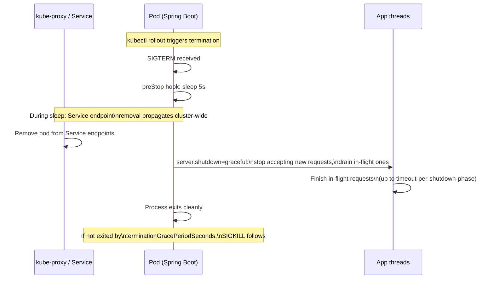

Every lesson so far has assumed you can `kubectl exec` into a pod and run `jcmd`. Two things break that assumption in real production environments: distroless/minimal images with no shell at all, and situations where shelling in is simply slower than an HTTP call you already have wired up. This lesson covers both — turning Spring Boot Actuator into a first-class diagnostic surface, and using ephemeral debug containers when there's truly no shell to be had — plus two related failure modes that show up constantly in real incidents: thread/PID exhaustion and ungraceful shutdown during rolling deploys.

This builds directly on the thread- and heap-dump techniques from the last three lessons — Actuator and ephemeral containers are just two more *ways* to get at that same data when the straightforward `kubectl exec -it ... -- jcmd` path is unavailable.

> **Prerequisites:** Complete [GC Tuning and CPU Throttling in Containers](/course/advanced/gc-tuning-and-cpu-throttling/) first. You should already be fluent with `jcmd`, `kubectl exec`, and `kubectl cp` from the earlier lessons in this module.

## Spring Boot Actuator as a first-class diagnostic surface

If Actuator is exposed — even only internally, reachable via port-forward — it's often faster than shelling in at all, and it works identically regardless of what base image the container uses.

```bash
kubectl port-forward pod/<pod> -n <ns> 8080:8080

curl -s localhost:8080/actuator/health | jq .
curl -s localhost:8080/actuator/health/liveness | jq .
curl -s localhost:8080/actuator/health/readiness | jq .
curl -s localhost:8080/actuator/metrics | jq .
curl -s localhost:8080/actuator/metrics/jvm.memory.used | jq .
curl -s localhost:8080/actuator/metrics/hikaricp.connections.active | jq .
curl -s localhost:8080/actuator/threaddump | jq . > threaddump.json
curl -s localhost:8080/actuator/heapdump -o heapdump.hprof
curl -s localhost:8080/actuator/env | jq .              # verify effective config/profile
curl -s localhost:8080/actuator/configprops | jq .
curl -s localhost:8080/actuator/loggers/com.yourpackage
curl -X POST localhost:8080/actuator/loggers/com.yourpackage \
  -H 'Content-Type: application/json' -d '{"configuredLevel":"DEBUG"}'   # dynamic log level change, no restart
```

That last command is the one worth building a runbook entry around: flipping a package's log level to `DEBUG` in a live pod, with zero redeploy and zero restart, then flipping it back once you've captured what you need. This is dramatically faster than editing a config map and rolling the deployment, and it means you can turn on verbose logging for exactly the five minutes you need it during an active incident.

Notice `/actuator/threaddump` and `/actuator/heapdump` — the same two artifacts from the previous two lessons, available over HTTP with no shell access required at all. This is often the fastest path when Actuator is reachable but the image has no shell.

> **Security note:** never expose actuator management endpoints outside the cluster/mesh. Restrict via a separate management port plus a `NetworkPolicy`, and never commit an Actuator route as public ingress.

## Threads/PID exhaustion

```bash
kubectl exec -it <pod> -n <ns> -- cat /proc/sys/kernel/pid_max
kubectl exec -it <pod> -n <ns> -- ls /proc/1/task | wc -l    # current thread count for JVM
kubectl top pod <pod> -n <ns>

# Node-level PID pressure (affects ALL pods on that node)
kubectl describe node <node> | grep -A3 PIDPressure
```

`OutOfMemoryError: unable to create new native thread` almost always means thread pool misconfiguration — an unbounded `@Async` executor, unbounded Kafka consumer threads, or reactive `Schedulers.newBoundedElastic` misuse — **not literally out of RAM**. The error message is misleading: the JVM is asking the OS for a new native thread and the OS is refusing, usually because a per-process thread/PID limit has been hit, not because heap or physical memory is exhausted. Always check thread *count* (`ls /proc/1/task | wc -l`) before assuming a memory sizing problem.

## Graceful shutdown / SIGTERM handling

Kubernetes sends `SIGTERM`, waits `terminationGracePeriodSeconds` (default 30s), then sends `SIGKILL`. Spring Boot apps that don't complete in-flight requests or don't drain connections cause request errors during every single rolling deploy — this is one of the most common "why do we get a handful of 502s on every deploy" root causes.

```bash
# Check configured grace period
kubectl get pod <pod> -n <ns> -o jsonpath='{.spec.terminationGracePeriodSeconds}'

# Watch what happens during a rollout — errors here mean shutdown isn't graceful
kubectl rollout restart deployment/<deploy> -n <ns>
kubectl get pods -n <ns> -w
```

Checklist for the app side (verify in code/config, not `kubectl`, but flag it during triage):

- `server.shutdown=graceful` and `spring.lifecycle.timeout-per-shutdown-phase` set (Spring Boot 2.3+).
- Readiness probe flips to `NotReady` immediately on `SIGTERM` — via a `preStop` hook sleep — **before** the app stops accepting connections, so the Service has time to remove the pod's endpoint before traffic actually stops flowing to it:

```yaml
lifecycle:
  preStop:
    exec:
      command: ["sh", "-c", "sleep 5"]
```

The ordering here matters and is easy to get backwards: without the `preStop` sleep, `SIGTERM` and endpoint removal race each other — the app can stop accepting connections *before* kube-proxy has finished removing the pod from Service routing, and requests land on a pod that's already refusing them.



## Ephemeral debug containers (distroless / minimal images)

Modern Java images (e.g. `gcr.io/distroless/java`) have no shell, no `curl`, no diagnostic tools at all — by design, to shrink attack surface. Ephemeral debug containers (Kubernetes 1.23+) solve this without rebuilding the image:

```bash
kubectl debug -it <pod> -n <ns> --image=busybox --target=<container-name> -- sh

# Attach a full toolbox (includes jattach-like tools) sharing the target's process namespace
kubectl debug -it <pod> -n <ns> --image=<your-debug-toolbox-image> \
  --target=<container-name> --share-processes -- bash

# Once inside, with --share-processes, you can see and jcmd the target JVM's PID directly
ps aux
jcmd <jvm-pid> Thread.print
```

The key flag is `--share-processes`: it puts your ephemeral debug container into the same process namespace as the target container, so `ps aux` shows the *target's* JVM process, not just your own empty debug container. Without it, you get a shell but can't see or attach to anything running in the pod you actually care about. Build a small internal "debug toolbox" image (JDK diagnostic tools, `curl`, `netcat`, `tcpdump`) once, and this becomes a two-command process regardless of how minimal the production image is.

## Lab

1. Deploy a Spring Boot app on a distroless base image (`gcr.io/distroless/java17-debian12` or similar) with Actuator enabled on its own management port:
   ```bash
   kubectl -n advanced-lab apply -f distroless-app-deployment.yaml
   POD=$(kubectl -n advanced-lab get pod -l app=distroless-app -o jsonpath='{.items[0].metadata.name}')
   ```
2. Confirm there's genuinely no shell — this command should fail:
   ```bash
   kubectl exec -it "$POD" -n advanced-lab -c distroless-app -- sh
   ```
3. Use Actuator instead to pull diagnostics with zero shell access:
   ```bash
   kubectl -n advanced-lab port-forward pod/"$POD" 8080:8080 &
   curl -s localhost:8080/actuator/health | jq .
   curl -s localhost:8080/actuator/threaddump | jq . > threaddump.json
   ```
4. Now debug it the ephemeral-container way instead, sharing the process namespace, and confirm you can see and `jcmd` the JVM's real PID from inside the debug container:
   ```bash
   kubectl debug -it "$POD" -n advanced-lab --image=eclipse-temurin:17-jdk \
     --target=distroless-app --share-processes -- bash
   # inside the ephemeral container:
   ps aux
   jcmd <jvm-pid> Thread.print | head -30
   ```
5. Trigger a rollout and watch for dropped requests, then fix it:
   ```bash
   kubectl -n advanced-lab apply -f distroless-app-deployment.yaml   # bump image tag or annotation
   kubectl -n advanced-lab get pods -w
   ```
   Confirm requests fail during rollout without a `preStop` sleep, then add one and re-run the rollout to confirm the fix.
6. Deliberately misconfigure an `@Async` executor with an unbounded thread pool, drive enough concurrent load to approach `pid_max`, and observe `OutOfMemoryError: unable to create new native thread` in the logs while `kubectl top pod` shows memory nowhere near its limit — confirming the error is about thread count, not RAM.

## Checkpoint

- [ ] I can pull a thread dump and flip a package's log level via Actuator HTTP endpoints with zero shell access.
- [ ] I can explain why `OutOfMemoryError: unable to create new native thread` is a thread-count problem, not a memory problem.
- [ ] I can explain the ordering problem a `preStop` sleep solves during rolling deploys.
- [ ] I can start an ephemeral debug container with `--share-processes` and `jcmd` a target JVM that has no shell of its own.
- [ ] I completed the lab and reproduced both a distroless debug session and a rollout that drops requests without graceful shutdown configured.
