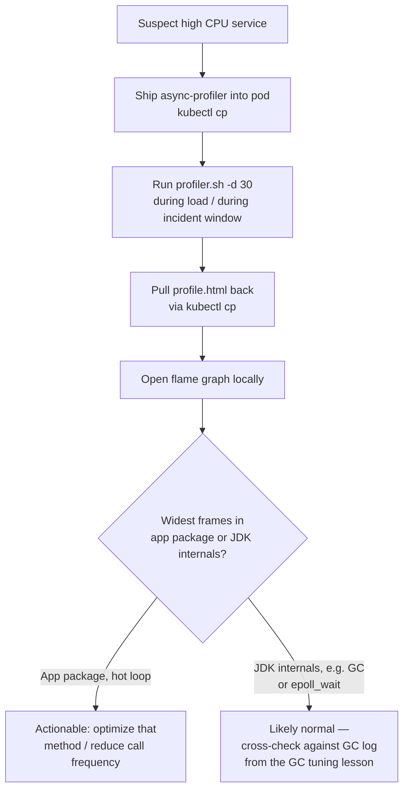

Thread dumps tell you where threads are stuck *right now*; `top -H` tells you which thread is hot but only at coarse granularity. Neither answers "which method, specifically, is burning 80% of this CPU-bound service's time" — that requires an actual sampling profiler attached to the live JVM. This lesson covers `async-profiler`, the standard tool for exactly this, run against a pod without stopping or restarting the JVM, producing a flame graph you read visually instead of parsing line-by-line.

This gets its own focused lesson, separate from the thread-dump lesson earlier in this module, because profiling deserves a different mental model: thread dumps are point-in-time snapshots you correlate by hand across several captures, while a profiler samples continuously over a window and aggregates automatically into one picture.

> **Prerequisites:** Complete [Actuator Runbooks and Ephemeral Debug Containers](/course/advanced/actuator-and-ephemeral-debug-containers/) first — you'll use the same `kubectl cp`/`kubectl exec` fluency, and the same ephemeral-container approach applies if your target image has no shell for unpacking the profiler.

## Why async-profiler instead of just more thread dumps

Manually taking repeated thread dumps to find a hot method works, but it's slow and statistically weak — you're eyeballing a handful of samples and hoping you caught the busy frame. `async-profiler` uses either `perf_events` (on Linux, which is what containers run on) or JVMTI-based sampling to take hundreds or thousands of stack samples per second over a defined duration, then aggregates them into a flame graph — a single visual where the width of each frame is proportional to how often it appeared across all samples. Wide frames are where the CPU time is actually going. This is strictly more rigorous than manual dump correlation, and it doesn't require pausing the JVM to do it.

## Running it against a live pod

```bash
kubectl cp async-profiler.tar.gz <ns>/<pod>:/tmp/
kubectl exec -it <pod> -n <ns> -- tar xzf /tmp/async-profiler.tar.gz -C /tmp

kubectl exec -it <pod> -n <ns> -- /tmp/async-profiler/profiler.sh -d 30 -f /tmp/profile.html 1
kubectl cp <ns>/<pod>:/tmp/profile.html ./profile.html   # open flame graph locally
```

Walking through each piece:

- `kubectl cp async-profiler.tar.gz <ns>/<pod>:/tmp/` — ship the profiler binary into the pod. It's a self-contained tarball with no installation step, which is exactly why it works well against minimal container images (assuming there's at least a shell to unpack and run it — for a fully distroless target with no shell at all, unpack and run it from an ephemeral debug container instead, sharing the process namespace as covered in the previous lesson).
- `profiler.sh -d 30 -f /tmp/profile.html 1` — profile for 30 seconds (`-d 30`), write an interactive HTML flame graph (`-f /tmp/profile.html`), attaching to PID `1` (the JVM, which is almost always PID 1 in a container).
- The `kubectl cp` back out at the end pulls the HTML file to your laptop, where you open it in a browser — no server-side rendering needed, the flame graph is self-contained interactive HTML/JS.

Run the profile *during* the period you're trying to explain — kick off a load test or wait for the real traffic pattern that causes the high CPU, and start the 30-second (or longer) capture window so it overlaps with the behavior you're investigating. A profile taken during idle time just tells you the JVM is idle.

## Reading the flame graph

- The x-axis has no time meaning — it's alphabetically sorted stacks, not a timeline. Don't read it left-to-right as "what happened first."
- The y-axis is stack depth: the bottom frame is where sampling started (often `main` or a thread pool's run loop), and each frame above is a method called by the one below it.
- Width is the signal: a wide frame means that method (or its children collectively) was on-CPU in a large fraction of all samples taken. A single wide frame near the top of a tall stack (not called by much else) usually is your hotspot.
- Look for wide frames in *your* application packages first, not JDK internals — a wide `ObjectMapper.writeValueAsString` or `String.format` frame in a hot loop is actionable; a wide `epoll_wait` frame in an idle Netty event loop thread is normal and not a problem.



## Lab

1. Deploy a Spring Boot service with a deliberately inefficient hot path — e.g. an endpoint that does unnecessary repeated `String` concatenation in a loop, or serializes the same large object graph to JSON on every call without caching:
   ```bash
   kubectl -n advanced-lab apply -f cpu-hotspot-deployment.yaml
   POD=$(kubectl -n advanced-lab get pod -l app=cpu-hotspot -o jsonpath='{.items[0].metadata.name}')
   ```
2. Download `async-profiler` locally (matching the JVM's OS/arch inside the container — check with `kubectl exec -it "$POD" -n advanced-lab -- uname -a` first), then ship it into the pod:
   ```bash
   kubectl cp async-profiler.tar.gz advanced-lab/"$POD":/tmp/
   kubectl exec -it "$POD" -n advanced-lab -- tar xzf /tmp/async-profiler.tar.gz -C /tmp
   ```
3. Start a load test against the hot endpoint in the background, then immediately start a 30-second profile so the capture window overlaps the load:
   ```bash
   kubectl -n advanced-lab port-forward svc/cpu-hotspot 8080:8080 &
   hey -z 35s -c 10 http://localhost:8080/hot-endpoint &
   kubectl exec -it "$POD" -n advanced-lab -- /tmp/async-profiler/profiler.sh -d 30 -f /tmp/profile.html 1
   ```
4. Pull the flame graph back and open it locally:
   ```bash
   kubectl cp advanced-lab/"$POD":/tmp/profile.html ./profile.html
   open ./profile.html   # or your OS's equivalent
   ```
5. Identify the widest frame inside your own application package, confirm it corresponds to the inefficient code you deliberately introduced, then fix the code, redeploy, and re-run the same profiling steps to confirm the frame has shrunk or disappeared.

## Checkpoint

- [ ] I can explain why async-profiler's sampling approach is statistically stronger than manually correlating repeated thread dumps.
- [ ] I can ship the profiler into a pod, run a timed capture against PID 1, and pull the resulting HTML back out.
- [ ] I can correctly read a flame graph's axes — width as sample frequency, height as stack depth, no left-to-right time meaning.
- [ ] I know to overlap the profiling window with the actual load or incident behavior, not idle time.
- [ ] I completed the lab and identified a real hotspot frame in my own application code, then confirmed a fix reduced it.
