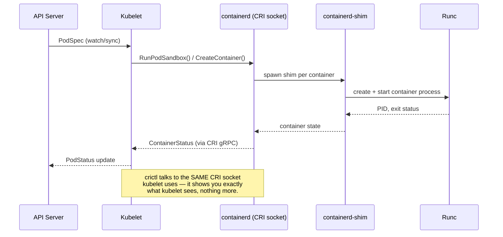

Everything you've diagnosed so far — pod crashes, probe failures, thread dumps, mesh latency — assumed the node underneath the pod and the control plane above it were healthy. This lesson removes that assumption. You'll learn how `kubelet` talks to `containerd`, how node conditions like `DiskPressure` and `MemoryPressure` trigger the eviction manager to kill pods that did nothing wrong, and how to check whether `etcd` and the API server themselves are the root cause. This is the layer where "restart the pod" stops being the answer — you're now debugging the machinery that runs pods, not the pods themselves.

As an incident commander or on-call lead, this matters because node- and control-plane-level failures have a much larger blast radius than a single bad deploy: one node under memory pressure can evict pods from a dozen unrelated services, and a slow etcd can make the entire cluster's API feel broken even though every workload is fine. You need to be able to tell "my Spring Boot app has a bug" apart from "the platform underneath it is degrading" within the first two minutes of an incident.

> **Prerequisites:** This lesson assumes you've completed the [Advanced capstone](/course/advanced/capstone-production-incident-simulation/) and are comfortable reading `kubectl describe pod`, pod status, and cluster events without prompting. If node conditions, taints, or `kubectl drain` are unfamiliar territory, skim the Intermediate scheduling material first — this lesson goes straight to the internals, not the basics.

## The kubelet / containerd / crictl relationship

Every node runs a `kubelet` process that is the only component talking directly to the container runtime. Since Kubernetes 1.24 removed dockershim, that runtime is `containerd` (or CRI-O) on virtually every managed and self-managed cluster you'll encounter. `kubelet` never calls `containerd` directly as a binary — it speaks the **Container Runtime Interface (CRI)**, a gRPC API, and `crictl` is the debugging client that speaks the same protocol so you can inspect exactly what `kubelet` sees.



Because `crictl` and `kubelet` share the same CRI socket, `crictl` is the ground truth when `kubectl` disagrees with reality — for example when a pod is stuck `Terminating` in the API but you need to know if the container process is actually still running on the node.

## Getting node-level access

You rarely have SSH to nodes in a managed cluster. The portable way in is `kubectl debug node`, which schedules a privileged debug pod on the target node and lets you `chroot` into the host filesystem:

```bash
kubectl get nodes -o wide
kubectl describe node <node>
kubectl top node <node>

# All pods on a suspect node
kubectl get pods -A -o wide --field-selector spec.nodeName=<node>

# Node conditions history
kubectl get events -A --field-selector involvedObject.kind=Node,involvedObject.name=<node>

# kubelet logs (requires node access via SSH or debug pod)
kubectl debug node/<node> -it --image=busybox -- chroot /host
journalctl -u kubelet -n 200 --no-pager       # once chrooted
journalctl -u containerd -n 200 --no-pager
```

## crictl deep dive

Once you have node access (via `kubectl debug node` + `chroot /host`, or SSH on self-managed infrastructure), `crictl` gives you the runtime's view directly, bypassing the API server entirely:

```bash
kubectl debug node/<node> -it --image=busybox -- chroot /host
crictl ps -a
crictl logs <container-id>
crictl inspect <container-id>
```

`crictl ps -a` shows every container containerd knows about, including ones the API server has already forgotten (e.g., a pod object was deleted but the container is still tearing down). `crictl inspect` dumps the full CRI container spec — cgroup paths, mounts, and the exact command that was run — which is invaluable when `kubectl describe pod` shows a vague `CrashLoopBackOff` with no other detail.

## Node conditions and the eviction manager

`kubelet` reports node **conditions** that summarize the health of the node's resources. The eviction manager watches these conditions and proactively kills pods to relieve pressure *before* the node becomes completely unusable — this is different from the OOM killer, which is a last-resort kernel action.

| Condition | Meaning | Typical trigger |
|---|---|---|
| `Ready` | kubelet is healthy and can accept pods | kubelet heartbeat to API server |
| `MemoryPressure` | Available memory has dropped below an eviction threshold | Node-level memory (not container-level) is scarce |
| `DiskPressure` | Available disk or inodes on the node have dropped below threshold | Image/container writable layer growth, log accumulation |
| `PIDPressure` | Available process IDs on the node are running low | Fork bombs, runaway thread creation across many pods |
| `NetworkUnavailable` | Node's network is not correctly configured | CNI plugin not yet initialized |

When a condition like `DiskPressure` fires, `kubelet` evicts pods to reclaim resources — and critically, it does **not** respect PodDisruptionBudgets when doing so, because eviction here is a kubelet-local safety action, not an API-server-mediated eviction subject to the Eviction API's PDB checks. It picks victims by QoS class first (`BestEffort` before `Burstable` before `Guaranteed`), then by usage above requests. This is why you can see pods from completely unrelated namespaces disappear from a single node under pressure — the eviction manager doesn't know or care about your namespace boundaries, only resource usage and QoS class.

## etcd health (self-managed control plane)

If you're running self-managed Kubernetes (kubeadm, kops, on-prem), `etcd` is the cluster's single source of truth, and its health is your control plane's health. On managed clusters (EKS/GKE/AKS) you don't get direct etcd access — the cloud provider owns it — but you should still know what "healthy etcd" means so you can interpret managed control-plane symptoms correctly.

```bash
kubectl -n kube-system get pods -l component=etcd
kubectl -n kube-system exec -it etcd-<master> -- etcdctl endpoint health --cluster
kubectl -n kube-system exec -it etcd-<master> -- etcdctl endpoint status --cluster -w table
kubectl -n kube-system exec -it etcd-<master> -- etcdctl alarm list
```

`etcdctl endpoint status --cluster -w table` is the single most useful command here — it shows you leader status, raft term, and DB size across all members in one table. A member with a much higher raft term or one that isn't the leader when it should be tells you there was a recent leadership election, often correlated with network partition or disk latency spikes. `etcdctl alarm list` surfaces things like `NOSPACE` (the db size quota was hit — a classic "etcd is unwriteable and now nothing in the cluster can be scheduled" incident).

## API server health

The API server exposes its own health surface, independent of whether individual workloads are healthy:

```bash
kubectl get --raw='/healthz?verbose'
kubectl get --raw='/readyz?verbose'
```

`/healthz?verbose` and `/readyz?verbose` return a line per internal check (`etcd`, `poststarthook/...`, `shutdown`, etc.) with `ok` or `failed`. When users report "kubectl is slow" or "deploys are hanging," this is the first thing to check — it tells you definitively whether the control plane itself is the bottleneck before you go chasing workload-level explanations.

## Drain and cordon workflow

Planned maintenance uses the same primitives you'll reach for during an incident to safely evacuate a node under suspicion:

```bash
kubectl cordon <node>
kubectl drain <node> --ignore-daemonsets --delete-emptydir-data
kubectl uncordon <node>
```

`cordon` marks the node unschedulable without touching running pods — always your first move on a suspect node, because it stops the bleeding (no new pods land there) without yet disrupting anything. `drain` then evicts existing pods respecting PodDisruptionBudgets (unlike the eviction-manager path above), and `--ignore-daemonsets` is required because DaemonSet pods are meant to run on every node and can't be "moved." `--delete-emptydir-data` is required if any pod uses an `emptyDir` volume, since that data is node-local and drain will otherwise refuse to proceed.

## Where node problems point next

| Finding | Go to |
|---|---|
| Node pressure is causing pod evictions across namespaces | [Persistent Storage for Stateful Workloads](/course/intermediate/persistent-storage-for-stateful-workloads/) (ephemeral storage/disk pressure), [Observability: Metrics, Logs, Traces, and Autoscaling](/course/advanced/observability-metrics-logs-traces/) (HPA/VPA/PDB) |
| Node is fine but you suspect the CNI/network plugin | [Low-Level Networking and Packet Capture](/course/expert/low-level-networking-and-packet-capture/) |
| Cloud-managed node group (EKS/GKE/AKS) specific issue | [Cloud-Managed Clusters](/course/expert/cloud-managed-clusters-eks-gke-aks/) |

## Lab

This lab needs a **real multi-node cluster** — a single-node kind/minikube cluster can't reproduce cross-node eviction blast radius, and you can't safely fake `DiskPressure` on your only node without losing your control plane too. If you don't have cloud access, a 3-node kubeadm cluster on local VMs (multipass, Vagrant, or three cloud spot instances) is the minimum viable setup.

1. Pick one worker node and identify it: `kubectl get nodes -o wide`.
2. Fill its disk artificially to trigger `DiskPressure`: `kubectl debug node/<node> -it --image=busybox -- chroot /host` then `dd if=/dev/zero of=/tmp/fill.img bs=1M count=<enough-to-cross-threshold>` (check `df -h` first — the default eviction threshold is typically `imagefs.available<15%`).
3. Deploy several unrelated small workloads across at least 2 namespaces, scheduled so some land on the target node.
4. Watch `kubectl get events -A --field-selector involvedObject.kind=Node,involvedObject.name=<node>` and `kubectl get pods -A -o wide` — observe which pods get evicted and confirm the QoS-class-first ordering.
5. Chroot into the node and correlate with `journalctl -u kubelet -n 200 --no-pager` — find the exact eviction manager log lines.
6. Cordon and drain the node cleanly, then clean up the disk-filling file and uncordon.
7. Separately, run `kubectl get --raw='/healthz?verbose'` against your lab cluster and read every line of output — identify which checks exist even when everything is healthy, so you recognize the failure output later.

## Checkpoint

- [ ] I can explain why `crictl` and `kubelet` never disagree about container state, but `kubectl` sometimes does.
- [ ] I can name all four node conditions and one realistic trigger for each.
- [ ] I understand why eviction-manager-driven evictions ignore PodDisruptionBudgets while `kubectl drain` does not.
- [ ] I can run and interpret `etcdctl endpoint status --cluster -w table` output to spot a leadership election.
- [ ] I know the difference between `cordon` and `drain` and can state why `cordon` is always the safer first move on a suspect node.
