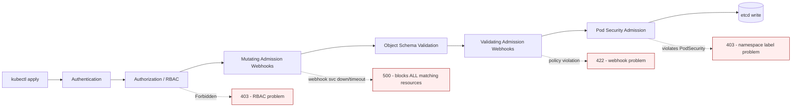

Every object you've ever created with `kubectl apply` passed through a request pipeline you probably never thought about: authentication, authorization (RBAC), then a chain of admission controllers that can mutate or reject the request before it's ever written to etcd. This lesson is about the failure mode that catches even experienced teams off guard — a single broken admission webhook can block **every** matching resource creation cluster-wide, not just the one deploy someone happened to be testing. You'll learn to recognize this pattern fast, because it looks like "everything is suddenly broken" when the actual fault is one small, often recently-changed, webhook configuration.

You already know RBAC and ServiceAccount basics from Intermediate — `kubectl auth can-i`, role bindings, and service account tokens. This lesson doesn't repeat that; it builds on top of it, because a webhook denial and an RBAC `Forbidden` error produce confusingly similar symptoms (both look like "I tried to create something and got rejected") but require completely different fixes. As an incident commander, telling these apart quickly is a core skill — you'll often get paged for "deploys are failing" with zero information about which of these two layers is the actual culprit.

> **Prerequisites:** This lesson builds directly on [Node and Control Plane Internals](/course/expert/node-and-control-plane-internals/). Make sure you're solid on the request-authorization basics from Intermediate RBAC material before continuing — this lesson assumes you already know what `kubectl auth can-i` does.

## Where admission fits in the request pipeline



Notice the order: RBAC happens *before* any webhook runs. If a request fails at RBAC, no webhook ever sees it. If a request passes RBAC but a mutating or validating webhook's backing service is unreachable, timing out, or returning errors, the API server rejects the request — and it does this for **every single resource matching that webhook's rules**, from every namespace, every user, every CI pipeline, simultaneously. This is the blast radius that makes webhook failures uniquely dangerous: one platform-team change to a webhook deployment can look like a cluster-wide outage to every team deploying that day.

## Distinguishing RBAC, webhook, and Pod Security Admission failures

First, rule out or confirm the RBAC layer — this is Intermediate-level material, so just the fast checks:

```bash
kubectl auth can-i create pods --namespace <ns>
kubectl auth can-i create pods --as=system:serviceaccount:<ns>:<sa-name> -n <ns>
kubectl auth can-i --list --as=system:serviceaccount:<ns>:<sa-name> -n <ns>

kubectl get rolebindings,clusterrolebindings -A -o wide | grep <sa-name>
```

If RBAC says yes but the create/update still fails, look at Pod Security Admission next — a namespace-level label-driven check that's often confused for a webhook because the error text looks similar:

```bash
kubectl get events -n <ns> | grep -i "violates PodSecurity"
kubectl describe namespace <ns> | grep pod-security
```

If neither of those explains it, you're looking at a webhook problem:

```bash
kubectl get validatingwebhookconfigurations
kubectl get mutatingwebhookconfigurations
kubectl describe validatingwebhookconfiguration <name>
```

The critical operational fact: **if a webhook's backing service is down, ALL matching resource creates/updates fail cluster-wide.** Before you spend time on the specific object that failed, check the webhook's target service and pod health first — that's very often the entire incident.

## Reading a webhook configuration for blast radius

`kubectl describe validatingwebhookconfiguration <name>` shows you the `rules` (which API groups/versions/resources/operations it intercepts), the `namespaceSelector`/`objectSelector` (which narrows the blast radius — or, if absent, means *everything* matching the rule is affected), and the `failurePolicy`.

`failurePolicy` is the single most important field during an incident:

| failurePolicy | Behavior when webhook is unreachable |
|---|---|
| `Fail` (default for most security-sensitive webhooks) | The request is **rejected**. If the webhook backend is down, every matching create/update cluster-wide starts failing immediately. |
| `Ignore` | The request is **allowed through** without that webhook's check. Silent — you won't see errors, but you also silently lose whatever policy/mutation the webhook was supposed to enforce. |

A `failurePolicy: Fail` webhook with a broad `rules` match and no `namespaceSelector` is the highest-blast-radius object in the entire cluster's admission chain — worse than almost any single workload failure, because it can take down deploys for every team at once. When you inherit a cluster, auditing every webhook's `failurePolicy` and selector scope is worth doing before you ever need it during an incident.

## Fast triage sequence for "deploys are suddenly failing everywhere"

1. Check webhook configs first, not the failing deploy: `kubectl get validatingwebhookconfigurations`, `kubectl get mutatingwebhookconfigurations`.
2. For each webhook whose rules could plausibly match what's failing, find its backing service: `kubectl describe validatingwebhookconfiguration <name>` — look at `clientConfig.service`.
3. Check that service's pods: `kubectl get pods -n <webhook-namespace> -l <webhook-selector>` — is it `CrashLoopBackOff`, `0/1 Ready`, or simply scaled to zero?
4. Check its logs for the actual admission review errors: `kubectl logs <webhook-pod> -n <webhook-namespace>`.
5. If confirmed, the fastest mitigation is almost always restoring the webhook service to health — not touching every failing deploy individually, since they'll all recover the moment the webhook backend is healthy again.

## Where this points next

| Finding | Go to |
|---|---|
| ServiceAccount needs cloud IAM permissions (AWS/GCP/Azure) | [Cloud-Managed Clusters](/course/expert/cloud-managed-clusters-eks-gke-aks/) |
| Blocked GitOps deploy caused by a webhook | [GitOps, Progressive Delivery & Rollback](/course/expert/gitops-progressive-delivery-and-rollback/) |
| Need to check Secret content a ServiceAccount should access | Intermediate ConfigMap/Secret material |

## Lab

This lab is fully simulatable on a local kind/minikube cluster — no cloud account or multi-node setup needed, since admission control is an API-server-level feature available identically everywhere.

1. Deploy a minimal validating webhook server (a small HTTP service that always returns `allowed: true` is enough to start) and register it with a `ValidatingWebhookConfiguration` scoped to `pods` create operations, `failurePolicy: Fail`.
2. Confirm normal pod creation still works.
3. Scale the webhook's backing deployment to zero: `kubectl scale deployment <webhook-deploy> -n <webhook-ns> --replicas=0`.
4. Attempt to create a pod anywhere in the cluster and observe the rejection — note that it affects namespaces that have nothing to do with your test.
5. Change `failurePolicy` to `Ignore`, repeat step 4, and observe the difference — the create now silently succeeds with no policy enforcement.
6. Restore `failurePolicy: Fail` and scale the webhook backend back up; confirm pod creation recovers immediately without touching anything else.
7. Practice the triage sequence above from a cold start (have a partner break something while you're not looking) and time yourself.

## Checkpoint

- [ ] I can order authentication, RBAC, mutating webhooks, schema validation, validating webhooks, and Pod Security Admission correctly in the request pipeline.
- [ ] I can explain why a webhook failure has a larger blast radius than an RBAC failure.
- [ ] I know the practical difference between `failurePolicy: Fail` and `failurePolicy: Ignore` and can state a real risk of each.
- [ ] Given "deploys are failing everywhere," I can name the first three commands I'd run before looking at any individual failing deploy.
- [ ] I can distinguish a Pod Security Admission rejection from a webhook rejection by where I'd look for evidence.
