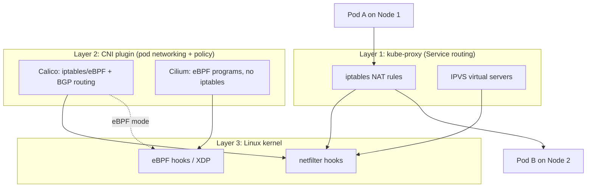
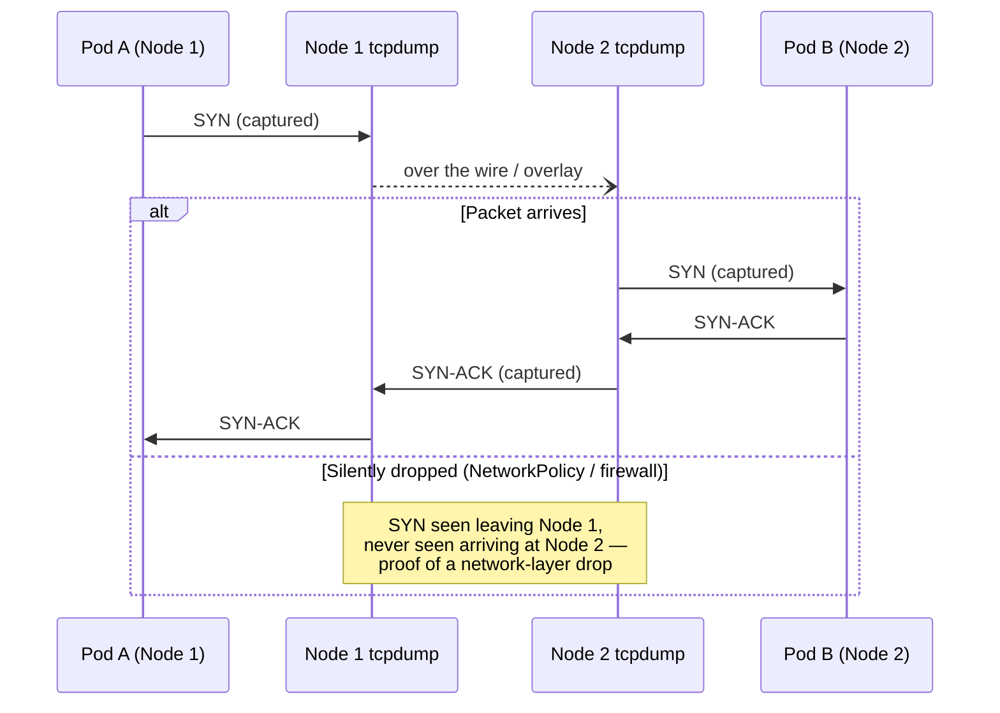

The Advanced-level networking lesson taught you to debug CNI issues on a single node — is the CNI pod healthy, is the interface up, can this one pod reach the network. This lesson goes a level deeper: how traffic actually gets routed *between* nodes across the whole cluster, how `NetworkPolicy` is actually enforced at the packet level (not just "the policy exists"), and how to prove, with a packet capture, that a connection is being silently dropped by the network layer rather than rejected by the application. This is cluster-wide network architecture, not single-node troubleshooting.

This matters for incident command because "the network is slow" or "service A can't reach service B" is one of the most common vague escalations you'll get, and without packet-level evidence you can spend hours guessing between application bugs, DNS, NetworkPolicy, and genuine infrastructure failure. Being able to definitively say "the SYN packet left node A and never arrived at node B" turns a guessing game into a fact, and it's the difference between an incident commander who directs the right team immediately and one who bounces the incident between three teams.

> **Prerequisites:** This builds on [Admission Control and Webhook Failures](/course/expert/admission-control-and-webhook-failures/). You should already be comfortable with the single-node CNI debugging workflow from the Advanced networking lesson (`/course/advanced/`) — checking CNI pod health, basic `NetworkPolicy` existence, and Service/Endpoint mismatches — before tackling cross-node packet-level analysis here.

## Three layers of Kubernetes networking enforcement



`kube-proxy` handles Service-to-pod load balancing (ClusterIP resolution to actual pod IPs). The CNI plugin handles pod-to-pod routing across nodes and enforces `NetworkPolicy`. Both ultimately program the same Linux kernel packet-filtering machinery, but through different mechanisms depending on mode — and knowing which mode your cluster runs determines which tool you reach for when something's dropped.

## kube-proxy: iptables vs IPVS

`kube-proxy` runs on every node and is responsible for making a Service's ClusterIP actually route to one of its backing pod IPs. It has two implementation modes:

```bash
kubectl -n kube-system get pods -l k8s-app=kube-proxy
kubectl -n kube-system logs <kube-proxy-pod>

# On the node itself (via debug pod with hostNetwork, or SSH)
kubectl debug node/<node-name> -it --image=nicolaka/netshoot
iptables -t nat -L -n | grep <service-cluster-ip>       # iptables mode
ipvsadm -Ln | grep <service-cluster-ip>                  # IPVS mode
```

**iptables mode** programs a chain of NAT rules per Service — with `KUBE-SERVICES` → `KUBE-SVC-<hash>` → `KUBE-SEP-<hash>` chains, one SEP (service endpoint) chain per backing pod, with probabilistic jump rules for load balancing. This scales linearly (badly) with Service and endpoint count — clusters with thousands of Services can see real `kube-proxy` sync latency.

**IPVS mode** uses the kernel's IP Virtual Server subsystem, which is a proper hash-table-based load balancer built for exactly this purpose. It's O(1) lookup regardless of Service count and supports more load-balancing algorithms (round-robin, least-connection, etc.). Most large-scale production clusters run IPVS for this reason. When you're debugging Service routing at scale, `ipvsadm -Ln` gives you a much more direct view of real-time connection state than parsing iptables chains.

## Calico and Cilium architecture

Both are CNI plugins, but they take fundamentally different approaches, and knowing which one you're running changes your entire debugging toolkit.

**Calico** traditionally uses iptables (with an eBPF mode available) for policy enforcement and BGP for cross-node routing — each node peers with others (or with route reflectors) to distribute pod CIDR routes, so packets between nodes are routed at L3 using standard BGP-learned routes, no overlay/tunnel required in the common configuration.

**Cilium** is eBPF-native from the ground up — it doesn't use iptables at all for its core data path. Policy enforcement, load balancing, and observability all happen via eBPF programs attached to kernel hooks, which is significantly faster at scale and gives much richer introspection:

```bash
kubectl -n kube-system get pods -l k8s-app=calico-node -o wide
kubectl -n kube-system logs <calico-node-pod>

# Cilium-specific
kubectl -n kube-system exec -it <cilium-pod> -- cilium status
kubectl -n kube-system exec -it <cilium-pod> -- cilium endpoint list
kubectl -n kube-system exec -it <cilium-pod> -- cilium monitor --type drop
```

`cilium monitor --type drop` is the single most valuable Cilium command for cluster-wide network incidents — it streams every packet the eBPF datapath is actively dropping, in real time, cluster-wide, along with the reason (policy denied, no route, etc.). There's no iptables equivalent this direct; with Calico in iptables mode you'd instead be correlating `iptables -L -v -n` packet counters on `DROP` targets across nodes, which is much more manual.

## NetworkPolicy enforcement path

`NetworkPolicy` objects are pure Kubernetes API objects — they do nothing by themselves. The CNI plugin watches them and translates them into its own enforcement primitives (iptables rules, eBPF programs, or Calico's own policy engine). This means a `NetworkPolicy` that "exists" but isn't being enforced is a real failure mode if the CNI's policy controller is unhealthy.

```bash
kubectl get networkpolicy -n <ns>
kubectl describe networkpolicy <policy> -n <ns>

# Test with a temporary unrestricted pod in the same namespace
kubectl run netshoot --rm -it --image=nicolaka/netshoot -n <ns> -- bash
# inside: curl, dig, nc, tcpdump, mtr all available
```

The critical distinction for incident diagnosis: a `NetworkPolicy` block happens at the network layer — the connecting side sees a hang or a timeout waiting on the SYN, **not** a clean TCP RST and definitely not an application-level HTTP error. If you see an immediate "connection refused," that's usually not a NetworkPolicy — that's nothing listening on the port. If you see a hang until timeout, that's consistent with a silent drop, which is exactly what most CNI implementations do for `NetworkPolicy`-denied traffic (drop, don't reject) — confirming this requires a packet capture, not just reading the policy YAML.

## Packet-level debugging across nodes

This is the technique for definitively answering "did the packet leave, and did it arrive":

```bash
kubectl debug node/<node> -it --image=nicolaka/netshoot -- tcpdump -i any host <pod-ip> -w /tmp/capture.pcap
kubectl cp <node-debug-pod>:/tmp/capture.pcap ./capture.pcap   # analyze in Wireshark
```

For a cross-node failure, you run this **simultaneously on both the source and destination node** — one filtered on the source pod IP, one on the destination pod IP — and compare. If you see the SYN leave the source node's capture but it never appears in the destination node's capture, the packet was dropped somewhere in between: a NetworkPolicy enforcement point, a security group/firewall rule at the cloud layer, or a broken overlay tunnel. If the SYN arrives at the destination but no SYN-ACK goes back, the problem is on the destination node — likely a `NetworkPolicy` ingress rule or the application itself not listening.



Once you have the `.pcap` file locally, Wireshark's `Statistics > Conversations` view quickly shows you which TCP streams completed the handshake and which didn't, and `tcp.analysis.retransmission` as a display filter surfaces exactly the connections that are stuck retrying — usually your incident's actual affected traffic, buried among everything else on the node.

## Where this points next

| Finding | Go to |
|---|---|
| Node itself is under resource pressure, not a network issue | [Node and Control Plane Internals](/course/expert/node-and-control-plane-internals/) |
| Cloud provider security groups/firewall rules are the actual block | [Cloud-Managed Clusters](/course/expert/cloud-managed-clusters-eks-gke-aks/) |
| Confirmed policy block, need to fix the policy itself | Intermediate/Advanced NetworkPolicy material |

## Lab

The core diagnostic technique (dual-node `tcpdump` correlation) genuinely requires a **multi-node cluster** — a single-node kind/minikube setup collapses "cross-node" into loopback traffic and won't show you a real drop. A 2-3 node kubeadm cluster (local VMs or cloud) with Calico or Cilium installed is the right lab environment. The iptables/IPVS inspection portions can be done on any cluster, including single-node.

1. Install a cluster with either Calico or Cilium (if you have a choice, do this lab once with each over time — the debugging commands are different enough to be worth separate practice).
2. Deploy two small workloads (e.g. netshoot pods) in different namespaces, forced onto different nodes with `nodeSelector` or `podAntiAffinity`.
3. Confirm baseline connectivity between them with `curl`/`nc`.
4. Apply a `NetworkPolicy` in the destination namespace that denies ingress from the source namespace.
5. Attempt the connection again from the source pod — note it hangs rather than refusing immediately.
6. Run simultaneous `tcpdump` captures on both nodes as shown above, reproduce the failed connection, and pull both `.pcap` files locally.
7. Open both in Wireshark and confirm: SYN visible leaving the source node, never arriving at the destination node.
8. If running Cilium, repeat using `cilium monitor --type drop` instead of raw `tcpdump` and compare how much faster you get the same answer.
9. Remove the `NetworkPolicy`, confirm recovery, and re-run the capture to see a completed three-way handshake for contrast.

## Checkpoint

- [ ] I can explain the difference between what `kube-proxy` does and what the CNI plugin does.
- [ ] I can state one real operational difference between iptables mode and IPVS mode for `kube-proxy` at scale.
- [ ] I can explain why Cilium's `cilium monitor --type drop` has no direct iptables-mode equivalent.
- [ ] I can distinguish, from symptoms alone, a NetworkPolicy-style silent drop from a "nothing listening" connection refused.
- [ ] I can design and run a dual-node packet capture to prove a cross-node packet was dropped in transit.
