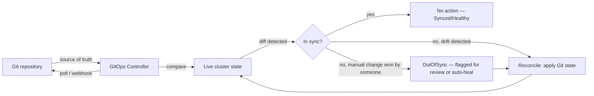
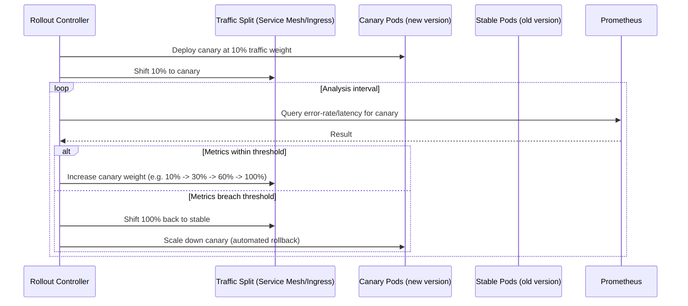

By now you can diagnose almost any layer of a running cluster. This lesson is about the layer that decides what gets deployed in the first place: GitOps controllers like ArgoCD and Flux that continuously reconcile your cluster state against a Git repository, and progressive delivery tooling (Argo Rollouts, Flagger) that can automatically roll back a bad deploy before a human even notices. You'll learn to read reconciliation drift, diagnose a rollout that's stuck partway, and understand exactly how automated rollback decides "this canary failed" from a Prometheus query.

This is core on-call-lead material because in a GitOps shop, "someone ran a bad `kubectl apply`" mostly stops being possible — but "the GitOps controller applied something bad from Git, or refuses to apply something good," becomes the new failure mode you have to reason about instead. You need to be able to look at a stuck deployment and immediately know whether the problem is in Git, in the controller's reconciliation, in the rollout strategy's health checks, or in the workload itself — and that diagnostic ordering is exactly what this lesson builds.

> **Prerequisites:** This builds on [Cloud-Managed Clusters](/course/expert/cloud-managed-clusters-eks-gke-aks/). You should be comfortable with basic `kubectl rollout` mechanics and Deployment strategy fields (`maxSurge`/`maxUnavailable`) from Advanced-level material before this lesson, which assumes that baseline and layers GitOps and progressive delivery on top of it.

## The GitOps reconciliation loop

Both ArgoCD and Flux implement the same core control loop, continuously, forever: watch Git, compare desired state to live cluster state, and reconcile any drift back toward what Git says should exist.



The critical mental model shift from plain `kubectl apply` workflows: if someone manually edits a live object with `kubectl edit` or `kubectl scale`, a GitOps controller running in auto-sync mode will silently revert it back to what's in Git on the next reconciliation pass. This looks like "my emergency scale-up got undone by itself" if you don't know a GitOps controller owns that resource — which is exactly the kind of surprise you want to have already understood *before* you're in an incident trying to manually mitigate something.

## Rollout status and history (the foundation)

Before touching any GitOps-specific tooling, these are the raw primitives every rollout diagnosis starts from:

```bash
kubectl rollout status deployment/<deploy> -n <ns>
kubectl rollout history deployment/<deploy> -n <ns>
kubectl rollout history deployment/<deploy> -n <ns> --revision=3

# Roll back immediately if a bad deploy is confirmed
kubectl rollout undo deployment/<deploy> -n <ns>
kubectl rollout undo deployment/<deploy> -n <ns> --to-revision=2

# Diff what's live vs what's in git (drift)
kubectl diff -f k8s/deployment.yaml
```

`kubectl rollout undo` is your fastest possible mitigation in a plain (non-GitOps) deploy — but if the deployment is GitOps-managed, using it is often a mistake: the controller will simply reconcile your manual rollback away again on the next sync, unless you also revert or pause the source in Git. Know which world you're in before you reach for this command during an incident.

## Helm rollback

Many GitOps setups deploy Helm charts under the hood, and Helm keeps its own independent revision history you can inspect and roll back directly:

```bash
helm list -n <ns>
helm status <release> -n <ns>
helm history <release> -n <ns>
helm get values <release> -n <ns>
helm rollback <release> <revision> -n <ns>
helm diff upgrade <release> <chart> -f values.yaml -n <ns>   # requires helm-diff plugin
```

`helm diff upgrade` (via the `helm-diff` plugin) is worth installing on every operator's machine ahead of time — it shows you exactly what a pending `helm upgrade` would change against the live release, which is the single best way to catch an unexpectedly large diff (like an accidental full values file replacement) before it goes live rather than after.

## ArgoCD

```bash
argocd app get <app-name>
argocd app diff <app-name>
argocd app history <app-name>
argocd app rollback <app-name> <revision-id>
argocd app logs <app-name> --follow
```

`argocd app get <app-name>` gives you two independent status fields that you must read together, not separately: **Sync status** (does live state match Git) and **Health status** (are the resulting Kubernetes resources actually healthy — pods Ready, Deployment fully rolled out, etc.). An app can be `Synced` but `Degraded` (Git and cluster agree, but what they agree on is broken), or `OutOfSync` but `Healthy` (someone drifted the live state, but the drifted state happens to be working fine right now). Confusing these two axes is one of the most common ArgoCD misdiagnoses — "it says Synced so the deploy must have gone out correctly" ignores Health entirely.

## Flux

```bash
flux get kustomizations
flux logs --level=error --kind=Kustomization
```

Flux's model is intentionally more Kubernetes-native than ArgoCD's — `flux get kustomizations` shows you each `Kustomization` custom resource's own reconciliation status directly as a Kubernetes condition, and `flux logs --level=error --kind=Kustomization` filters the controller's own logs down to just reconciliation failures, which is usually your fastest path to "why hasn't this changed in 20 minutes" during an incident.

## Stuck rollout diagnosis

`kubectl rollout status` hanging indefinitely is one of the most common pages in a GitOps shop, and it always resolves to the same triage sequence:

```bash
kubectl get rs -n <ns> -l app=<app-label>          # check new ReplicaSet isn't scaling up
kubectl describe rs <new-rs> -n <ns>               # events will show WHY (same triage as pod status)
kubectl get deployment <deploy> -n <ns> -o jsonpath='{.spec.strategy}'   # confirm maxSurge/maxUnavailable aren't blocking progress with PDB
```

The pattern to look for: a new ReplicaSet exists but isn't scaling up, or is scaling up but its pods aren't reaching `Ready`. The former is usually a resource quota, a PodDisruptionBudget interacting badly with `maxUnavailable`, or an admission webhook rejecting the new pods (tying directly back to the [Admission Control](/course/expert/admission-control-and-webhook-failures/) lesson). The latter is a plain pod-readiness problem — probes, image pull, or application startup failure — which you already know how to diagnose from Intermediate and Advanced material.

## Progressive delivery: canary and blue-green with automated rollback

Argo Rollouts and Flagger both extend the basic Deployment rolling-update model into staged traffic shifting with automated analysis gates.



The core idea: instead of a human watching a dashboard after a deploy, you write the failure condition as a Prometheus query up front (e.g. `error-rate > 5%` or `p99 latency > 500ms` over a rolling window) and the rollout controller itself queries that condition at each analysis step, automatically reverting traffic to the stable version the moment the query breaches threshold — often within seconds, far faster than a human would notice and react. This is the single highest-leverage progressive-delivery technique for reducing incident frequency and severity, because it converts "bad deploy causes a 20-minute outage while someone gets paged and manually rolls back" into "bad deploy causes a brief blip visible only in metrics."

## Where this points next

| Finding | Go to |
|---|---|
| New ReplicaSet pods aren't becoming Ready | Intermediate/Advanced pod-lifecycle material |
| New pods are restarting | Intermediate/Advanced restart-diagnosis material |
| PodDisruptionBudget is blocking the rollout | Advanced resource/scheduling material |
| Stuck rollout traces back to a webhook | [Admission Control and Webhook Failures](/course/expert/admission-control-and-webhook-failures/) |

## Lab

Most of this lab is simulatable on a single-node kind/minikube cluster — ArgoCD, Flux, and Argo Rollouts all run fine locally. The one thing you can't fully simulate locally is a *realistic* automated-rollback-on-SLO-breach scenario, since that needs real traffic and a real Prometheus with meaningful data; a lightweight synthetic load generator (e.g. `hey` or `k6`) against a local cluster gets you close enough to practice the mechanics.

1. Install ArgoCD (or Flux) on a local cluster and connect it to a Git repository containing a simple Deployment manifest.
2. Confirm initial sync, then manually `kubectl scale` the deployment directly and watch the GitOps controller revert it on the next reconciliation — this is the "surprise" from the reconciliation-loop section, deliberately reproduced so it's no longer a surprise.
3. Install Argo Rollouts and convert the Deployment into a `Rollout` resource with a canary strategy and an `AnalysisTemplate` querying a Prometheus error-rate metric.
4. Deploy a "good" version and confirm the canary progresses through its traffic steps to 100%.
5. Deploy a deliberately broken version (e.g., one that returns HTTP 500 for some percentage of requests) behind a synthetic load generator, and watch the automated analysis catch the error-rate breach and roll back.
6. Separately, practice `helm rollback` on a plain Helm release: install a chart, upgrade it with a broken `values.yaml`, and roll back to the prior revision, confirming with `helm history`.
7. Deliberately create a stuck rollout (e.g., a PodDisruptionBudget with `minAvailable` set too high relative to `maxUnavailable`) and walk through the stuck-rollout triage sequence to find and fix it.

## Checkpoint

- [ ] I can explain why `kubectl rollout undo` can be actively counterproductive on a GitOps-managed resource.
- [ ] I can state the difference between ArgoCD's Sync status and Health status and give an example where they diverge.
- [ ] I can walk through the three-command stuck-rollout triage sequence from memory.
- [ ] I can describe how an automated canary rollback decides to trigger, including where the threshold is defined.
- [ ] I know when `helm rollback` is the right tool versus `kubectl rollout undo` versus reverting a Git commit.
