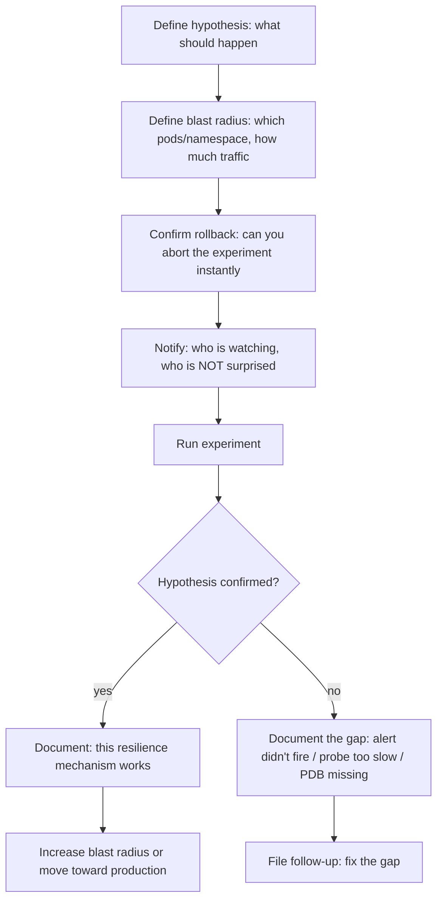

Everything up to this lesson has been reactive: something broke, and you diagnosed it. Chaos engineering flips that around — you deliberately break things on purpose, in a controlled way, to find out whether your alerting, probes, circuit breakers, and runbooks actually work *before* a real incident forces you to find out the hard way. This lesson covers Chaos Mesh and Litmus, the two dominant Kubernetes-native chaos engineering platforms, and how to design experiments that inject pod kills, network latency, and CPU stress safely.

This is the natural next step for an incident-commander-in-training: everything you've learned in this course so far assumed failures happen to you. Chaos engineering is where you start causing failures on your own terms, on a schedule you control, so that the muscle memory and tooling gaps get found during a Tuesday-afternoon game day instead of a Saturday-night page. It also directly validates work from earlier in the course — the probes you configured in Intermediate, the circuit breakers and PodDisruptionBudgets from Advanced, and the alerting you built are all things chaos experiments put to the test.

> **Prerequisites:** This builds on [GitOps, Progressive Delivery, and Rollback](/course/expert/gitops-progressive-delivery-and-rollback/). You should already understand liveness/readiness probes (Intermediate), and ideally circuit breakers and PodDisruptionBudgets (Advanced) — chaos experiments are only useful if you have a mental model of what "correct" resilience behavior looks like beforehand.

## Why controlled chaos, and not just "wait for an outage"

Real incidents are uncontrolled experiments: you don't know when they'll happen, what exactly failed, or whether your team was even paying attention when it did. A chaos experiment inverts every one of those properties — you choose the failure, you choose the blast radius, you choose the time, and you have someone specifically watching to see whether the expected safety mechanism (a probe, an alert, a PDB, a retry policy) actually engages. The value isn't the failure itself — it's finding the gap between what you *believe* your resilience mechanisms do and what they *actually* do, in an environment where finding that gap is a learning exercise instead of a customer-facing outage.

## Chaos Mesh vs Litmus at a glance

| | Chaos Mesh | Litmus |
|---|---|---|
| Origin | CNCF project, built by PingCAP | CNCF project, built by Harness (formerly ChaosNative) |
| Configuration model | Kubernetes CRDs per fault type (`PodChaos`, `NetworkChaos`, `StressChaos`, `IOChaos`, etc.) | `ChaosEngine` CRD referencing reusable `ChaosExperiment` templates from a public "ChaosHub" |
| Scheduling | Native `Schedule` CRD for recurring experiments | `ChaosSchedule` CRD, similar concept |
| Best fit | Teams who want fine-grained, code-reviewable CRDs per experiment type | Teams who want a library of pre-built, shareable experiments across an organization |
| Observability | Built-in dashboard (Chaos Dashboard) | Integrates with Litmus ChaosCenter |

Both are legitimate choices; if your organization already has one installed, use it rather than introducing a second chaos tool. The concepts below apply to both — the CRD names differ, but the experiment design questions are identical.

## Core experiment types

**Pod kills** validate that your Deployment/ReplicaSet reconciliation and readiness probes correctly detect and replace a killed pod without user-visible impact, and that your PodDisruptionBudget correctly limits how many can be killed at once. A Chaos Mesh `PodChaos` experiment with `action: pod-kill` targeting a label selector is the canonical version of this test.

**Network latency and partition** injection validates whether your Spring Boot service's timeouts, retries, and circuit breakers (Resilience4j, Hystrix-successor patterns from the Advanced service-mesh material) actually trip when a downstream dependency slows down, rather than cascading the slowness upward and exhausting thread pools. This is frequently where teams discover their circuit breaker's timeout threshold is set higher than the caller's own request timeout, which means the caller gives up and retries *before* the circuit breaker even has a chance to open — a very common and very avoidable production bug that's much cheaper to find in a chaos experiment.

**CPU/memory stress** injection validates your HPA scaling thresholds and resource requests/limits — does the pod get OOMKilled before the HPA reacts, does the HPA scale up in time to prevent request queuing, and do your alerts fire *before* users notice degraded latency rather than only after.

## Designing a safe experiment



The hypothesis step is the one teams most often skip, and it's the one that makes the experiment actually useful. "Let's kill a pod and see what happens" produces an anecdote. "We believe the readiness probe will detect the killed pod within 10 seconds and the Service will stop routing to it within 15 seconds, with zero 5xx responses to end users" produces a pass/fail result you can act on. Always start experiments in a non-production or clearly-scoped staging environment, and only graduate specific, already-validated experiment types into production once you have confidence and, ideally, an automated abort condition (chaos tooling can watch the same SLO metrics your progressive-delivery rollback does, and auto-abort if things go worse than expected).

## Example: Chaos Mesh network latency experiment

```yaml
apiVersion: chaos-mesh.org/v1alpha1
kind: NetworkChaos
metadata:
  name: order-service-latency
  namespace: staging
spec:
  action: delay
  mode: all
  selector:
    namespaces:
      - staging
    labelSelectors:
      app: order-service
  delay:
    latency: "2s"
    jitter: "500ms"
  duration: "5m"
  scheduler:
    cron: "@every 30m"
```

This injects 2s (±500ms jitter) of latency into all traffic for pods labeled `app: order-service` in the `staging` namespace, for 5-minute windows every 30 minutes — enough to reliably trip a circuit breaker configured with a sub-second timeout, without permanently degrading the environment.

```bash
kubectl apply -f network-latency-experiment.yaml
kubectl get networkchaos -n staging
kubectl describe networkchaos order-service-latency -n staging

# Abort immediately if something goes wrong
kubectl delete networkchaos order-service-latency -n staging
```

## Validating PDB-respecting rescheduling under node failure

A node-failure experiment (Chaos Mesh's `PodChaos` with `action: pod-failure`, or a real `kubectl drain` in a lab) is how you confirm your PodDisruptionBudgets actually protect availability the way you think they do:

```bash
kubectl get pdb -n <ns>
kubectl describe pdb <pdb-name> -n <ns>

# Simulate node loss for the experiment
kubectl cordon <node>
kubectl drain <node> --ignore-daemonsets --delete-emptydir-data

# Watch that PDB minAvailable is respected during rescheduling
kubectl get pods -n <ns> -o wide -w
```

If a drain ever violates a PDB's `minAvailable`, `kubectl drain` will refuse to proceed and block on the violating pod — which is correct behavior, but only useful if you've actually tested it and know what that blocked state looks like, rather than discovering it for the first time during a real emergency maintenance window.

## Where this points next

| Finding | Go to |
|---|---|
| A circuit breaker or timeout didn't trip as expected | Advanced-level service mesh / resilience material |
| An alert didn't fire during the experiment | Advanced-level observability material |
| The chaos experiment surfaced a real incident-response gap | [Incident Command and Postmortems](/course/expert/incident-command-and-postmortems/) |

## Lab

Most of this lab can be done on a local kind/minikube cluster — Chaos Mesh and Litmus both install and run fine there, and pod-kill/CPU-stress/network-latency experiments don't need real cloud infrastructure. A multi-node cluster is preferable but not strictly required, except for the node-failure/drain portion, which is more realistic with at least 2-3 nodes so you can observe pods actually rescheduling elsewhere rather than just disappearing.

1. Install Chaos Mesh (or Litmus, if your organization already standardizes on it) via its Helm chart on a local cluster.
2. Deploy a small multi-replica service with liveness/readiness probes and a PodDisruptionBudget already configured.
3. Write a hypothesis statement for a pod-kill experiment before running it (use the format from the "Designing a safe experiment" section above).
4. Run a `PodChaos` pod-kill experiment against one replica and verify your hypothesis — measure actual detection and recovery time, not just "it recovered eventually."
5. Run a `NetworkChaos` latency experiment against a service with a downstream dependency call, and confirm whether a timeout/circuit-breaker configuration trips as expected (if you don't have one configured, this is a good moment to discover that gap).
6. Run a `StressChaos` CPU-stress experiment and watch whether your HPA (if configured) reacts, and how long it takes.
7. Simulate a node failure via `cordon`/`drain` against a namespace with a PDB, and confirm the drain either respects `minAvailable` or blocks correctly if it can't.
8. Write up each experiment's pass/fail result and one concrete follow-up action, even for the ones that passed.

## Checkpoint

- [ ] I can state why a chaos experiment needs an explicit hypothesis, not just "see what happens."
- [ ] I can name the three experiment types covered here and one specific resilience mechanism each one validates.
- [ ] I can explain the common bug where a circuit breaker's timeout is set higher than the caller's request timeout, and why chaos testing catches it.
- [ ] I know how to safely abort a running chaos experiment mid-flight.
- [ ] I can describe what "PDB-respecting rescheduling" should look like and how I'd verify it during a drain.
