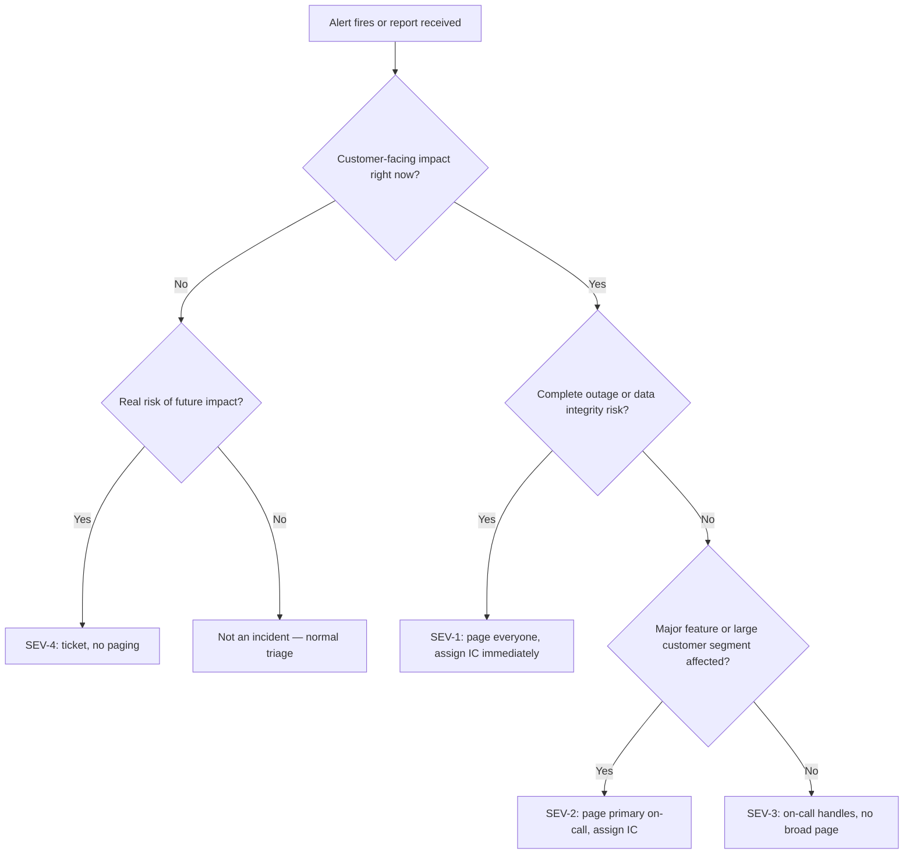

Every technical skill in this course — reading pod status, capturing thread dumps, tracing packets, diagnosing IRSA — exists to support one moment: you are the person leading response to a live incident, people are asking you for status, and you need to be both technically correct and clearly communicating under pressure. This lesson is about that moment itself: how to classify severity fast, how to communicate on a predictable cadence so stakeholders stop interrupting you for status, and how to run a blameless postmortem that actually produces fixes instead of blame. It closes with multi-cluster and at-scale operational concerns, because leading incidents at organizational scale means reasoning about failure domains larger than a single cluster.

This is the capstone skill of the entire course. Every technical lesson before this one made you a better *diagnostician*; this lesson is about being a better *incident commander*, which is a distinct and learnable skill on top of the diagnosis — someone can be technically brilliant and still run a chaotic, badly-communicated incident, and someone with less depth but disciplined process can run a calm, well-communicated one. You want both, and this is where you build the second half.

> **Prerequisites:** This builds on [Chaos Engineering and Failure Injection](/course/expert/chaos-engineering-and-failure-injection/) and, implicitly, on every diagnostic skill from all four levels of this course — this lesson is about the process wrapped around diagnosis, not a replacement for it.

## Severity classification

Classifying severity fast and consistently is what lets an organization respond proportionally — paging five people for a SEV-4 burns trust, and treating a SEV-1 like a routine ticket costs real money and customer trust. A simple, memorable scheme beats an elaborate one nobody can apply under pressure:

| Severity | Definition | Example | Response expectation |
|---|---|---|---|
| SEV-1 | Complete outage or critical data-integrity risk, customer-facing | Checkout service down cluster-wide; production data corruption in progress | Immediate all-hands page, incident commander assigned within minutes, exec communication started |
| SEV-2 | Significant, customer-facing degradation, workaround may exist | One region degraded; a major feature (e.g. search) is failing but checkout works | Page primary on-call, IC assigned, stakeholder updates on a fixed cadence |
| SEV-3 | Limited impact, internal or a small customer segment | One non-critical microservice is elevated-error-rate but has retries masking it from users | Handled by on-call during business hours, no broad paging |
| SEV-4 | No current customer impact, but a real risk found | A NetworkPolicy audit found an overly permissive rule; a chaos experiment found a gap | Tracked as a ticket, addressed in normal work |

Classify based on current, observed impact — not on worst-case speculation and not on how technically interesting the root cause might be. A one-line typo in a config that took down checkout is still a SEV-1; a fascinating kernel-level networking bug that only elevated p99 latency by 20ms for one internal service is still a SEV-3 at most.

## Communication cadence

The single biggest failure mode in incident communication is silence — stakeholders assume silence means either "nothing is happening" or "it's worse than being told," and both drive people to interrupt the incident commander for status, which slows down the actual response. The fix is a fixed cadence, stated up front: for a SEV-1, an update every 15-30 minutes even if the update is "still investigating, no new information" — because a predictable non-update is far less disruptive than an unpredictable silence.

A good status update, every time, covers four things in order: **current impact** (what's broken, for whom, right now), **current hypothesis or confirmed cause** (say "unknown, still investigating" if that's genuinely true — do not speculate as if it were fact), **actions in progress**, and **next update time**. Keep it in plain language — "checkout requests are failing for roughly 30% of EU customers, we've identified a bad deploy as the likely cause and are rolling it back now, next update in 15 minutes" is a complete, correct update that a non-engineer stakeholder can act on.

## Blameless postmortems

A postmortem's purpose is to find and fix systemic gaps — in alerting, in runbooks, in architecture — not to identify who to blame. This isn't just a cultural nicety; it has a direct mechanical effect: if postmortems assign blame, people will (rationally, self-protectively) omit details, hedge language, and avoid volunteering the full timeline, which makes the postmortem less accurate and therefore less useful for actually preventing recurrence. A blameless postmortem should read like a systems investigation: a factual timeline, a root-cause analysis that traces the full causal chain (not just the last domino), and a list of concrete, owned, dated follow-up actions.

The most common postmortem failure is stopping the root-cause analysis one level too shallow — "the pod crashed because of an OOM" is true but not actionable on its own; "the pod crashed because of an OOM, because the JVM heap flag didn't account for the reduced container memory limit set during last month's cost-optimization pass, and no alert existed for approaching-OOM memory pressure" is a root cause you can actually act on with two concrete follow-ups.

## Using the incident runbook template

Don't improvise the document structure mid-incident — use a standard template every time, so the format itself isn't something you have to think about while your attention is needed elsewhere. This course maintains a ready-to-use template at [Incident Response Runbook Template](/reference/incident-runbook-template/) — copy it into your incident doc at the moment an incident is declared, not after the fact, since the triage-timeline checklist inside it is meant to be filled in live as you work, not reconstructed from memory afterward.

## Game-day exercises

A game day is a chaos experiment (see the [previous lesson](/course/expert/chaos-engineering-and-failure-injection/)) combined with the full incident-command process — someone injects an undisclosed failure, a trainee runs complete incident response under time pressure using the runbook template linked above, and the group reviews the resulting postmortem together afterward. The value of running this as a structured exercise rather than "just wait for a real incident" is that you can deliberately choose trainees who haven't led an incident before, in a setting where a wrong turn costs nothing but time, and you can debrief immediately while the decision points are still fresh — something a real 2 a.m. incident never affords you.

Effective game days share a few properties: the failure is genuinely undisclosed to the trainee (a fully rehearsed scenario tests nothing), a designated observer takes notes on decision points without intervening, there's a hard time-box so the exercise ends even if the trainee hasn't fully resolved it, and the postmortem review afterward is scored against the same rubric you'd use for a real incident.

## Operating at scale: multi-cluster and capacity considerations

Everything in this course so far has largely assumed a single cluster. Organizations operating at real scale add a layer of decisions above the cluster boundary that an incident commander needs at least a conceptual grasp of, because "which cluster" and "do we have capacity" become incident questions in their own right.

**Cluster federation and multi-cluster service mesh** let you run workloads across multiple clusters — often for blast-radius isolation (a control-plane failure in one cluster shouldn't take down every region) or for regulatory data-residency reasons — while still allowing cross-cluster service discovery and traffic management through a shared mesh control plane (e.g., Istio's multi-cluster mesh, or Linkerd multi-cluster). The operational cost is real: you now have N control planes to keep healthy instead of one, and a cross-cluster call failure requires knowing which of two clusters' networking, RBAC, and admission layers to check — doubling the surface area from every lesson in this course.

**Cross-region failover** for stateless services is usually solvable with DNS-level or global-load-balancer-level traffic shifting once a region is deemed unhealthy — but the incident-command complexity is in the decision itself: how do you *know* a whole region is unhealthy versus one cluster in it, and who has the authority to trigger a failover that will itself cause a large, visible traffic shift and possible cold-start capacity issues in the target region.

**Capacity planning at scale** — cluster autoscaler tuning, bin-packing efficiency, and spot/preemptible node handling — moves from "nice to have" to a real incident-prevention concern once you're running enough nodes that a 10% efficiency gap is a meaningful cost line item, and enough spot capacity that a cloud-wide spot reclamation event is a plausible failure mode. For stateless Java workloads specifically, spot/preemptible nodes are usually safe to lean on heavily (the JVM starts, joins the pool, and gets evicted without state loss) provided your PodDisruptionBudgets and readiness probes are configured correctly — which ties directly back to the chaos-engineering validation from the previous lesson. Bin-packing tuning (via scheduler priorities, pod topology spread constraints, and appropriately-sized resource requests) directly affects how much of your spot/on-demand mix the cluster autoscaler can actually use efficiently — a cluster with wildly over-requested pods will scale up nodes it doesn't need and never bin-pack well enough to scale back down.

## Lab

The severity classification, communication cadence, and postmortem-writing portions of this lab need only people and a whiteboard or doc — no cluster required. The game-day exercise ideally uses the same multi-node cluster and chaos tooling from the previous lesson; the multi-cluster section is conceptual and doesn't require you to stand up multiple real clusters unless your organization already operates that way.

1. Take three real or invented incident scenarios and classify each into a severity level using the table above; write the one-sentence justification for each — do this individually, then compare with a partner and discuss any disagreements.
2. Draft a first status update and a 15-minutes-later follow-up update for a SEV-1 scenario, using the four-part structure (impact, hypothesis, actions, next update time).
3. Run a full game-day exercise: have one person inject an undisclosed failure using Chaos Mesh/Litmus or a manual misconfiguration (combine at least two failure types for realism — e.g., a NetworkPolicy change plus a resource-limit change), have the trainee lead response solo using the [Incident Response Runbook Template](/reference/incident-runbook-template/), and have an observer take timestamped notes without helping.
4. Immediately after resolution, write a blameless postmortem together as a group, specifically checking that the root-cause section goes at least two levels deep past the first "it crashed because X" explanation.
5. As a discussion exercise (no infrastructure needed): sketch what would change about your incident-command process if the same failure happened across two clusters simultaneously instead of one — who declares severity, who's the single incident commander across both response threads, and how do you avoid duplicated or contradictory stakeholder updates.

## Checkpoint

- [ ] I can classify a described incident into SEV-1 through SEV-4 using observed impact, not speculation.
- [ ] I can write a complete four-part status update from a one-line incident description.
- [ ] I can explain, with a concrete example, why blameless postmortems produce more accurate timelines than blame-assigning ones.
- [ ] I know where the incident runbook template lives and why it should be opened at the moment an incident is declared, not after.
- [ ] I can describe one concrete way multi-cluster operation doubles incident-command complexity versus a single cluster.
