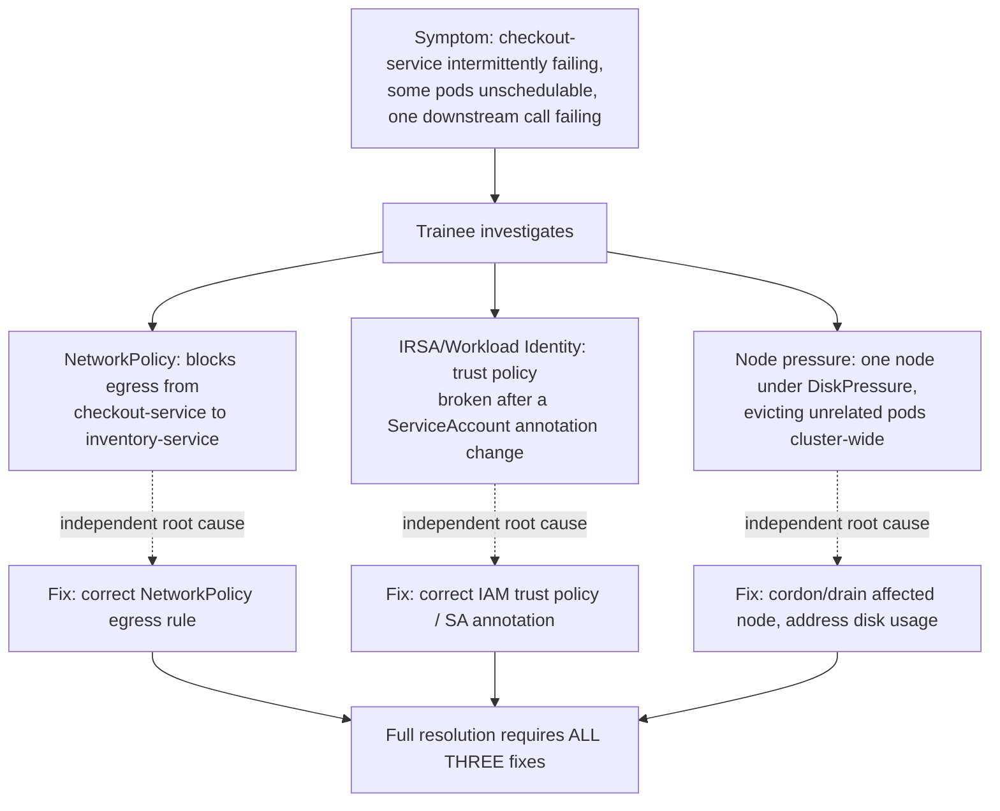

This is the final exercise of the entire course. Every prior lesson — from reading your first pod status in Beginner through packet capture, IRSA, GitOps, chaos engineering, and incident command here in Expert — was building toward being able to walk into an unannounced, multi-layered production failure and lead the response solo. This capstone is that test: a staging cluster gets hit with an undisclosed failure that spans three unrelated layers at once (NetworkPolicy, IRSA/Workload Identity, and node pressure), and the trainee runs full incident response — triage, mitigation, stakeholder communication, and postmortem — under time pressure, with no advance warning of what's actually wrong.

Passing this capstone is the practical definition of "incident commander ready" used throughout this course's [Assessment Rubric](/reference/assessment-rubric/): not "knows every command," but "can independently drive an incident from alert to resolution to written postmortem, under time pressure, without being told what's broken."

> **Prerequisites:** This capstone assumes you've completed every prior lesson in this level, especially [Incident Command and Postmortems](/course/expert/incident-command-and-postmortems/), [Chaos Engineering and Failure Injection](/course/expert/chaos-engineering-and-failure-injection/), [Cloud-Managed Clusters](/course/expert/cloud-managed-clusters-eks-gke-aks/), and [Low-Level Networking and Packet Capture](/course/expert/low-level-networking-and-packet-capture/). If any of those feel shaky, go back — this exercise is deliberately unforgiving of gaps.

## Why three unrelated layers combined

A single-cause incident is a normal Tuesday. What makes this capstone Expert-level is that the three injected faults are **independent of each other** and, individually, each points toward a different lesson in this course — the difficulty isn't diagnosing any one of them, it's not letting an early correct diagnosis convince you the incident is fully explained when two more unrelated things are also wrong. Real severe incidents are very often like this: an on-call engineer fixes the obvious thing, declares victory, and is paged again 20 minutes later because a second, unrelated fault was masked by the first one's symptoms.

## Facilitator guide: designing and running the scenario

If you're running this as a facilitator for someone else (a teammate, a trainee, a study group), design and inject the three faults ahead of time, and do not disclose any of them to the trainee.

**Fault 1 — NetworkPolicy egress block.** Apply a `NetworkPolicy` in the namespace of a Spring Boot service (e.g. `checkout-service`) that blocks egress to another namespace it depends on (e.g. `inventory-service`), without an explicit deny-all label that would make it obviously visible in a first-glance `kubectl get networkpolicy`. The symptom should present as intermittent timeouts on one specific downstream call, not a hard connection-refused — mirroring the silent-drop behavior from the [Low-Level Networking](/course/expert/low-level-networking-and-packet-capture/) lesson.

**Fault 2 — Broken IRSA/Workload Identity trust.** Modify the trust policy condition (AWS) or IAM policy binding (GCP) or federated credential subject (Azure) for a ServiceAccount used by an unrelated service (e.g. a service that reads from cloud object storage), so that it starts returning `AccessDenied`. Choose a service that is not the same one affected by Fault 1, so the trainee has to recognize these as two separate incidents happening simultaneously rather than one cascading failure.

**Fault 3 — Node under DiskPressure.** On a third, unrelated node, artificially fill disk usage (as in the [Node and Control Plane Internals](/course/expert/node-and-control-plane-internals/) lab) until `DiskPressure` triggers and the eviction manager starts evicting pods — ideally including at least one pod from a namespace unrelated to either of the first two faults, so the trainee sees a third, seemingly random symptom.

Inject all three with enough time offset that they don't all alert in the same 30 seconds (stagger by a few minutes) — this better simulates how real multi-fault incidents actually surface, with symptoms arriving in a confusing sequence rather than a single clean dashboard of red.

Assign a silent observer to log timestamps against the trainee's actions (when they ran which command, when they formed which hypothesis, when they communicated status) without helping or hinting — this observer log is what makes the postmortem review afterward useful.

## What the trainee should be evaluated on

This isn't a checklist of "did they type the right kubectl command" — it's an evaluation of incident-command judgment under ambiguity. Score against the same dimensions as the [Assessment Rubric](/reference/assessment-rubric/), with capstone-specific emphasis on:

| Dimension | What "ready" looks like |
|---|---|
| Initial triage speed | Starts from symptoms and events, not guesses; distinguishes cluster-level from workload-level within the first few minutes |
| Avoiding premature closure | After fixing the first fault found, actively re-checks for additional unrelated symptoms rather than declaring the incident resolved |
| Correct tool selection per fault | Reaches for `NetworkPolicy`/packet-capture tools for the network symptom, cloud IAM/SDK log tools for the identity symptom, and node/eviction tools for the pressure symptom — without cross-applying the wrong toolkit |
| Communication cadence | Sends a status update within the first several minutes and on a predictable cadence thereafter, correctly reflecting genuine uncertainty when the cause isn't yet known |
| Severity judgment | Classifies severity based on actual observed customer impact, and re-classifies if impact changes as more faults are discovered |
| Postmortem depth | Root-cause section for each of the three faults goes past the surface symptom to the actual configuration change or condition that caused it |
| Composure under multiplicity | Doesn't treat discovering a second unrelated fault as evidence their first diagnosis was wrong — correctly holds multiple simultaneous root causes in mind |

The single highest-value thing to watch for as a facilitator: does the trainee, after fixing Fault 1, say some version of "let me check if anything else is still wrong" before declaring the incident over? That instinct — treating resolution of the first found cause as a checkpoint, not the finish line — is the entire point of combining three unrelated faults into one exercise.

## Running it as the trainee

If you're the one being evaluated, treat this exactly like a real page: don't discuss the scenario with the facilitator beforehand, start a live incident doc from the [Incident Response Runbook Template](/reference/incident-runbook-template/) the moment you're told something is wrong, and narrate your reasoning out loud (or in writing) as you go — both because it's good incident-command practice and because it gives your observer something to evaluate. Set yourself a communication cadence and stick to it even if you have nothing new to report. When you find and fix one root cause, explicitly ask yourself whether the original reported symptoms are now fully explained, or whether something doesn't add up — that question is what's being tested.

## Lab

This capstone **genuinely requires a real multi-node cluster** (3+ nodes) and, for full fidelity, **real cloud access** for the IRSA/Workload Identity fault — the whole point of this exercise is that it doesn't collapse into something simulatable on a single-node local cluster. If cloud access genuinely isn't available, the IRSA fault can be approximated with a similarly-shaped but Kubernetes-only substitute (e.g., a broken RBAC binding or a broken webhook causing `AccessDenied`-style errors) — note clearly in the postmortem that this was a substitution, since the diagnostic path differs from real cloud IAM.

1. **Facilitator setup (before the trainee is involved):** stand up a 3+ node staging cluster with a small multi-service Spring Boot application (at minimum: a service with a downstream dependency call, and a service reading from cloud storage), NetworkPolicies already in normal use so an added one doesn't stand out, and Workload Identity/IRSA already configured and working.
2. **Facilitator injects all three faults**, staggered by several minutes, and starts a timer.
3. **Trainee is paged** with only a vague initial symptom (e.g., "customers report checkout errors, investigate") and opens the runbook template.
4. **Trainee runs full incident response solo**, with the observer logging silently.
5. **Time-box the exercise** (90 minutes is a reasonable default) — if unresolved at the time limit, stop and move to review rather than letting it run indefinitely; an incomplete resolution is still valuable data for the postmortem review.
6. **Group postmortem review:** compare the trainee's actual timeline (from their incident doc) against the observer's independent log, identify any gaps, and write the final blameless postmortem together covering all three faults.
7. **Score against the evaluation table above** and the course's [Assessment Rubric](/reference/assessment-rubric/), and identify specific follow-up lessons (from anywhere in this course, not just Expert) to revisit based on where the trainee struggled.

## Checkpoint

- [ ] I (or the trainee) can produce a complete incident doc, using the runbook template, covering all three injected faults.
- [ ] I can articulate, for each of the three faults, which specific lesson's toolkit was the correct one to reach for.
- [ ] I did not declare the incident resolved after fixing only one of the three faults.
- [ ] I sent status updates on a predictable cadence throughout, even when there was nothing new to report.
- [ ] I can write a root-cause paragraph for each fault that goes at least two levels past the surface symptom.
- [ ] I can state, in one sentence, what specifically I'd want to drill again before considering myself fully incident-commander-ready.
