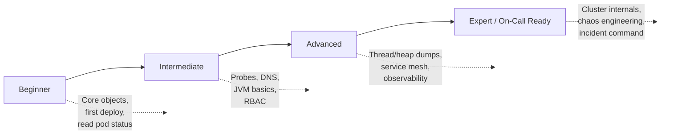

## Who this course is for

You're a Java or Spring Boot developer. You build microservices. Your team runs them on Kubernetes, and when something breaks at 2 a.m., you're the one who gets paged, not a dedicated platform team. This course exists because most Kubernetes material is written for infrastructure engineers, not for the person who actually wrote the `@RestController` that's now returning 503s.

No prior Kubernetes operational experience is assumed. Docker familiarity and comfortable Java/Spring Boot development are the only prerequisites: see [Prerequisites](/kubernetes/prerequisites) for cluster setup and [Tool Installation Guide](/kubernetes/tool-installation-guide) for progressive tool installs.

## How the course is structured

The course has four levels. Each one builds on the last, don't skip ahead, because later levels assume the muscle memory from earlier labs, not just the reading.

| Level | Focus | Est. Duration |
|---|---|---|
| [Beginner](../01-beginner/01-kubernetes-architecture-fundamentals.md) | Core Kubernetes objects, deploying a Spring Boot app, reading pod status | 2-3 weeks |
| [Intermediate](../02-intermediate/01-liveness-readiness-and-startup-probes.md) | Probes, DNS, config propagation, storage, RBAC, JVM-in-container basics | 3-4 weeks |
| [Advanced](../03-advanced/01-thread-dumps-and-deadlock-analysis.md) | Thread/heap dumps, GC tuning, service mesh, observability, autoscaling | 4-5 weeks |
| [Expert](../04-expert/01-node-and-control-plane-internals.md) | Cluster internals, low-level networking, chaos engineering, incident command | 4-6 weeks |

Each lesson follows the same shape:

- **Prerequisites**: what you need to already know, linked directly to the lesson that teaches it.
- **Core concepts**: the mental model, explained once, well.
- **Commands**: copy-pasteable, every flag explained, run against a real lab cluster.
- **Diagrams**: where a picture genuinely beats a paragraph.
- **Checkpoint**: a short self-assessment at the bottom of every page. If you can't answer it, re-read before moving on.

Standalone reference material, the command cheat sheet, incident runbook template, lab-fault-injection ideas, and the full assessment rubric, lives in the [Reference](/kubernetes/command-cheat-sheet) section, separate from the teaching path, so you can jump straight to it once you're operating day-to-day.

## What you'll be able to do by the end

By the Expert capstone, you should be able to walk into an unannounced production incident, triage it using nothing but `kubectl` and the observability stack, correctly identify whether the root cause is in your Spring Boot code, the JVM, the cluster, or the network, and communicate that clearly under time pressure.

## Checkpoint

- [ ] I understand the four-level structure and why the order matters.
- [ ] I know where Reference material lives versus teaching content.
- [ ] I'm ready to check the [Prerequisites](/kubernetes/prerequisites) page before starting Level 1.

**Next:** [Prerequisites →](/kubernetes/prerequisites)
