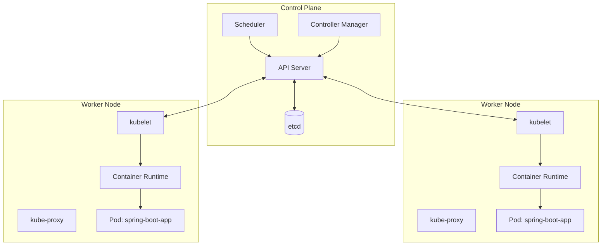
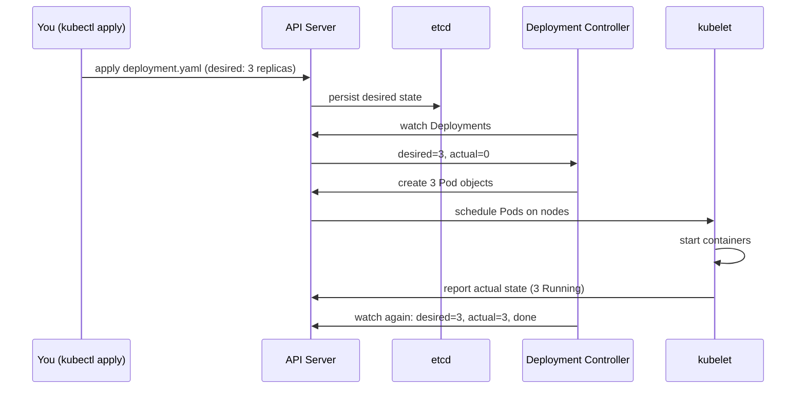

You already know how to run a Spring Boot JAR on your laptop: `java -jar app.jar`, done.

Kubernetes exists because running that same JAR reliably across dozens of machines, surviving crashes, and rolling out updates without downtime is a distributed-systems problem no single `java` command solves.

This lesson builds the mental model of *what Kubernetes actually is*, the pieces that make up a cluster and the loop that keeps your app running, so every command in the rest of this course has something to attach to.


None for this lesson, if you haven't set up a local cluster yet, do that first via [Prerequisites](/kubernetes/prerequisites).



## Control plane vs data plane

A Kubernetes cluster is two kinds of machines doing two different jobs. The **control plane** makes decisions; the **data plane** (worker nodes) runs your containers.

### 1. Control plane

The control plane is a small set of machines (one in a local `kind` cluster, typically three for HA in production) that form the cluster's brain.

They store state, expose the API, schedule Pods, and run reconciliation loops. They do **not** run your application containers - that's deliberate, so a misbehaving Spring Boot app can't take down the machinery that manages the cluster.

| Component | Job |
|---|---|
| **API server** (`kube-apiserver`) | **The front door:** every `kubectl` command, every controller, everything talks to Kubernetes only through this REST API. Validates and persists requests. |
| **etcd** | **The cluster's database:** a distributed key-value store holding the entire desired and observed state. If etcd is gone, the cluster has amnesia. |
| **Scheduler** (`kube-scheduler`) | Watches for Pods with no assigned node, decides *which* node each should run on based on resource requests, constraints, and affinity rules. |
| **Controller manager** (`kube-controller-manager`) | Runs the reconciliation loops: the ReplicaSet controller, Deployment controller, Node controller, etc.: that notice drift and correct it. |

### 2. Worker nodes

Worker nodes are the machines in the **data plane**: the pool that actually runs Pods. Every replica of your Spring Boot Deployment lands on a worker node. You scale capacity by adding more worker nodes, not by growing the control plane. 

Each worker runs the same three local agents below - one copy per node.

| Component | Job |
|---|---|
| **kubelet** | The agent that actually talks to the container runtime on its node: Starts/Stops containers, Reports pod status back to the API server. |
| **kube-proxy** | Maintains the network rules (iptables/IPVS) that let traffic sent to a Service's virtual IP reach the right Pod. |
| **Container runtime** (containerd, CRI-O) | Actually pulls images and runs containers: kubelet delegates to this via the Container Runtime Interface (CRI). |

**Notice what's *not* in this table:**

- Nothing here knows about "Spring Boot" or "your app." 
- Kubernetes only knows about generic objects, Pods, Services, Deployments, described as data.

That's the whole trick.



## The declarative model: desired state vs actual state

This is the single most important idea in Kubernetes, and it's a mental shift if you're used to imperative deployment scripts (SSH in, run `systemctl restart myapp`).

- You **declare** what you want: "I want 3 replicas of `spring-boot-app:1.4.0` running." You write this as YAML and `kubectl apply` it. This becomes the **desired state**, stored in etcd.
- Kubernetes controllers continuously **observe** the **actual state**: what's really running right now.
- A **reconciliation loop** compares the two, and if they differ, takes action to close the gap, start a missing Pod, kill an extra one, restart a crashed container.

You never tell Kubernetes *how* to fix a problem. You only ever change *what you want*, and something in the control plane figures out the *how*.

This is why `kubectl apply -f deployment.yaml` run twice with identical content is a no-op, actual state already matches desired state, so there's nothing to reconcile.



If a node crashes and takes a Pod with it, actual state drops to 2. The controller notices on its very next reconciliation pass (this happens continuously, not on a timer you configure) and creates a replacement Pod, no human, no alert required, no `systemctl restart`. This self-healing property is why Kubernetes exists.

## kubectl basics: contexts, namespaces, imperative vs declarative

`kubectl` is a thin client that turns commands into API server requests. Three concepts you'll use in every single lesson from here on:

**Contexts**: a context bundles a cluster address, a user credential, and a default namespace. If you work against multiple clusters (local `kind`, a staging EKS cluster, production), contexts let you switch between them without retyping connection details.

```bash
kubectl config get-contexts          # list all known contexts
kubectl config current-context       # which one is active right now
kubectl config use-context kind-course   # switch
```

**Namespaces**: a way to partition one cluster into logical sub-clusters. Most objects (Pods, Deployments, Services) live inside exactly one namespace; cluster-wide objects (Nodes, PersistentVolumes) don't.

```bash
kubectl get namespaces
kubectl get pods -n kube-system      # -n scopes a single command
kubectl config set-context --current --namespace=my-app   # change the default for your context
```

**Imperative vs declarative**: two ways to change cluster state, and you should mostly avoid the first once you're past quick experiments:

```bash
# Imperative: you tell kubectl exactly what action to take, right now
kubectl create deployment hello --image=springio/gs-spring-boot-docker
kubectl scale deployment hello --replicas=3
kubectl delete pod hello-abc123

# Declarative: you describe desired end state in a YAML file, kubectl figures out the diff
kubectl apply -f deployment.yaml
kubectl apply -f service.yaml
kubectl diff -f deployment.yaml     # preview what would change before applying
```

Declarative YAML checked into version control is the standard for anything beyond a scratch experiment, it's reviewable, diffable, and reproducible. Every lesson after this one assumes YAML manifests, not one-off imperative commands.

## Where to go next once you're past Beginner

Later levels build directly on this mental model: [Intermediate](/kubernetes/liveness-readiness-and-startup-probes) covers how kubelet uses probes to judge container health, and [Expert](/kubernetes/node-and-control-plane-internals) opens up the control plane internals (etcd performance, API server admission chains) this lesson only sketches.

## Lab

1. Confirm your cluster is up and inspect its identity:
   ```bash
   kubectl cluster-info
   kubectl config current-context
   kubectl version --short
   ```
2. List the nodes and check they're `Ready`:
   ```bash
   kubectl get nodes -o wide
   ```
3. Look at control plane component health (informative even though `componentstatuses` is deprecated):
   ```bash
   kubectl get componentstatuses
   kubectl -n kube-system get pods -o wide
   ```
   You should see `etcd`, `kube-apiserver`, `kube-scheduler`, `kube-controller-manager`, and (on `kind`) `coredns` and a CNI Pod all `Running`.
4. Create a namespace to work in for the rest of this course, and switch your context's default to it:
   ```bash
   kubectl create namespace course
   kubectl config set-context --current --namespace=course
   ```
5. Run something imperatively, then throw it away, this is the last time this course uses the imperative form:
   ```bash
   kubectl create deployment hello --image=springio/gs-spring-boot-docker --dry-run=client -o yaml
   ```
   The `--dry-run=client -o yaml` combination doesn't create anything, it prints the YAML kubectl *would* have sent to the API server. Study that output; it's your first look at a Deployment manifest shape, which the next lesson builds on directly.

## Checkpoint

- [ ] I can explain the difference between the control plane and the data plane, and name at least four control-plane components.
- [ ] I can explain, end-to-end, what happens when you run `kubectl apply -f deployment.yaml`, from your terminal to a running container.
- [ ] I understand why "desired state vs actual state" reconciliation means Kubernetes self-heals without a human restarting anything.
- [ ] I can switch kubectl contexts and namespaces, and I know the difference between an imperative command and a declarative `apply`.
- [ ] My local cluster is running and `kubectl get componentstatuses` / `kubectl -n kube-system get pods` show healthy output.
