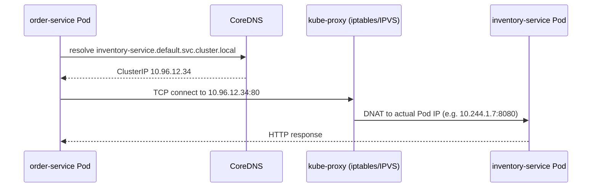

You just learned that Pod IPs are throwaway, every rolling update, every crash-and-restart hands your Spring Boot app a new IP address. So how does your `order-service` reliably call your `inventory-service` if the IP keeps changing? This lesson answers that with the two mechanisms Kubernetes provides: a stable virtual IP (the Service) and a DNS name that always resolves to it. This is the thing that replaces hardcoded hostnames and service registries you may have used with Eureka or Consul.


[Kubernetes Architecture Fundamentals](/kubernetes/kubernetes-architecture-fundamentals), [Pods, ReplicaSets, and Deployments](/kubernetes/pods-replicasets-and-deployments)



## Service types

A **Service** is a stable network identity that load-balances traffic across a *set* of Pods, selected by label, the same label-selector mechanism a Deployment uses to find its Pods.

| Type | Reachable from | Typical use |
|---|---|---|
| **ClusterIP** (default) | Only inside the cluster | Internal service-to-service calls: your Spring Boot microservices talking to each other |
| **NodePort** | Any node's IP, on a fixed high port (30000-32767) | Quick external access without a cloud load balancer, common in local/on-prem setups |
| **LoadBalancer** | The public internet, via a cloud provider's load balancer | Public-facing production traffic on managed cloud clusters (EKS/GKE/AKS provision an actual LB) |
| **ExternalName** | N/A: it's a DNS alias, not a proxy | Point an in-cluster name at an external hostname (e.g., a managed RDS endpoint) without hardcoding it in app config |

A NodePort Service is actually a ClusterIP Service *plus* a port opened on every node; a LoadBalancer Service is a NodePort Service *plus* a cloud load balancer pointed at those node ports. They stack, not replace each other.

```yaml
apiVersion: v1
kind: Service
metadata:
  name: hello
spec:
  type: ClusterIP
  selector:
    app: hello              # matches Pods with label app=hello
  ports:
    - port: 80               # port the Service listens on
      targetPort: 8080       # port the container actually listens on
```

## How a Service finds its Pods

The `selector` is the entire mechanism, a Service does not know about Deployments or ReplicaSets at all, only about Pod labels. Kubernetes continuously maintains an **Endpoints** (or the newer **EndpointSlice**) object listing the IPs of every currently-Running, currently-Ready Pod matching that selector. `kube-proxy` on every node watches Endpoints and programs the network rules (iptables or IPVS) so traffic to the Service's ClusterIP gets load-balanced across those Pod IPs.

```bash
kubectl get svc hello
kubectl get endpoints hello
kubectl get endpointslices -l kubernetes.io/service-name=hello
```

If a Pod fails its readiness probe, it's removed from Endpoints immediately, traffic stops routing to it, without the Pod being deleted. This is the mechanism [Intermediate](/kubernetes/liveness-readiness-and-startup-probes) covers in depth.

## Service discovery via DNS

Every Service automatically gets a DNS name, resolved by the cluster's DNS server (almost always **CoreDNS**, running as Pods in `kube-system`). The full form is:

```
<service-name>.<namespace>.svc.cluster.local
```

Within the same namespace, you can drop everything after the service name, `hello` alone resolves. Across namespaces, you need at least `<service-name>.<namespace>`. Your Spring Boot `application.yml` should reference dependent services by this DNS name, never by IP:

```yaml
inventory:
  base-url: http://inventory-service.default.svc.cluster.local:80
```



## Verifying it end to end (the layered checklist)

When a Spring Boot app can't reach another service, work through this checklist from the inside out rather than guessing, each layer rules out one failure category:

```bash
# 1. Can the pod resolve DNS at all?
kubectl exec -it <pod> -n <ns> -- nslookup kubernetes.default
kubectl exec -it <pod> -n <ns> -- nslookup <target-service>.<target-ns>.svc.cluster.local
kubectl exec -it <pod> -n <ns> -- cat /etc/resolv.conf

# 2. Is CoreDNS healthy cluster-wide?
kubectl -n kube-system get pods -l k8s-app=kube-dns
kubectl -n kube-system logs -l k8s-app=kube-dns --tail=100
kubectl -n kube-system get svc kube-dns

# 3. Does the target Service exist and have endpoints?
kubectl get svc <target-service> -n <target-ns>
kubectl get endpoints <target-service> -n <target-ns>
kubectl get endpointslices -n <target-ns> -l kubernetes.io/service-name=<target-service>

# 4. Do Service selectors actually match pod labels? (classic misconfiguration)
kubectl get svc <target-service> -n <target-ns> -o jsonpath='{.spec.selector}'
kubectl get pods -n <target-ns> --show-labels

# 5. Can you reach the pod IP directly (bypassing Service)?
kubectl get pod <target-pod> -n <target-ns> -o jsonpath='{.status.podIP}'
kubectl exec -it <pod> -n <ns> -- curl -sv http://<target-pod-ip>:<port>/actuator/health

# 6. Can you reach via ClusterIP/Service DNS?
kubectl exec -it <pod> -n <ns> -- curl -sv http://<target-service>.<target-ns>.svc.cluster.local:<port>

# 7. Port-forward for external verification from your own machine
kubectl port-forward svc/<target-service> -n <target-ns> 8080:80
```

An empty result from `kubectl get endpoints` with a Service that otherwise looks correct is the single most common root cause at this level, it almost always means the Service's `selector` doesn't actually match any Pod's labels. Check both sides with the commands in step 4 before looking anywhere else.

Deeper networking failures, NetworkPolicy rules silently blocking traffic, CNI plugin (Calico/Cilium/Flannel) issues, kube-proxy/iptables debugging, packet captures, are covered in [Intermediate](/kubernetes/dns-and-service-discovery-deep-dive), once you've got the basics solid.

## Lab

1. Reuse the `hello` Deployment from the previous lesson (recreate it if you tore it down):
   ```bash
   kubectl apply -f deployment.yaml
   kubectl get pods -l app=hello
   ```
2. Expose it via a ClusterIP Service:
   ```bash
   kubectl expose deployment hello --port=80 --target-port=8080 --name=hello-svc
   kubectl get svc hello-svc
   kubectl get endpoints hello-svc
   ```
3. Launch a second Pod to act as a caller, and use it to resolve and call the Service by DNS name:
   ```bash
   kubectl run caller --rm -it --image=busybox:1.36 --restart=Never -- sh
   # inside the shell:
   nslookup hello-svc
   nslookup hello-svc.default.svc.cluster.local
   wget -qO- http://hello-svc.default.svc.cluster.local:80/actuator/health
   exit
   ```
4. Break it on purpose, patch the Service's selector so it no longer matches any Pod, and observe the empty Endpoints:
   ```bash
   kubectl patch svc hello-svc -p '{"spec":{"selector":{"app":"does-not-exist"}}}'
   kubectl get endpoints hello-svc
   ```
5. Fix it back and confirm Endpoints repopulate:
   ```bash
   kubectl patch svc hello-svc -p '{"spec":{"selector":{"app":"hello"}}}'
   kubectl get endpoints hello-svc
   ```
6. Port-forward the Service to your own machine and hit it with `curl`:
   ```bash
   kubectl port-forward svc/hello-svc 8080:80
   # in another terminal:
   curl -sv http://localhost:8080/actuator/health
   ```

## Checkpoint

- [ ] I can name the four Service types and when to use each.
- [ ] I can explain how a Service finds its Pods (label selector → Endpoints/EndpointSlice → kube-proxy rules).
- [ ] I can write out the full DNS name format for a Service and know when the short form works.
- [ ] I deliberately broke a Service's selector, saw `kubectl get endpoints` return empty, and fixed it.
- [ ] I can walk the seven-step "inside out" checklist from memory when a Spring Boot service can't reach a dependency.
