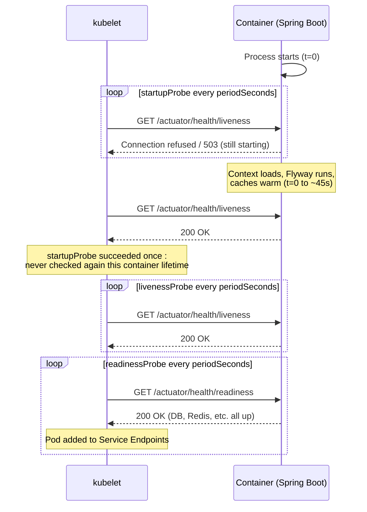

## What this lesson teaches

You already know how to read a pod's status and logs from the Beginner capstone. Now you'll learn *why* a perfectly healthy-looking Spring Boot app can get killed over and over by Kubernetes itself, not by a bug in your code, but by a misconfigured probe. Probes are the single most common source of "it works locally but crash-loops in the cluster" tickets for Java developers, because Spring context startup time is highly variable (bean count, database migrations, cache warmup) and the kubelet doesn't know that unless you tell it. By the end of this lesson you'll be able to configure liveness, readiness, and startup probes correctly against real Spring Boot Actuator health groups, and diagnose probe-induced restarts from `kubectl describe` output alone.


This lesson assumes you've completed the [Beginner capstone](/kubernetes/capstone-fix-a-broken-deployment) and are comfortable with `kubectl describe pod`, `kubectl logs`, and reading the `RESTARTS` column. If any of that feels shaky, go back before continuing, everything here builds directly on it.



## Core concepts

### The three probe types Kubernetes runs

| Probe | Question it answers | Effect on failure |
|---|---|---|
| **Liveness** | "Is this process still functioning, or should it be killed and restarted?" | kubelet kills and restarts the container |
| **Readiness** | "Is this container ready to receive traffic right now?" | Pod is removed from the Service's Endpoints: traffic stops, container keeps running |
| **Startup** | "Has the app finished its (possibly slow) initial startup?" | While it fails, liveness/readiness probes are suspended entirely; if it never succeeds within its threshold, the container is killed |

Each probe supports four mechanisms:

- **HTTP** (`httpGet`), GETs a path, success = 2xx/3xx status code. This is what you'll use for Spring Boot Actuator.
- **TCP** (`tcpSocket`), just checks the port accepts a connection. Weaker signal (a hung app can still accept TCP connections), but useful for non-HTTP services.
- **exec**: runs a command inside the container; exit code 0 = success.
- **gRPC** (`grpcContainer`), native gRPC health checking protocol support (K8s 1.24+ stable), avoids needing a sidecar or exec hack for gRPC-only services.

Every probe has timing knobs that matter as much as the mechanism itself:

| Field | Meaning |
|---|---|
| `initialDelaySeconds` | Wait this long after container start before the *first* probe attempt |
| `periodSeconds` | How often to probe |
| `timeoutSeconds` | How long to wait for a probe response before counting it as failed |
| `failureThreshold` | Consecutive failures before declaring Unhealthy (liveness → kill; readiness → remove from Endpoints) |
| `successThreshold` | Consecutive successes before declaring Healthy again |

### Spring Boot Actuator health groups

Spring Boot Actuator exposes exactly the split Kubernetes wants, out of the box, via health *groups*:

```yaml
management:
  endpoint:
    health:
      probes:
        enabled: true
  health:
    livenessState:
      enabled: true
    readinessState:
      enabled: true
```

This gives you two purpose-built endpoints:

- `/actuator/health/liveness`, is the JVM process itself in a broken, unrecoverable state? Deliberately excludes downstream dependency checks (DB, message broker), a slow database should not cause Kubernetes to kill and restart your app; that's a readiness concern, not a liveness one.
- `/actuator/health/readiness`, includes downstream dependency health (DataSource, Redis, custom `HealthIndicator`s), correctly reflects "can this instance actually serve a request right now."

Wiring these into a Deployment:

```yaml
livenessProbe:
  httpGet:
    path: /actuator/health/liveness
    port: 8080
  periodSeconds: 10
  failureThreshold: 3
readinessProbe:
  httpGet:
    path: /actuator/health/readiness
    port: 8080
  periodSeconds: 5
  failureThreshold: 3
```

### The classic mismatch: `initialDelaySeconds` vs actual startup time

This is the single most common probe-related incident for Spring Boot on Kubernetes. A Spring Boot app with a large context (many beans), Flyway/Liquibase migrations, and cache warmup can easily take 30-60 seconds to become ready, but a copy-pasted probe template says:

```yaml
livenessProbe:
  httpGet:
    path: /actuator/health/liveness
    port: 8080
  initialDelaySeconds: 15   # too short for this app
  periodSeconds: 10
  failureThreshold: 3
```

Timeline of the failure: the kubelet starts probing at 15s. The app is still starting (say it needs 45s). By 15s + 3×10s = 45s, `failureThreshold` is exceeded and the kubelet kills the container for being "unhealthy", except it was never unhealthy, it just hadn't finished starting. The container restarts, starts the 45-second boot sequence over again, and gets killed again at the same point. This looks exactly like `CrashLoopBackOff` from a bad deploy, but the app code is fine, it's purely a probe timing misconfiguration.

**The fix is `startupProbe`**, not just a bigger `initialDelaySeconds`:

```yaml
startupProbe:
  httpGet:
    path: /actuator/health/liveness
    port: 8080
  periodSeconds: 5
  failureThreshold: 24     # 24 * 5s = 120s grace period for startup
livenessProbe:
  httpGet:
    path: /actuator/health/liveness
    port: 8080
  periodSeconds: 10
  failureThreshold: 3
readinessProbe:
  httpGet:
    path: /actuator/health/readiness
    port: 8080
  periodSeconds: 5
  failureThreshold: 3
```

While `startupProbe` is failing, liveness and readiness are not evaluated at all, the app gets its full 120-second grace period to finish Flyway migrations and warm caches, however long that takes on a given run, without a hardcoded `initialDelaySeconds` gambling against variable startup time. Once `startupProbe` succeeds once, it's never checked again for the life of that container, liveness and readiness take over with their normal, tight timing.

### Probe lifecycle against the kubelet



### Diagnosing a probe-induced restart

```bash
# Confirm it's a probe kill, not an app crash
kubectl describe pod <pod> -n <ns> | grep -A5 Liveness
kubectl describe pod <pod> -n <ns> | grep -B2 -A2 "Unhealthy"

# Confirm the probe endpoint actually works from inside the pod
kubectl exec -it <pod> -n <ns> -- curl -sv http://localhost:8080/actuator/health

# Compare probe timing config against actual Spring Boot startup time
kubectl get pod <pod> -n <ns> -o yaml | grep -A8 livenessProbe
kubectl get pod <pod> -n <ns> -o yaml | grep -A8 readinessProbe
kubectl get pod <pod> -n <ns> -o yaml | grep -A8 startupProbe
```

If `describe` shows repeated `Liveness probe failed` events timed suspiciously close to your Spring Boot "Started Application in Xs" log line, you've found a timing mismatch, not a real defect.

## Lab

Reproduce and fix the classic mismatch on a local `kind` cluster.

1. **Create a local cluster** (skip if you already have one running):
   ```bash
   kind create cluster --name intermediate-probes
   ```

2. **Deploy a Spring Boot app with an artificially slow startup.** Add a startup delay to make the timing mismatch reproducible even with a small demo app, either sleep in a `@PostConstruct`/`ApplicationRunner`, or simply pick a deployment YAML with an aggressive probe config against any real Spring Boot image you have handy:
   ```yaml
   # probe-lab.yaml
   apiVersion: apps/v1
   kind: Deployment
   metadata:
     name: slow-start-app
   spec:
     replicas: 1
     selector:
       matchLabels: { app: slow-start-app }
     template:
       metadata:
         labels: { app: slow-start-app }
       spec:
         containers:
           - name: app
             image: <your-spring-boot-image>
             ports:
               - containerPort: 8080
             livenessProbe:
               httpGet: { path: /actuator/health/liveness, port: 8080 }
               initialDelaySeconds: 15
               periodSeconds: 10
               failureThreshold: 3
   ```
   ```bash
   kubectl apply -f probe-lab.yaml
   ```

3. **Observe the crash loop:**
   ```bash
   kubectl get pods -w
   kubectl describe pod -l app=slow-start-app | grep -A5 Liveness
   ```
   You should see `RESTARTS` climbing and `Liveness probe failed` events in `describe` output, timed before the app's own "Started Application" log line ever appears.

4. **Fix it** by adding a `startupProbe` and removing the too-short `initialDelaySeconds` from `livenessProbe`:
   ```yaml
             startupProbe:
               httpGet: { path: /actuator/health/liveness, port: 8080 }
               periodSeconds: 5
               failureThreshold: 24
             livenessProbe:
               httpGet: { path: /actuator/health/liveness, port: 8080 }
               periodSeconds: 10
               failureThreshold: 3
             readinessProbe:
               httpGet: { path: /actuator/health/readiness, port: 8080 }
               periodSeconds: 5
               failureThreshold: 3
   ```
   ```bash
   kubectl apply -f probe-lab.yaml
   kubectl get pods -w
   ```
   Confirm the pod now reaches `Running`/`1/1 Ready` without a single restart.

5. **Clean up:**
   ```bash
   kubectl delete -f probe-lab.yaml
   ```

## Checkpoint

- [ ] I can explain the difference between what liveness and readiness probes each do on failure.
- [ ] I can explain why Spring Boot Actuator's `/liveness` group deliberately excludes downstream dependency checks.
- [ ] I can diagnose, from `kubectl describe pod` output alone, whether a restart was probe-induced vs a genuine app crash.
- [ ] I fixed a startup-time/`initialDelaySeconds` mismatch using a `startupProbe` in the lab, not just by inflating `initialDelaySeconds`.
- [ ] I understand that a `startupProbe` suspends liveness/readiness checks entirely until it succeeds once.
