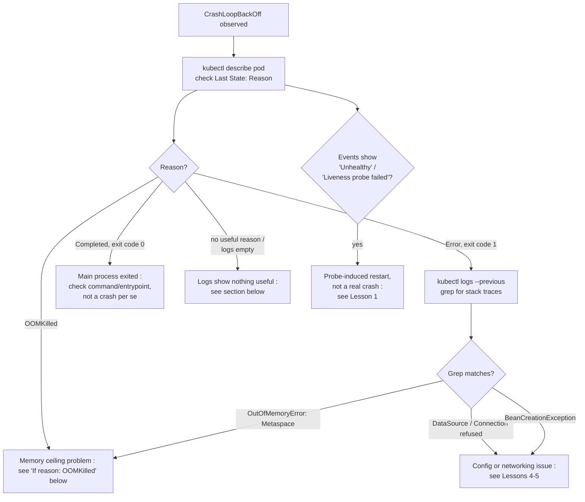

## What this lesson teaches

In the last lesson you learned one specific cause of restart loops, probe misconfiguration. This lesson widens the lens: `CrashLoopBackOff` is a *symptom*, not a diagnosis, and it can mean at least four genuinely different root causes for a Java/Spring Boot workload, an application error, an OOM kill, a probe kill, or a crash that happens before your logging framework even initializes. You'll learn the exit code vocabulary Kubernetes actually uses, a repeatable decision tree to classify any crash in under a minute, and how to handle the frustrating case where `kubectl logs` shows nothing useful at all.


This lesson builds on [Liveness, Readiness, and Startup Probes](/kubernetes/liveness-readiness-and-startup-probes), you need to be able to tell a probe-induced restart apart from the other categories covered here, since they overlap heavily in symptoms.



## Core concepts

### The CrashLoopBackOff decision tree

Treat every `CrashLoopBackOff` as a decision tree, not a guess. Run these four steps in order, every time:

```bash
# Step 1: get the real reason, not just the badge
kubectl describe pod <pod> -n <ns>

# Step 2: get logs from the container that just died (NOT the new restarted one)
kubectl logs <pod> -n <ns> --previous

# Step 3: check restart count trend over time
kubectl get pod <pod> -n <ns> -o jsonpath='{.status.containerStatuses[0].restartCount}'

# Step 4: check requested vs actual memory limit
kubectl get pod <pod> -n <ns> -o jsonpath='{.spec.containers[0].resources}'
```



### If `reason: OOMKilled`

This is a resource-ceiling problem, not necessarily a memory leak. Root causes in order of frequency for Java workloads:

1. **JVM heap not aware of container cgroup limits**: old JVM (<10) or `-Xmx` set higher than the container memory limit.
2. **Off-heap memory not accounted for**: thread stacks, metaspace, direct buffers (Netty/Kafka clients), native libraries, JIT code cache, the container limit covers total RSS, not just heap.
3. **Container memory limit set too low** relative to actual working set (undersized during capacity planning).
4. **Genuine memory leak**: unbounded caches, static collections, listener/connection leaks, `ThreadLocal` leaks.
5. **High concurrent request volume** spiking thread count → thread stack memory.

```bash
# Compare limit vs JVM heap flags actually in effect
kubectl exec -it <pod> -n <ns> -- jcmd 1 VM.flags
kubectl exec -it <pod> -n <ns> -- jcmd 1 VM.native_memory summary   # needs -XX:NativeMemoryTracking=summary

# Check cgroup memory limit as seen INSIDE the container
kubectl exec -it <pod> -n <ns> -- cat /sys/fs/cgroup/memory.max            # cgroup v2
kubectl exec -it <pod> -n <ns> -- cat /sys/fs/cgroup/memory/memory.limit_in_bytes  # cgroup v1

# Live memory breakdown
kubectl top pod <pod> -n <ns> --containers
kubectl exec -it <pod> -n <ns> -- ps aux
kubectl exec -it <pod> -n <ns> -- cat /proc/1/status | grep -E "Vm|Rss"
```

Deep heap-dump analysis and GC-level tuning are covered in the [Advanced JVM diagnostics lessons](/kubernetes/thread-dumps-and-deadlock-analysis), this lesson stops at classifying and confirming the OOM, not fully resolving a leak.

### If exit code is `1` (application error)

```bash
kubectl logs <pod> -n <ns> --previous | tail -100
# Look for: Spring "APPLICATION FAILED TO START" banner, stack traces, "Caused by:" chains
```

Common Spring Boot startup failure signatures to grep for directly:

```bash
kubectl logs <pod> -n <ns> --previous | grep -iE "APPLICATION FAILED TO START|BeanCreationException|Caused by|Connection refused|UnknownHostException|Address already in use|Port already in use|Failed to configure a DataSource|NoSuchBeanDefinitionException"
```

| Log signature | Likely cause | Where to check |
|---|---|---|
| `Failed to configure a DataSource` | DB env vars/secret missing or DB unreachable | [ConfigMap/Secret Propagation](/kubernetes/configmap-secret-propagation), DB Service DNS, NetworkPolicy |
| `UnknownHostException: <service-name>` | DNS/Service name wrong or CoreDNS issue | [DNS & Service Discovery Deep Dive](/kubernetes/dns-and-service-discovery-deep-dive) |
| `Connection refused` to a dependency | Dependency pod not ready / wrong port / service selector mismatch | [DNS & Service Discovery Deep Dive](/kubernetes/dns-and-service-discovery-deep-dive), [ConfigMap/Secret Propagation](/kubernetes/configmap-secret-propagation) |
| `Port already in use` | Two processes/containers competing on same port, leftover process from crash loop | Container `command`, liveness probe delay |
| `BeanCreationException` / `NoSuchBeanDefinitionException` | Missing profile-specific config, wrong `SPRING_PROFILES_ACTIVE` | [ConfigMap/Secret Propagation](/kubernetes/configmap-secret-propagation) |
| `OutOfMemoryError: Metaspace` | Class loading leak (often dynamic proxies/hot reload in prod) | JVM flags, `-XX:MaxMetaspaceSize` |
| `OutOfMemoryError: unable to create new native thread` | Thread leak or `ulimit`/PID limit hit | [Advanced: Thread Dumps](/kubernetes/thread-dumps-and-deadlock-analysis), node `PIDPressure` |

### Exit code reference

Beyond the Spring-specific signatures above, the raw exit code itself narrows things down before you even open a log:

| Exit code | Meaning | Typical cause |
|---|---|---|
| `0` | Clean exit | Main process completed/exited intentionally: check `command`/`args`, this often isn't a crash at all |
| `1` | Generic application error | Uncaught exception, Spring context failed to start |
| `137` | `SIGKILL` (128 + 9) | OOMKilled by the kernel cgroup OOM killer, or manually killed |
| `143` | `SIGTERM` (128 + 15) | Graceful shutdown signal: if unexpected, check `terminationGracePeriodSeconds` and whether the app handled it in time |
| `1` shown as `Error` with `OOMKilled` reason absent | JVM-level `OutOfMemoryError` (heap/metaspace) caught by the JVM itself, distinct from the kernel killing the whole container | Look for `java.lang.OutOfMemoryError` in `--previous` logs specifically |

### If pod restarts but logs show nothing useful

The app may be crashing before logging initializes, or stdout/stderr isn't where you think.

```bash
# Check container's actual entrypoint/command
kubectl get pod <pod> -n <ns> -o jsonpath='{.spec.containers[0].command}{"\n"}{.spec.containers[0].args}'

# Check if logging framework writes to file instead of stdout (anti-pattern in containers)
kubectl exec -it <pod> -n <ns> -- ls -la /app/logs 2>/dev/null

# Raise verbosity temporarily via env override (if supported) and redeploy, or exec in before crash:
kubectl debug <pod> -n <ns> -it --image=busybox --target=<container> -- sh
```

If the app writes logs to a file inside the container instead of stdout/stderr, `kubectl logs` will always be empty, the fix is application-level (log to console in containerized environments), but you can confirm this diagnosis by exec-ing in before the crash and checking `/app/logs` or wherever the logging config points.

### Liveness/readiness probe-induced restarts (not a real crash)

Covered in depth in [Lesson 1](/kubernetes/liveness-readiness-and-startup-probes), the quick confirmation commands:

```bash
kubectl describe pod <pod> -n <ns> | grep -A5 Liveness
kubectl describe pod <pod> -n <ns> | grep -B2 -A2 "Unhealthy"

# Confirm probe endpoint actually works from inside the pod
kubectl exec -it <pod> -n <ns> -- curl -sv http://localhost:8080/actuator/health

# Compare probe timing config against Spring Boot startup time
kubectl get pod <pod> -n <ns> -o yaml | grep -A8 livenessProbe
kubectl get pod <pod> -n <ns> -o yaml | grep -A8 readinessProbe
kubectl get pod <pod> -n <ns> -o yaml | grep -A8 startupProbe
```

**Classic mismatch, restated:** Spring Boot app takes 45s to start (large context, many beans, Flyway migrations) but `livenessProbe.initialDelaySeconds` is 15s → kubelet kills it mid-startup, forever. Fix: add a `startupProbe` with a generous `failureThreshold * periodSeconds`, and let liveness/readiness only kick in after startup succeeds.

## Lab

Reproduce three distinct crash causes against a local `kind` cluster, and diagnose each from symptoms alone before checking your notes.

1. **Set up the namespace:**
   ```bash
   kubectl create namespace crash-lab
   ```

2. **Cause 1, bad DB config (exit code 1, application error).** Deploy a Spring Boot app pointed at a nonexistent database host:
   ```yaml
   # cause1-bad-db.yaml
   apiVersion: apps/v1
   kind: Deployment
   metadata:
     name: bad-db-app
     namespace: crash-lab
   spec:
     replicas: 1
     selector:
       matchLabels: { app: bad-db-app }
     template:
       metadata:
         labels: { app: bad-db-app }
       spec:
         containers:
           - name: app
             image: <your-spring-boot-image>
             env:
               - name: SPRING_DATASOURCE_URL
                 value: jdbc:postgresql://nonexistent-db-host:5432/mydb
   ```
   ```bash
   kubectl apply -f cause1-bad-db.yaml
   kubectl get pods -n crash-lab -w
   kubectl logs -n crash-lab -l app=bad-db-app --previous | grep -iE "Failed to configure a DataSource|UnknownHostException"
   ```
   Confirm you land on `Failed to configure a DataSource` / `UnknownHostException` from the table above.

3. **Cause 2, OOM (exit code 137, OOMKilled).** Deploy with a memory limit far below the JVM's default heap sizing:
   ```yaml
   # cause2-oom.yaml
   apiVersion: apps/v1
   kind: Deployment
   metadata:
     name: oom-app
     namespace: crash-lab
   spec:
     replicas: 1
     selector:
       matchLabels: { app: oom-app }
     template:
       metadata:
         labels: { app: oom-app }
       spec:
         containers:
           - name: app
             image: <your-spring-boot-image>
             resources:
               limits:
                 memory: "128Mi"
               requests:
                 memory: "128Mi"
   ```
   ```bash
   kubectl apply -f cause2-oom.yaml
   kubectl get pods -n crash-lab -w
   kubectl describe pod -n crash-lab -l app=oom-app | grep -A3 "Last State"
   ```
   Confirm `Last State: Terminated`, `Reason: OOMKilled`, `Exit Code: 137`.

4. **Cause 3, failing readiness/liveness (probe kill, not a crash at all).** Reuse the probe-lab pattern from Lesson 1 with an intentionally wrong path:
   ```yaml
   # cause3-bad-probe.yaml
   apiVersion: apps/v1
   kind: Deployment
   metadata:
     name: bad-probe-app
     namespace: crash-lab
   spec:
     replicas: 1
     selector:
       matchLabels: { app: bad-probe-app }
     template:
       metadata:
         labels: { app: bad-probe-app }
       spec:
         containers:
           - name: app
             image: <your-spring-boot-image>
             livenessProbe:
               httpGet: { path: /actuator/health/nonexistent-path, port: 8080 }
               initialDelaySeconds: 5
               periodSeconds: 5
               failureThreshold: 3
   ```
   ```bash
   kubectl apply -f cause3-bad-probe.yaml
   kubectl describe pod -n crash-lab -l app=bad-probe-app | grep -B2 -A2 Unhealthy
   ```
   Confirm you see `Liveness probe failed: HTTP probe failed with statuscode: 404` in Events, a probe kill, correctly distinguished from causes 1 and 2 even though all three present as `CrashLoopBackOff` in `kubectl get pods`.

5. **Clean up:**
   ```bash
   kubectl delete namespace crash-lab
   ```

## Checkpoint

- [ ] I can name at least four distinct root causes that all present as `CrashLoopBackOff`.
- [ ] I know why `kubectl logs --previous` (not plain `kubectl logs`) is the correct command for a container that already restarted.
- [ ] I can map exit codes 0, 1, 137, and 143 to their likely causes without looking them up.
- [ ] I reproduced and correctly distinguished a DB config crash, an OOM kill, and a probe kill in the lab using only symptoms.
- [ ] I know what to check when `kubectl logs` is empty even though the pod is clearly restarting.
