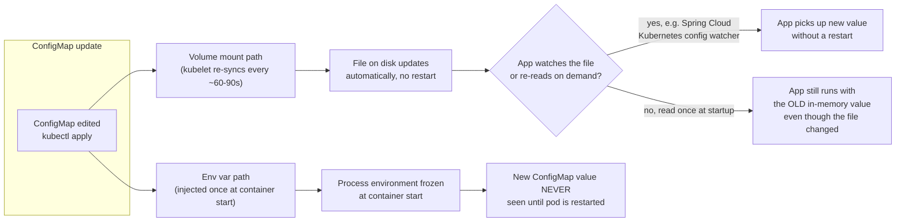

## What this lesson teaches

Beginner taught you how to externalize `application.yml` and a DB URL into a ConfigMap, and the basic difference between env-var and volume-mount consumption. This lesson goes one level deeper into the single most misdiagnosed "config isn't working" ticket in Java shops running on Kubernetes: the *propagation* behavior once a ConfigMap changes after the pod is already running. You'll learn exactly how long a mounted ConfigMap takes to update inside a running container, why an env-var-based ConfigMap never updates without a restart no matter how long you wait, and how Spring Cloud Config Server and Vault integrations add another layer on top of native Kubernetes config mechanisms.


This lesson assumes you've completed [DNS and Service Discovery Deep Dive](/kubernetes/dns-and-service-discovery-deep-dive) and already know the Beginner-level basics of creating a ConfigMap and referencing it via `envFrom`/`env` or `volumeMounts` in a pod spec.



## Core concepts

### The key gotcha: volumes auto-update, env vars never do

**ConfigMaps mounted as volumes auto-update (with a delay); ConfigMaps consumed as env vars do NOT update without a pod restart.** If a Spring Boot app isn't picking up a ConfigMap change, the first thing to check is which mechanism it's using, this single distinction accounts for a huge fraction of "I updated the ConfigMap and nothing happened" tickets.

Why the difference exists: a **volume-mounted** ConfigMap is periodically re-synced by the kubelet from the API server's view of the object (default sync period is roughly 60-90 seconds, though the exact interval depends on the kubelet's configured sync period and internal caching, so treat it as "eventually, usually under two minutes," not a guaranteed SLA). The kubelet updates the files on disk inside the container; nothing on the container side is told this happened. An **env var** sourced from a ConfigMap (`env.valueFrom.configMapKeyRef` or `envFrom.configMapRef`), by contrast, is injected into the container's process environment exactly once, at container start, by the container runtime, Linux processes cannot have their environment variables changed from outside after they start, so there is no mechanism by which this could ever "propagate." The only way for a running container to see a new env var value is for the container to be restarted.



Note the extra nuance inside the volume path: even a correctly auto-updated file on disk does nothing for your app unless the app itself re-reads that file or is wired to watch it (Spring Cloud Kubernetes's `ConfigMap`/`Secret` watchers, or a `@RefreshScope` + `/actuator/refresh` combination, are the common ways to make Spring Boot actually react to a changed file rather than just reading it once at boot).

### Diagnostic commands

```bash
# Confirm what the pod actually received (not what you think you deployed)
kubectl exec -it <pod> -n <ns> -- env | sort
kubectl exec -it <pod> -n <ns> -- env | grep -i spring

# Verify mounted ConfigMap/Secret content
kubectl exec -it <pod> -n <ns> -- cat /config/application.yml
kubectl get configmap <cm-name> -n <ns> -o yaml
kubectl get secret <secret-name> -n <ns> -o jsonpath='{.data}' | jq 'map_values(@base64d)'

# Detect stale mounted ConfigMap (kubelet sync delay, ~60-90s by default, or NOT reloaded if consumed as env var)
kubectl get configmap <cm-name> -n <ns> -o jsonpath='{.metadata.resourceVersion}'
kubectl exec -it <pod> -n <ns> -- stat /config/application.yml   # check mtime
```

`resourceVersion` on the ConfigMap object itself changes the instant `kubectl apply`/`edit` succeeds, that's the API server's source of truth for "has this actually changed." Comparing it against the mounted file's `mtime` (via `stat`) inside the pod tells you whether the kubelet has caught up yet, independent of whether your application has re-read the file.

```bash
# Diff deployed manifest vs what's live (drift detection)
kubectl diff -f deployment.yaml
```

`kubectl diff` is useful here specifically because config drift, someone `kubectl edit`-ing a ConfigMap directly instead of updating it in source control and re-applying, is one of the most common causes of "prod and staging have different config and nobody knows why."

### Spring Cloud Config Server and Vault integration

Many Spring Boot shops don't use native Kubernetes ConfigMaps/Secrets directly for application config at all, instead the app talks to a **Spring Cloud Config Server** (backed by a Git repo) or **HashiCorp Vault** at startup (and optionally on a refresh event) to fetch its configuration. This adds an entirely separate layer that can fail independently of anything Kubernetes-native:

```bash
# Check the app's own startup logs for config-fetch attempts
kubectl logs <pod> -n <ns> --previous | grep -iE "Config Server|vault|Fetching config"

# Verify the config server itself is serving the expected values
curl -s http://<config-server>:8888/<app-name>/<profile>
```

Common failure modes specific to this layer:
- **Config Server itself unreachable**: a Kubernetes Service/DNS/NetworkPolicy issue underneath (see the [DNS deep dive](/kubernetes/dns-and-service-discovery-deep-dive)) manifests here as "app fails to start, no obvious Kubernetes-level cause," because the actual dependency is another in-cluster service, not a ConfigMap object.
- **Wrong profile/label requested**: the app requests `<app-name>/<profile>` but `SPRING_PROFILES_ACTIVE`/`SPRING_CLOUD_CONFIG_LABEL` don't match what's actually branch/labeled in the backing Git repo, silently falling back to `default` profile values.
- **Vault token/auth failure**: Vault-backed config requires the pod to authenticate (often via its ServiceAccount token, using Vault's Kubernetes auth method); a token permission problem here looks like a config problem but is actually an RBAC/auth problem, see the [Namespaces, RBAC & Multi-Tenancy lesson](/kubernetes/namespaces-rbac-and-multi-tenancy) for the ServiceAccount side of this.
- **Bootstrap vs application context timing**: in older Spring Cloud versions, config is fetched during a separate "bootstrap" phase before the main application context starts; a failure here can produce a different, less obvious stack trace than a normal bean creation failure, so specifically grep for `Config Server` and `Fetching config` rather than only the generic Spring failure banner.

## Lab

Reproduce both propagation behaviors side by side on a local `kind` cluster.

1. **Set up two ConfigMaps and two Deployments, one volume-mounted, one env-var-based:**
   ```bash
   kubectl create namespace config-lab

   kubectl create configmap app-config-vol \
     --from-literal=GREETING="hello-v1" -n config-lab

   kubectl create configmap app-config-env \
     --from-literal=GREETING="hello-v1" -n config-lab
   ```

2. **Deploy the volume-mounted variant:**
   ```yaml
   # vol-app.yaml
   apiVersion: apps/v1
   kind: Deployment
   metadata:
     name: vol-app
     namespace: config-lab
   spec:
     replicas: 1
     selector: { matchLabels: { app: vol-app } }
     template:
       metadata: { labels: { app: vol-app } }
       spec:
         containers:
           - name: app
             image: busybox
             command: ["sh", "-c", "while true; do cat /config/GREETING; sleep 5; done"]
             volumeMounts:
               - name: config
                 mountPath: /config
         volumes:
           - name: config
             configMap:
               name: app-config-vol
   ```
   ```bash
   kubectl apply -f vol-app.yaml
   ```

3. **Deploy the env-var variant:**
   ```yaml
   # env-app.yaml
   apiVersion: apps/v1
   kind: Deployment
   metadata:
     name: env-app
     namespace: config-lab
   spec:
     replicas: 1
     selector: { matchLabels: { app: env-app } }
     template:
       metadata: { labels: { app: env-app } }
       spec:
         containers:
           - name: app
             image: busybox
             command: ["sh", "-c", "while true; do echo $GREETING; sleep 5; done"]
             env:
               - name: GREETING
                 valueFrom:
                   configMapKeyRef:
                     name: app-config-env
                     key: GREETING
   ```
   ```bash
   kubectl apply -f env-app.yaml
   ```

4. **Update both ConfigMaps to a new value:**
   ```bash
   kubectl patch configmap app-config-vol -n config-lab --type merge -p '{"data":{"GREETING":"hello-v2"}}'
   kubectl patch configmap app-config-env -n config-lab --type merge -p '{"data":{"GREETING":"hello-v2"}}'
   ```

5. **Watch both pods' logs over the next 2 minutes:**
   ```bash
   kubectl logs -f -n config-lab deploy/vol-app &
   kubectl logs -f -n config-lab deploy/env-app &
   ```
   Confirm the volume-mounted pod eventually prints `hello-v2` (within roughly 60-90 seconds) without any restart, while the env-var pod keeps printing `hello-v1` indefinitely.

6. **Confirm the env-var pod only updates after a restart:**
   ```bash
   kubectl rollout restart deployment/env-app -n config-lab
   kubectl logs -f -n config-lab deploy/env-app
   ```
   Confirm it now prints `hello-v2`.

7. **Clean up:**
   ```bash
   kubectl delete namespace config-lab
   ```

## Checkpoint

- [ ] I can state, without looking it up, which consumption mechanism (volume vs env var) auto-updates and which requires a restart.
- [ ] I can explain why env vars fundamentally cannot propagate to a running process, at the OS level.
- [ ] I know the difference between a file on disk updating and an application actually picking up that change.
- [ ] I can name at least two Spring Cloud Config/Vault-specific failure modes that look like Kubernetes config problems but aren't.
- [ ] I ran the lab and directly observed the ~60-90s volume-mount propagation delay versus the env var's total non-propagation until restart.
