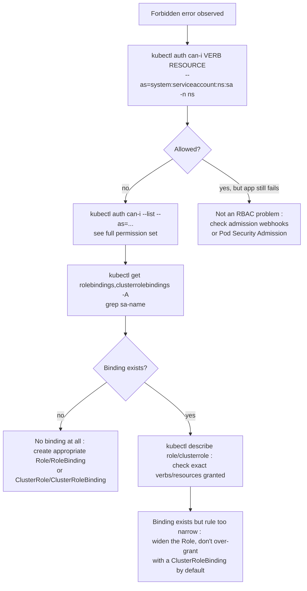

## What this lesson teaches

So far every lesson has assumed you have full permission to run whatever `kubectl` command you need. Real clusters, especially multi-team, multi-tenant ones, restrict that deliberately, and Spring Boot apps that talk to the Kubernetes API directly (for service discovery, leader election, or reading their own ConfigMaps at runtime) run under a `ServiceAccount` with its own, often much narrower, permission set. This lesson teaches the RBAC model that governs "who/what can do what, where" in Kubernetes, and how to diagnose a `Forbidden` error methodically instead of guessing at permissions by trial and error.


This lesson assumes you've completed [Persistent Storage for Stateful Workloads](/kubernetes/persistent-storage-for-stateful-workloads). No prior security/RBAC knowledge is assumed.



## Core concepts

### Namespace isolation as the first tenancy boundary

A `Namespace` is Kubernetes' primary mechanism for dividing a single cluster among multiple teams or environments. Most namespaced resources (Pods, Services, ConfigMaps, Secrets, PVCs, Deployments, RBAC `Role`/`RoleBinding`) exist *within* exactly one namespace and are invisible to `kubectl get <resource>` calls scoped to a different namespace. Namespace isolation alone, however, is only an organizational/RBAC boundary by default, it does **not** provide network isolation (any pod can reach any other pod across namespaces unless `NetworkPolicy` says otherwise, see the [DNS deep dive lesson](/kubernetes/dns-and-service-discovery-deep-dive)) and does not provide resource isolation unless `ResourceQuota`/`LimitRange` objects are also applied per namespace.

### RBAC building blocks

Kubernetes RBAC (Role-Based Access Control) has exactly four object types, split along two axes, namespaced vs cluster-scoped, and "what actions" vs "who gets them":

| Object | Scope | Purpose |
|---|---|---|
| `Role` | Namespaced | Defines a set of permissions (verbs on resources) *within one namespace* |
| `RoleBinding` | Namespaced | Grants a `Role` (or a `ClusterRole`, when bound via a `RoleBinding`) to a user/group/ServiceAccount, scoped to that one namespace |
| `ClusterRole` | Cluster-wide | Defines a set of permissions that can apply cluster-wide, OR be reused namespace-by-namespace via a `RoleBinding` |
| `ClusterRoleBinding` | Cluster-wide | Grants a `ClusterRole` cluster-wide, across all namespaces |

The subtlety most people miss: a `ClusterRole` is just a *reusable definition* of permissions, whether it grants cluster-wide access or single-namespace access depends entirely on whether it's attached via a `ClusterRoleBinding` (cluster-wide) or a `RoleBinding` (scoped to that binding's namespace only). This is the standard pattern for "the same permission set, reusable across many namespaces without redefining it each time":

```yaml
apiVersion: rbac.authorization.k8s.io/v1
kind: ClusterRole
metadata:
  name: pod-reader
rules:
  - apiGroups: [""]
    resources: ["pods"]
    verbs: ["get", "list", "watch"]
---
apiVersion: rbac.authorization.k8s.io/v1
kind: RoleBinding
metadata:
  name: read-pods-in-team-a
  namespace: team-a
subjects:
  - kind: ServiceAccount
    name: team-a-app
    namespace: team-a
roleRef:
  kind: ClusterRole
  name: pod-reader
  apiGroup: rbac.authorization.k8s.io
```

This grants `team-a-app`'s ServiceAccount `get`/`list`/`watch` on pods *only within `team-a`*, even though `pod-reader` is defined as a `ClusterRole`, because it was attached with a `RoleBinding`, not a `ClusterRoleBinding`.

### ServiceAccounts: identity for pods, not people

A `ServiceAccount` is the identity a *pod* authenticates to the Kubernetes API as (as opposed to a human user, which Kubernetes RBAC also supports but doesn't manage the credentials for, that's handled by whatever authentication method the cluster uses, e.g. OIDC). Every pod runs as some ServiceAccount, if you don't specify one, it defaults to the namespace's `default` ServiceAccount, which typically has no meaningful RBAC permissions bound to it in a well-configured cluster (an important security default: an app should never rely on the `default` ServiceAccount having any particular access).

```bash
# ServiceAccount token issues (Spring Boot apps calling K8s API directly, or Vault auth)
kubectl get sa <sa-name> -n <ns> -o yaml
kubectl exec -it <pod> -n <ns> -- cat /var/run/secrets/kubernetes.io/serviceaccount/token
```

That mounted token at `/var/run/secrets/kubernetes.io/serviceaccount/token` is what a Spring Boot app uses if it makes calls to the Kubernetes API itself (via the `kubernetes-client` Java library, Spring Cloud Kubernetes's config/discovery features, or Vault's Kubernetes auth method, which validates this exact token against the API server to grant a Vault token in exchange).

### Diagnosing `Forbidden` errors with `kubectl auth can-i`

This is the single fastest way to answer "does X have permission to do Y" without trial-and-error:

```bash
# "Forbidden" errors: check what a user/service account CAN do
kubectl auth can-i create pods --namespace <ns>
kubectl auth can-i create pods --as=system:serviceaccount:<ns>:<sa-name> -n <ns>
kubectl auth can-i --list --as=system:serviceaccount:<ns>:<sa-name> -n <ns>
```

- Plain `kubectl auth can-i <verb> <resource>` checks *your own* current identity (whatever your kubeconfig context authenticates as).
- `--as=system:serviceaccount:<ns>:<sa-name>` impersonates a specific ServiceAccount, the exact identity string format Kubernetes uses internally for ServiceAccount subjects, useful when you need to check "can the *app's* identity do this," not your own admin identity.
- `--list` dumps every permission the impersonated identity has in the given namespace in one shot, rather than checking one verb/resource pair at a time, the fastest way to get the full picture during an incident.

```bash
kubectl get rolebindings,clusterrolebindings -A -o wide | grep <sa-name>
kubectl describe role <role> -n <ns>
kubectl describe clusterrole <clusterrole>
```

Once `auth can-i` confirms a permission is missing, these commands find *which* binding (or absence of one) is responsible, and `describe role`/`describe clusterrole` shows the exact verb/resource/apiGroup rules granted.

### Pod Security Admission and webhook failures (context, not deep-dive)

Two related but distinct failure categories worth recognizing at this level, even though full admission-control mechanics are covered in the [Expert cluster-internals lessons](/kubernetes/node-and-control-plane-internals):

```bash
# Pod Security Admission / PodSecurityPolicy rejections
kubectl get events -n <ns> | grep -i "violates PodSecurity"
kubectl describe namespace <ns> | grep pod-security

# Admission webhook failures (blocking deploys mysteriously)
kubectl get validatingwebhookconfigurations
kubectl get mutatingwebhookconfigurations
kubectl describe validatingwebhookconfiguration <name>
```

A rejected pod that never even reaches `Pending`, the `kubectl apply` itself errors out, is an admission-control problem, not an RBAC problem: RBAC governs *who can ask*, admission control governs *whether the thing they asked for is allowed to exist*. If a webhook's backing service is down, **all** matching resource creates/updates fail cluster-wide, which is a strong hint to check the webhook's target service/pod health first before assuming it's a manifest mistake.

### RBAC troubleshooting flow



## Lab

Reproduce and fix a `Forbidden` error using a restricted ServiceAccount on a local `kind` cluster.

1. **Set up a namespace and a restricted ServiceAccount:**
   ```bash
   kubectl create namespace rbac-lab
   kubectl create serviceaccount restricted-app -n rbac-lab
   ```

2. **Confirm it has no meaningful permissions yet:**
   ```bash
   kubectl auth can-i list pods --as=system:serviceaccount:rbac-lab:restricted-app -n rbac-lab
   kubectl auth can-i list configmaps --as=system:serviceaccount:rbac-lab:restricted-app -n rbac-lab
   ```
   Both should print `no`.

3. **Deploy a pod running as this ServiceAccount, that tries to list ConfigMaps via the Kubernetes API (simulating a Spring Cloud Kubernetes config-watching app):**
   ```yaml
   # restricted-pod.yaml
   apiVersion: v1
   kind: Pod
   metadata:
     name: api-caller
     namespace: rbac-lab
   spec:
     serviceAccountName: restricted-app
     containers:
       - name: kubectl
         image: bitnami/kubectl:latest
         command: ["sh", "-c", "sleep 3600"]
   ```
   ```bash
   kubectl apply -f restricted-pod.yaml
   kubectl exec -it api-caller -n rbac-lab -- kubectl get configmaps -n rbac-lab
   ```
   Confirm this fails with a `Forbidden` error naming `system:serviceaccount:rbac-lab:restricted-app`.

4. **Diagnose using `auth can-i`, exactly as you would during a real incident:**
   ```bash
   kubectl auth can-i get configmaps --as=system:serviceaccount:rbac-lab:restricted-app -n rbac-lab
   kubectl auth can-i --list --as=system:serviceaccount:rbac-lab:restricted-app -n rbac-lab
   ```

5. **Create a minimal Role and RoleBinding granting exactly what's needed:**
   ```yaml
   # configmap-reader.yaml
   apiVersion: rbac.authorization.k8s.io/v1
   kind: Role
   metadata:
     name: configmap-reader
     namespace: rbac-lab
   rules:
     - apiGroups: [""]
       resources: ["configmaps"]
       verbs: ["get", "list", "watch"]
   ---
   apiVersion: rbac.authorization.k8s.io/v1
   kind: RoleBinding
   metadata:
     name: restricted-app-configmap-reader
     namespace: rbac-lab
   subjects:
     - kind: ServiceAccount
       name: restricted-app
       namespace: rbac-lab
   roleRef:
     kind: Role
     name: configmap-reader
     apiGroup: rbac.authorization.k8s.io
   ```
   ```bash
   kubectl apply -f configmap-reader.yaml
   ```

6. **Confirm the fix, and confirm the ServiceAccount still can't do anything beyond what was granted:**
   ```bash
   kubectl exec -it api-caller -n rbac-lab -- kubectl get configmaps -n rbac-lab
   kubectl exec -it api-caller -n rbac-lab -- kubectl get pods -n rbac-lab
   ```
   The first command should now succeed; the second should still be `Forbidden`, demonstrating least-privilege in action.

7. **Clean up:**
   ```bash
   kubectl delete namespace rbac-lab
   ```

## Checkpoint

- [ ] I can explain the difference between `Role`/`RoleBinding` and `ClusterRole`/`ClusterRoleBinding` in terms of scope.
- [ ] I know that a `ClusterRole` bound via a `RoleBinding` grants only namespace-scoped access, not cluster-wide access.
- [ ] I can use `kubectl auth can-i --as=system:serviceaccount:<ns>:<sa>` to check permissions before touching any Role objects.
- [ ] I can explain why a `Forbidden` error and an admission-webhook rejection are different failure categories requiring different fixes.
- [ ] I reproduced a `Forbidden` error in the lab and fixed it with a minimally-scoped `Role`/`RoleBinding`, not a `ClusterRoleBinding`.
