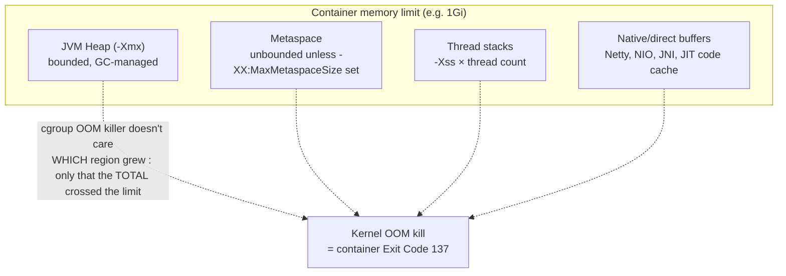

## What this lesson teaches

Every lesson so far has treated the JVM as a black box that either starts or doesn't. This lesson opens that box just enough to explain the interaction that causes a huge share of Java-specific OOM incidents on Kubernetes: the relationship between the container's cgroup memory limit and the JVM's own heap-sizing defaults. You already diagnosed OOMKilled at the symptom level in the [CrashLoopBackOff lesson](/kubernetes/crashloopbackoff-and-exit-codes), this lesson explains the mechanism underneath it, and introduces `jcmd`/`jstat` as basic inspection tools. Full thread dumps, heap dumps, and GC tuning are deliberately out of scope here, that's [Advanced-level material](/kubernetes/thread-dumps-and-deadlock-analysis); this lesson is strictly the conceptual foundation and baseline identity checks.


This lesson assumes you've completed [Namespaces, RBAC, and Multi-Tenancy](/kubernetes/namespaces-rbac-and-multi-tenancy) and the OOMKilled material in [CrashLoopBackOff and Exit Code Deep Dive](/kubernetes/crashloopbackoff-and-exit-codes).



## Core concepts

### cgroup limits vs JVM heap defaults

A container's `resources.limits.memory` is enforced by the Linux kernel via a cgroup, the kernel simply kills the process (or the whole container, depending on cgroup configuration) if total memory usage crosses that ceiling, regardless of what the JVM thinks its own limits are. Historically (JDK 8 before update 191, and all versions before JDK 10), the JVM had **no idea it was running in a container**: it read `/proc/meminfo` for total system memory (the *node's* memory, not the container's limit) and sized its default heap (`-Xmx`, when not explicitly set) as a fraction of that. On a node with 64Gi of RAM, a container limited to 512Mi could still have a JVM default-sizing its heap toward several gigabytes, guaranteeing an OOM kill almost immediately under any real load.

Modern JVMs (JDK 10+, and backported to JDK 8u191+) are **container-aware**: they read the cgroup limits directly and size default heap as a fraction of the *container* limit, not the node's total memory. This fixed the worst version of the problem, but does not eliminate the need to think about memory sizing, for two reasons covered next.

### Why `-Xmx` still matters even with a container-aware JVM

1. **The default heap fraction is conservative, not tailored to your app.** A container-aware JVM defaults `-Xmx` to roughly 25% of the container memory limit (`-XX:MaxRAMPercentage`, default 25.0). That's a reasonable generic default, but it leaves the other ~75% of the container's memory budget for everything else, and whether that split is *correct* for your specific app is something the JVM cannot know. An app doing heavy off-heap work (Netty buffers, large thread counts) needs a smaller heap fraction to leave room; an app that's almost entirely heap-allocated objects with few threads could safely use a much larger fraction.

2. **Off-heap memory is not counted against `-Xmx` at all, but IS counted against the container limit.** This is the critical point: `-Xmx` only bounds the *heap*. It does nothing to bound thread stacks (`-Xss` × thread count), metaspace (class metadata, unbounded by default unless `-XX:MaxMetaspaceSize` is set), direct/native buffers (NIO, Netty, Kafka/gRPC clients), the JIT compiler's code cache, or native library memory (glibc arena overhead, JNI). The container's cgroup limit, by contrast, covers the process's *entire* resident memory footprint, heap plus all of the above. A JVM can be well within its heap budget and still get the whole container OOM-killed because off-heap consumption pushed total RSS over the cgroup ceiling.

The practical implication: **explicitly setting `-Xmx` (and ideally `-XX:MaxMetaspaceSize`, `-Xss`) to leave deliberate headroom below the container limit is still correct practice**, even on a fully container-aware modern JVM, because the question isn't "does the JVM know its limit," it's "does the heap-plus-everything-else total stay under that limit," and only you know how much off-heap memory your specific app needs.



### Inspecting a running JVM's effective configuration

```bash
kubectl exec -it <pod> -n <ns> -- sh
# or bash if available:
kubectl exec -it <pod> -n <ns> -- bash

# Inside the pod:
java -version
jps -l                                  # list JVM processes and main class (PID is usually 1 in containers)
jcmd 1 VM.version
jcmd 1 VM.flags                         # effective JVM flags, incl. container-derived heap sizing
jcmd 1 VM.system_properties | grep -i spring
```

`jcmd 1 VM.flags` is the single most useful command here, it shows the *actual, effective* flags the JVM is running with, including any values the JVM computed automatically from the container's cgroup limits (e.g., a computed `-XX:MaxHeapSize` you never explicitly set). Comparing this output against the container's declared `resources.limits.memory` tells you immediately whether the JVM's own view of its heap ceiling makes sense relative to the container's total budget, before you even look at actual memory usage.

```bash
# Check cgroup memory limit as seen INSIDE the container: confirm the JVM is seeing what you expect
kubectl exec -it <pod> -n <ns> -- cat /sys/fs/cgroup/memory.max            # cgroup v2
kubectl exec -it <pod> -n <ns> -- cat /sys/fs/cgroup/memory/memory.limit_in_bytes  # cgroup v1
```

### Basic `jstat` usage

`jstat` gives a lightweight, continuously-sampled view of GC/heap behavior without the overhead of a full profiling session, useful as a first look before deciding whether deeper GC tuning (Advanced level) is warranted:

```bash
kubectl exec -it <pod> -n <ns> -- jstat -gcutil 1 1000 10      # every 1s, 10 samples
```

This samples GC utilization stats for PID 1 every 1000ms, 10 times, showing heap generation occupancy percentages and GC counts/time. A heap that's consistently near 100% occupancy even right after a garbage collection cycle (rather than dropping back down) is an early, cheap signal of either a genuine leak or simply an undersized heap for the actual working set, worth knowing before reaching for a full heap dump.

### Setting a memory limit and observing the effect end-to-end

The full loop that ties this lesson together: set a container memory limit, observe how the JVM sizes its heap in response, then deliberately misconfigure `-Xmx` *above* that limit and watch it OOM-kill, proving that an explicit, wrong `-Xmx` overrides the JVM's own container-awareness entirely (container-awareness only applies to *computing a default*; an explicit flag always wins).

## Lab

Run the full memory-sizing experiment on a local `kind` cluster.

1. **Deploy a Spring Boot pod with a 512Mi memory limit and no explicit `-Xmx`:**
   ```yaml
   # jvm-default.yaml
   apiVersion: v1
   kind: Pod
   metadata:
     name: jvm-default
   spec:
     containers:
       - name: app
         image: <your-spring-boot-image>
         resources:
           limits:
             memory: "512Mi"
           requests:
             memory: "512Mi"
   ```
   ```bash
   kubectl apply -f jvm-default.yaml
   kubectl wait --for=condition=Ready pod/jvm-default --timeout=60s
   ```

2. **Observe the JVM's computed default heap sizing relative to the container limit:**
   ```bash
   kubectl exec -it jvm-default -- jcmd 1 VM.flags | grep -iE "MaxHeapSize|MaxRAMPercentage"
   kubectl exec -it jvm-default -- cat /sys/fs/cgroup/memory.max
   ```
   Confirm the computed `MaxHeapSize` is roughly 25% of 512Mi (Java expresses it in bytes, expect a value in the neighborhood of 128Mi, modulo rounding and JVM version differences).

3. **Sample live GC stats:**
   ```bash
   kubectl exec -it jvm-default -- jstat -gcutil 1 1000 5
   ```

4. **Now deliberately misconfigure `-Xmx` above the container limit and trigger `OOMKilled`:**
   ```yaml
   # jvm-misconfigured.yaml
   apiVersion: v1
   kind: Pod
   metadata:
     name: jvm-misconfigured
   spec:
     containers:
       - name: app
         image: <your-spring-boot-image>
         env:
           - name: JAVA_TOOL_OPTIONS
             value: "-Xmx1024m"
         resources:
           limits:
             memory: "512Mi"
           requests:
             memory: "512Mi"
   ```
   ```bash
   kubectl apply -f jvm-misconfigured.yaml
   kubectl get pod jvm-misconfigured -w
   ```
   Confirm the pod eventually shows `OOMKilled` in `Last State` once the JVM's heap usage grows past what the 512Mi container can actually hold, even though the JVM itself believes it has up to 1024Mi of heap available.

5. **Confirm the root cause explicitly:**
   ```bash
   kubectl describe pod jvm-misconfigured | grep -A5 "Last State"
   ```

6. **Clean up:**
   ```bash
   kubectl delete pod jvm-default jvm-misconfigured
   ```

## Checkpoint

- [ ] I can explain what changed between pre-JDK-10 JVMs and modern container-aware JVMs regarding memory sizing.
- [ ] I can explain why `-Xmx` still matters even on a fully container-aware JVM.
- [ ] I can name at least three categories of off-heap memory that count against the container limit but not against `-Xmx`.
- [ ] I can read `jcmd 1 VM.flags` output and identify the effective computed heap size.
- [ ] I reproduced an OOM kill in the lab caused specifically by an explicit `-Xmx` set above the container's memory limit.
