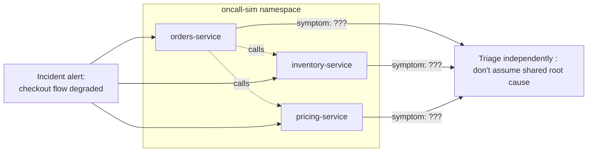

## What this lesson teaches

Every lesson in this level taught you one failure mode in isolation, with the luxury of already knowing what was broken. Real on-call incidents don't announce their category, you get a vague alert ("checkout-service is returning errors") and have to figure out *which* of the eight things you've now learned is actually at fault, often with more than one thing broken at once. This capstone simulates exactly that: three independent Spring Boot microservices, each broken in a different way you've studied in this level (networking, config, JVM memory), deployed simultaneously, with no hints about which service maps to which failure category. You'll triage all three within a time box and produce a written root-cause summary for each, the same deliverable a real incident retro expects.


This capstone assumes you've completed all of Module 2, Lessons 1 through 8, [Probes](/kubernetes/liveness-readiness-and-startup-probes), [CrashLoopBackOff & Exit Codes](/kubernetes/crashloopbackoff-and-exit-codes), [Restart Troubleshooting Across a Deployment](/kubernetes/restart-troubleshooting-across-a-deployment), [DNS & Service Discovery](/kubernetes/dns-and-service-discovery-deep-dive), [ConfigMap/Secret Propagation](/kubernetes/configmap-secret-propagation), [Persistent Storage](/kubernetes/persistent-storage-for-stateful-workloads), [Namespaces & RBAC](/kubernetes/namespaces-rbac-and-multi-tenancy), and [JVM-in-Container Basics](/kubernetes/jvm-in-container-basics). This is a synthesis exercise, not a place to learn new material, if any of the diagnostic commands feel unfamiliar, go back to the relevant lesson first.



## Scenario

You're on call. Three Spring Boot microservices in the `oncall-sim` namespace are misbehaving simultaneously: `orders-service`, `inventory-service`, and `pricing-service`. All three feed the same checkout flow, so the incident channel is treating this as one outage even though, as you'll discover, the root causes are completely unrelated to each other. Your job is to triage all three independently, using only `kubectl` and the diagnostic techniques from this level, and produce a root-cause summary for each before "paging" anyone else (i.e., before looking at the answer key below).

**Time box:** give yourself 45 minutes for triage across all three services before reading the root-cause reveal at the end of this lesson. This mirrors a real incident's time pressure, the goal is building the reflex of working the [scoping → decision-tree → confirm](/kubernetes/restart-troubleshooting-across-a-deployment) flow quickly under three simultaneous unknowns, not achieving a perfect diagnosis on the first pass.



## Setup

1. **Create the namespace and a shared "database" and "config server" stand-in used by the scenario:**
   ```bash
   kubectl create namespace oncall-sim
   ```

2. **Deploy `orders-service` with an injected `NetworkPolicy` block against its downstream dependency** (this is the networking fault, you will not be told this in advance during the actual triage):
   ```yaml
   # orders-service.yaml
   apiVersion: apps/v1
   kind: Deployment
   metadata:
     name: orders-service
     namespace: oncall-sim
   spec:
     replicas: 2
     selector: { matchLabels: { app: orders-service } }
     template:
       metadata: { labels: { app: orders-service } }
       spec:
         containers:
           - name: app
             image: <your-spring-boot-image>
             env:
               - name: INVENTORY_URL
                 value: http://inventory-service.oncall-sim.svc.cluster.local:8080
             ports:
               - containerPort: 8080
   ---
   apiVersion: v1
   kind: Service
   metadata:
     name: orders-service
     namespace: oncall-sim
   spec:
     selector: { app: orders-service }
     ports:
       - port: 8080
   ---
   apiVersion: networking.k8s.io/v1
   kind: NetworkPolicy
   metadata:
     name: block-inventory-ingress
     namespace: oncall-sim
   spec:
     podSelector:
       matchLabels: { app: inventory-service }
     policyTypes: ["Ingress"]
     ingress: []
   ```

3. **Deploy `inventory-service` normally** (it's the *target* of the networking fault, but is itself healthy, part of the triage challenge is realizing the problem isn't in this pod at all):
   ```yaml
   # inventory-service.yaml
   apiVersion: apps/v1
   kind: Deployment
   metadata:
     name: inventory-service
     namespace: oncall-sim
   spec:
     replicas: 2
     selector: { matchLabels: { app: inventory-service } }
     template:
       metadata: { labels: { app: inventory-service } }
       spec:
         containers:
           - name: app
             image: <your-spring-boot-image>
             ports:
               - containerPort: 8080
   ---
   apiVersion: v1
   kind: Service
   metadata:
     name: inventory-service
     namespace: oncall-sim
   spec:
     selector: { app: inventory-service }
     ports:
       - port: 8080
   ```

4. **Deploy `pricing-service` with a ConfigMap consumed as an env var, updated but never restarted** (this is the config fault):
   ```bash
   kubectl create configmap pricing-config \
     --from-literal=DISCOUNT_ENGINE_URL=http://discount-v1.oncall-sim.svc.cluster.local:9090 \
     -n oncall-sim
   ```
   ```yaml
   # pricing-service.yaml
   apiVersion: apps/v1
   kind: Deployment
   metadata:
     name: pricing-service
     namespace: oncall-sim
   spec:
     replicas: 2
     selector: { matchLabels: { app: pricing-service } }
     template:
       metadata: { labels: { app: pricing-service } }
       spec:
         containers:
           - name: app
             image: <your-spring-boot-image>
             envFrom:
               - configMapRef:
                   name: pricing-config
             ports:
               - containerPort: 8080
   ---
   apiVersion: v1
   kind: Service
   metadata:
     name: pricing-service
     namespace: oncall-sim
   spec:
     selector: { app: pricing-service }
     ports:
       - port: 8080
   ```
   ```bash
   kubectl apply -f orders-service.yaml -f inventory-service.yaml -f pricing-service.yaml
   # Simulate "the discount engine moved": update the ConfigMap AFTER pods are already running,
   # exactly as a real config change during business hours would happen:
   kubectl patch configmap pricing-config -n oncall-sim --type merge \
     -p '{"data":{"DISCOUNT_ENGINE_URL":"http://discount-v2.oncall-sim.svc.cluster.local:9090"}}'
   ```

5. **Deploy a fourth component with a JVM memory misconfiguration**: a `payment-service` whose `-Xmx` is set above its container limit (the JVM memory fault; note this one is a genuine crash loop, unlike the other two which are "silently degraded but Running"):
   ```yaml
   # payment-service.yaml
   apiVersion: apps/v1
   kind: Deployment
   metadata:
     name: payment-service
     namespace: oncall-sim
   spec:
     replicas: 2
     selector: { matchLabels: { app: payment-service } }
     template:
       metadata: { labels: { app: payment-service } }
       spec:
         containers:
           - name: app
             image: <your-spring-boot-image>
             env:
               - name: JAVA_TOOL_OPTIONS
                 value: "-Xmx900m"
             resources:
               limits:
                 memory: "512Mi"
               requests:
                 memory: "512Mi"
             ports:
               - containerPort: 8080
   ---
   apiVersion: v1
   kind: Service
   metadata:
     name: payment-service
     namespace: oncall-sim
   spec:
     selector: { app: payment-service }
     ports:
       - port: 8080
   ```
   ```bash
   kubectl apply -f payment-service.yaml
   ```

You now have four services running, but only three *root causes* to find: `orders-service` and `inventory-service` together form a single "networking" incident, since the fault is a NetworkPolicy between them. The other two root causes are the config and JVM memory issues described above. Start your 45-minute timer now.

## Lab: the triage

Work through each service using only the techniques from this level. Suggested approach, not a rigid script:

1. **Get the lay of the land first** (per the [restart troubleshooting lesson](/kubernetes/restart-troubleshooting-across-a-deployment), scope before you root-cause):
   ```bash
   kubectl get pods -n oncall-sim -o wide
   kubectl get pods -n oncall-sim --sort-by='.status.containerStatuses[0].restartCount'
   kubectl get events -n oncall-sim --sort-by='.lastTimestamp'
   ```

2. **For each service that's `Running` but suspected unhealthy** (not obviously crash-looping), check actual request behavior, not just pod status, a pod can be `2/2 Running` and still be serving 500s to every request:
   ```bash
   kubectl exec -it -n oncall-sim deploy/orders-service -- curl -sv --max-time 5 http://inventory-service.oncall-sim.svc.cluster.local:8080/actuator/health
   ```

3. **For any service that IS crash-looping**, run the full decision tree from [Lesson 2](/kubernetes/crashloopbackoff-and-exit-codes):
   ```bash
   kubectl describe pod -n oncall-sim -l app=payment-service
   kubectl logs -n oncall-sim -l app=payment-service --previous
   ```

4. **For the networking suspect**, work the layered checklist from [Lesson 4](/kubernetes/dns-and-service-discovery-deep-dive), DNS resolution first, then direct pod IP, then NetworkPolicy:
   ```bash
   kubectl exec -it -n oncall-sim deploy/orders-service -- nslookup inventory-service.oncall-sim.svc.cluster.local
   kubectl get networkpolicy -n oncall-sim
   kubectl describe networkpolicy -n oncall-sim
   ```

5. **For the config suspect**, check env vars actually in effect versus the current ConfigMap content, per [Lesson 5](/kubernetes/configmap-secret-propagation):
   ```bash
   kubectl exec -it -n oncall-sim deploy/pricing-service -- env | grep DISCOUNT
   kubectl get configmap pricing-config -n oncall-sim -o yaml
   ```

6. **For the JVM memory suspect**, confirm the exit code and compare `-Xmx` against the container limit, per [Lesson 8](/kubernetes/jvm-in-container-basics):
   ```bash
   kubectl get pod -n oncall-sim -l app=payment-service -o jsonpath='{.items[*].status.containerStatuses[*].lastState.terminated}'
   ```

7. **Write a root-cause summary for each of the three incidents** (one to two sentences each) before reading the reveal below. Use this template:
   ```
   Service: <name>
   Symptom observed: <what kubectl get pods / logs showed>
   Root cause: <the actual underlying issue>
   Fix applied: <the kubectl/manifest change that resolves it>
   ```

### Root-cause reveal (read only after attempting triage)

- **`orders-service` → `inventory-service`:** A `NetworkPolicy` (`block-inventory-ingress`) denies all ingress to `inventory-service`, so `orders-service` can resolve the DNS name fine but every request times out. Fix: replace the deny-all policy with one that allows ingress from `orders-service`, e.g. adding an `ingress.from.podSelector` matching `app: orders-service`.
- **`pricing-service`:** The `DISCOUNT_ENGINE_URL` env var comes from a ConfigMap consumed via `envFrom`. The ConfigMap was updated after the pods started, but env vars never propagate to a running container, `pricing-service` is still calling the old (now-wrong) `discount-v1` hostname. Fix: `kubectl rollout restart deployment/pricing-service -n oncall-sim` to pick up the new value (and going forward, consider whether this config should be volume-mounted with a file-watching refresh mechanism if hot-reload is a requirement).
- **`payment-service`:** `-Xmx900m` was set via `JAVA_TOOL_OPTIONS` above the container's 512Mi memory limit, so the JVM sizes its heap toward 900MB while the kernel cgroup enforces a hard 512Mi ceiling, guaranteed `OOMKilled` (`Exit Code: 137`) once heap usage grows. Fix: remove the explicit `-Xmx` override (let the container-aware JVM default to ~25% of 512Mi) or set it explicitly to a value with headroom below the limit, e.g. `-Xmx350m`.

## Checkpoint

- [ ] I triaged all three root causes using only `kubectl` commands from this level, without being told in advance which category each symptom belonged to.
- [ ] I correctly distinguished a "pod Running but functionally broken" incident (NetworkPolicy, config) from a genuine crash loop (JVM memory).
- [ ] I wrote a root-cause summary for each incident in the symptom/root-cause/fix format before reading the reveal.
- [ ] I can explain, in my own words, why `orders-service`'s own pod logs were the wrong place to look for the networking root cause.
- [ ] I applied the fix for all three and confirmed recovery with `kubectl get pods -n oncall-sim` and a follow-up `curl`/`exec` check, not just by re-reading the manifest.

You've completed Intermediate. The [Advanced level](/kubernetes/thread-dumps-and-deadlock-analysis) picks up exactly where [JVM-in-Container Basics](/kubernetes/jvm-in-container-basics) left off, thread dumps, heap dumps, GC tuning, and profiling, plus service mesh and observability at scale.
