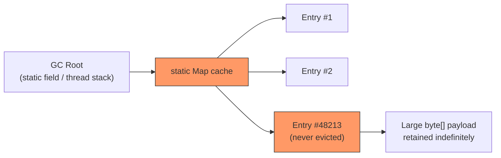

Thread dumps tell you what threads are doing right now; heap dumps tell you what's actually sitting in memory and, crucially, *why it hasn't been garbage collected*. For Java and Spring Boot developers, memory leaks almost never look like a leak in the C sense, nothing is "lost," something is just being held onto by a reference chain nobody intended, usually a static collection, a cache with no eviction policy, or a listener that never gets deregistered. This lesson teaches you to capture that evidence safely in production and read it offline.

This builds on the thread-dump skills from the previous lesson, you'll often reach for a heap dump right after a thread dump shows normal-looking threads but memory graphs keep climbing, which rules out a hang and points at retention instead.


Complete [Thread Dumps and Deadlock Analysis](/kubernetes/thread-dumps-and-deadlock-analysis) first, this lesson assumes you're comfortable with `jcmd` and pulling files out of pods with `kubectl cp`.



## Capturing heap dumps on demand

```bash
# On-demand heap dump (works while pod is alive and healthy)
kubectl exec -it <pod> -n <ns> -- jcmd 1 GC.heap_dump /tmp/heapdump.hprof
kubectl cp <ns>/<pod>:/tmp/heapdump.hprof ./heapdump.hprof

# Live heap histogram: fast, no full dump needed, good first look
kubectl exec -it <pod> -n <ns> -- jcmd 1 GC.class_histogram | head -30
```

The class histogram is the cheap first move: it lists live instance counts and total bytes per class, sorted descending, with no need to move a multi-gigabyte file anywhere. If `com.yourapp.SomeCache$Entry` has 4 million live instances, you don't need a full dump to know where to look next, but you do need one to see the reference chain keeping them alive.

## Capturing heap dumps automatically on OOM

Waiting for a live incident to remember `jcmd` is how forensic evidence gets lost. Configure the JVM to dump automatically the moment it OOMs, so the *next* crash is self-documenting:

```bash
# Automatic heap dump on OOM: add to JVM args so the NEXT OOM captures evidence automatically
# -XX:+HeapDumpOnOutOfMemoryError -XX:HeapDumpPath=/tmp/heapdump.hprof
# Then mount /tmp (or a dedicated emptyDir volume) so the file survives container restart:
kubectl exec -it <pod> -n <ns> -- ls -la /tmp/*.hprof
```

Recommended Deployment additions to make OOM events forensically debuggable in the first place:

```yaml
env:
  - name: JAVA_TOOL_OPTIONS
    value: >-
      -XX:+HeapDumpOnOutOfMemoryError
      -XX:HeapDumpPath=/dumps/heapdump.hprof
      -XX:+ExitOnOutOfMemoryError
volumeMounts:
  - name: dumps
    mountPath: /dumps
volumes:
  - name: dumps
    emptyDir: {}
```

`-XX:+ExitOnOutOfMemoryError` makes the JVM die immediately and cleanly on OOM instead of limping along in a corrupted state, Kubernetes then restarts it predictably, and you already have the dump waiting in the mounted volume instead of lost with the old container filesystem.

> Without a dedicated `emptyDir` (or persistent volume) mount, the `.hprof` file dies with the container it was written in, and `kubectl cp` after a restart will find nothing.

## Offline analysis: dominator tree, GC roots, leak suspects

Never eyeball a multi-gigabyte heap dump in a terminal. Pull it locally and open it in a dedicated tool:

- **Eclipse MAT (Memory Analyzer Tool)**: the industry standard for this. Its "Leak Suspects" report runs automatically on open and usually names the offending class directly. The **dominator tree** view is the key concept: it shows which objects, if removed, would free the most retained memory, i.e., who's really holding everything else alive, cutting through layers of intermediate wrapper objects.
- **VisualVM**: lighter weight, ships with some JDK distributions or as a separate download; good for quick histogram-style browsing and live sampling, less powerful than MAT for deep leak-suspect analysis.
- **JDK Mission Control (JMC)**: strong for combining heap data with JFR (Java Flight Recorder) if you're also capturing flight recordings.

The core concept to understand before opening any of these: an object only leaks if something is still reachable from a **GC root** (a thread stack, a static field, a JNI reference) all the way down to it. MAT's dominator tree and "path to GC root" view exist specifically to answer "why is this object still alive", that's the question a leak investigation is actually trying to answer, not just "what's using memory."



If a static `Map` keeps accumulating `Entry` objects with no eviction (no TTL, no max size, no `WeakHashMap`), every entry stays reachable from that GC root forever, this is the single most common Java memory leak pattern, and it's exactly what the dominator tree will surface as the top retained-size suspect.

## Lab

1. Deploy a small Spring Boot app with a deliberately unbounded static cache, e.g. a `static final Map<String, byte[]> cache = new HashMap<>()` that an endpoint adds a new large entry to on every call, with no eviction:
   ```bash
   kubectl -n advanced-lab apply -f leaky-app-deployment.yaml
   POD=$(kubectl -n advanced-lab get pod -l app=leaky-app -o jsonpath='{.items[0].metadata.name}')
   ```
2. Capture a baseline heap dump before inducing the leak:
   ```bash
   kubectl exec -it "$POD" -n advanced-lab -- jcmd 1 GC.heap_dump /tmp/before.hprof
   kubectl cp advanced-lab/"$POD":/tmp/before.hprof ./before.hprof
   ```
3. Drive load against the leaking endpoint for a couple of minutes:
   ```bash
   kubectl -n advanced-lab port-forward svc/leaky-app 8080:8080 &
   for i in $(seq 1 500); do curl -s "localhost:8080/cache-add?key=$i" > /dev/null; done
   ```
4. Capture a second dump and pull it out:
   ```bash
   kubectl exec -it "$POD" -n advanced-lab -- jcmd 1 GC.heap_dump /tmp/after.hprof
   kubectl cp advanced-lab/"$POD":/tmp/after.hprof ./after.hprof
   ```
5. Open `after.hprof` in Eclipse MAT, run the built-in Leak Suspects report, and drill into the dominator tree until you find the static cache holding thousands of entries. Confirm the "path to GC root" traces back to a `static` field.
6. Compare live instance counts between `before.hprof` and `after.hprof` using the class histogram to quantify growth:
   ```bash
   kubectl exec -it "$POD" -n advanced-lab -- jcmd 1 GC.class_histogram | grep -i "YourApp"
   ```

## Checkpoint

- [ ] I can capture an on-demand heap dump with `jcmd 1 GC.heap_dump` and a fast histogram with `jcmd 1 GC.class_histogram`.
- [ ] I've configured `-XX:+HeapDumpOnOutOfMemoryError` with a mounted volume so a real OOM would leave forensic evidence behind.
- [ ] I can explain what a GC root is and why "path to GC root" is the central question in leak analysis.
- [ ] I can navigate a dominator tree in Eclipse MAT or VisualVM to find the top retained-size object.
- [ ] I completed the lab and identified the exact static reference keeping leaked entries alive.
