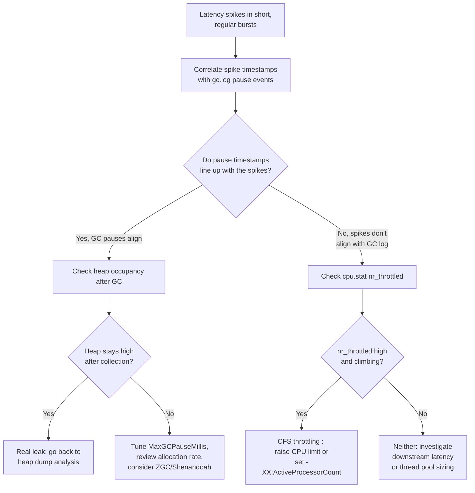

Two completely different problems produce the same symptom in a containerized Spring Boot app: request latency that spikes in short, regular bursts. One is the garbage collector pausing the world; the other is the Linux kernel scheduler forcibly stopping your JVM mid-execution because a CPU *limit* was hit. Confusing the two leads teams to spend a week tuning GC flags for a problem that a one-line resource limit change would have fixed, or vice versa. This lesson teaches you to tell them apart definitively, using evidence, not guesses.

This builds on the heap-dump work from the previous lesson: once you've ruled out a leak (heap genuinely isn't growing unbounded), pause-like latency symptoms usually come down to one of the two causes covered here.


Complete [Heap Dumps and Memory Leak Hunting](/kubernetes/heap-dumps-and-memory-leaks) first, so you've already ruled out "the heap is just genuinely full of live leaked objects" before investigating GC tuning or throttling.



## Collector tradeoffs: G1, ZGC, Shenandoah

| Collector | Pause target | Best for | Tradeoff |
|---|---|---|---|
| **G1GC** (default, JDK 9+) | `-XX:MaxGCPauseMillis` (soft target, e.g. 200ms) | General-purpose, small-to-mid heaps (a few GB) | Pauses scale somewhat with heap/live-set size; can miss its pause target under high allocation rate. |
| **ZGC** | Sub-millisecond pauses, concurrent | Large heaps (tens of GB+), latency-sensitive services | Higher throughput overhead than G1 in some workloads; needs a reasonably modern JDK (fully production-ready from JDK 15+). |
| **Shenandoah** | Sub-millisecond pauses, concurrent | Similar to ZGC: large heaps, latency-sensitive | Similar tradeoffs to ZGC; availability depends on your JDK distribution. |

For most Spring Boot microservices running with container heaps in the low single-digit gigabytes, G1 with a tuned `-XX:MaxGCPauseMillis` is the right default. Reach for ZGC/Shenandoah specifically when you have a large heap *and* a hard latency SLA that occasional G1 pause-target misses would violate.

## Confirming which GC is active and watching it live

```bash
# Confirm which GC is active
kubectl exec -it <pod> -n <ns> -- jcmd 1 VM.flags | grep -i "UseG1GC\|UseZGC\|UseParallelGC\|UseShenandoahGC"

# Live GC stats
kubectl exec -it <pod> -n <ns> -- jstat -gcutil 1 1000 10      # every 1s, 10 samples
```

`jstat -gcutil` prints percentage-full for each generation plus cumulative GC time, watch the `YGC`/`YGCT` (young GC count/time) and `FGC`/`FGCT` (full GC count/time) columns climb during a load test to see collection frequency and cost in real time, no log parsing needed.

## Reading GC logs

```bash
# Enable GC logging (add to JVM args, JDK 9+ unified logging)
# -Xlog:gc*:file=/dumps/gc.log:time,uptime,level,tags:filecount=5,filesize=20M
kubectl exec -it <pod> -n <ns> -- tail -f /dumps/gc.log
```

Symptoms → cause, straight from GC log patterns:

| Symptom | Likely cause |
|---|---|
| Frequent full GCs with heap still high after collection | Real leak, or heap is simply too small for the working set. |
| Long G1 pauses correlating with request timeout spikes | Tune `-XX:MaxGCPauseMillis`, review allocation rate, consider ZGC/Shenandoah for large heaps. |
| High GC overhead but low pause times | Allocation-heavy code path: check for excessive object creation, string concatenation in hot loops, unbounded `Optional`/stream chains. |

## Telling GC pauses apart from CFS CPU throttling

This is the crux of the lesson. A **CPU limit** on a container is enforced by the Linux kernel's Completely Fair Scheduler (CFS) using cgroup quotas: your container gets a fixed CPU-time budget per fixed period (e.g. 100ms), and once it's spent that budget, the kernel simply stops scheduling it until the next period, no matter what it was doing, including running mid-GC or mid-request. This looks identical to a GC pause from the outside (a stall, then a resume) but the *fix* is completely different.

```bash
# Check for CFS throttling (needs cgroup access, or use kubectl exec)
kubectl exec -it <pod> -n <ns> -- cat /sys/fs/cgroup/cpu.stat   # look at nr_throttled, throttled_time (cgroup v2)
```

If `nr_throttled` is high and growing, the JVM is being paused mid-execution by the kernel scheduler, this manifests as GC-pause-like symptoms and tail latency, but the fix is raising or removing the CPU limit, or right-sizing `-XX:ActiveProcessorCount` (so the JVM sizes its own thread pools and GC worker threads to the *actual* CPU budget it has, instead of assuming it owns every core the node exposes), not GC tuning.



The diagnostic rule of thumb: **GC pauses show up in the GC log at the exact millisecond they happen. CFS throttling never appears in the GC log at all**: the JVM has no idea it was paused; from its perspective time simply skipped forward. If your latency spikes don't correlate with any GC log entry, stop looking at GC flags and go straight to `cpu.stat`.

## Lab

1. Deploy a CPU-bound Spring Boot endpoint (e.g. a tight loop doing hashing or JSON serialization of a large object) with a deliberately undersized CPU limit:
   ```yaml
   resources:
     requests:
       cpu: "250m"
     limits:
       cpu: "250m"
   ```
   ```bash
   kubectl -n advanced-lab apply -f cpu-bound-deployment.yaml
   POD=$(kubectl -n advanced-lab get pod -l app=cpu-bound -o jsonpath='{.items[0].metadata.name}')
   ```
2. Generate sustained load against the endpoint (a simple loop or `hey`/`ab` if installed locally):
   ```bash
   kubectl -n advanced-lab port-forward svc/cpu-bound 8080:8080 &
   hey -z 60s -c 20 http://localhost:8080/cpu-work
   ```
3. While load is running, watch throttling accumulate:
   ```bash
   kubectl exec -it "$POD" -n advanced-lab -- cat /sys/fs/cgroup/cpu.stat
   ```
   Confirm `nr_throttled` and `throttled_time` climb steadily during the load window.
4. In parallel, enable and tail GC logging as described above, and confirm GC pause events do **not** correlate with the same timestamps as your observed latency spikes, this is the evidence that rules GC out.
5. Fix it two ways and compare: first raise the CPU limit (e.g. to `"1000m"`) and re-run the load test, confirming `nr_throttled` stops climbing; then, instead, leave the limit low but set `-XX:ActiveProcessorCount=1` via `JAVA_TOOL_OPTIONS` so the JVM stops oversubscribing threads relative to its real budget, and compare tail latency in both configurations.

## Checkpoint

- [ ] I can name the pause-time/heap-size tradeoffs between G1, ZGC, and Shenandoah and pick the right default for a typical Spring Boot service.
- [ ] I can enable unified GC logging and read the symptom-to-cause table against real log output.
- [ ] I can check `cpu.stat` for `nr_throttled`/`throttled_time` and explain why CFS throttling never appears in a GC log.
- [ ] I can explain what `-XX:ActiveProcessorCount` fixes and why it matters under a tight CPU limit.
- [ ] I completed the lab and can show, with evidence from both `cpu.stat` and `gc.log`, which of the two causes was responsible for my induced latency spike.
