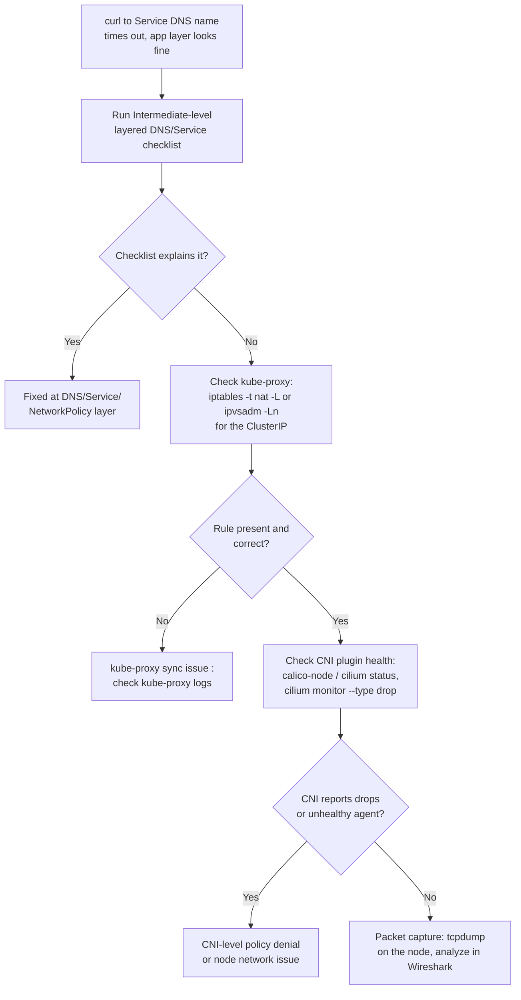

You already know the layered DNS/Service/NetworkPolicy checklist from Intermediate, that covers the vast majority of "pod A can't reach pod B" incidents. This lesson goes one level below that checklist, to the actual mechanism that makes a Service's virtual IP resolve to a real pod IP at all: kube-proxy's iptables/IPVS rules, the CNI plugin that wires up the pod network itself, and packet-level capture for the rare incident where none of the higher-level checks explain what you're seeing. For a Java/Spring Boot developer this is usually the last stop, you get here when `curl` to a Service DNS name times out but everything at the application layer looks fine.

This builds on the Intermediate networking/DNS lesson's layered checklist, treat this lesson as steps you add *underneath* that checklist when steps 1-7 there don't explain the symptom.


Complete [CPU Profiling with async-profiler](/kubernetes/cpu-profiling-with-async-profiler) first, and make sure you're already comfortable with the Intermediate-level DNS/Service/NetworkPolicy layered checklist (`/kubernetes/dns-and-service-discovery-deep-dive` or equivalent), this lesson assumes you've already ruled out the higher layers.



## kube-proxy / iptables / IPVS issues

Every Service's ClusterIP is virtual, no interface actually owns that address. kube-proxy is the component that programs the node's packet-filtering rules so traffic destined for a ClusterIP gets DNAT'd to one of the Service's real pod IPs. It runs in one of two modes: iptables (the long-standing default, using `iptables -t nat` chains) or IPVS (Linux's in-kernel load balancer, better suited to clusters with very large numbers of Services).

```bash
kubectl -n kube-system get pods -l k8s-app=kube-proxy
kubectl -n kube-system logs <kube-proxy-pod>

# On the node itself (via debug pod with hostNetwork, or SSH)
kubectl debug node/<node-name> -it --image=nicolaka/netshoot
iptables -t nat -L -n | grep <service-cluster-ip>       # iptables mode
ipvsadm -Ln | grep <service-cluster-ip>                  # IPVS mode
```

`kubectl debug node/<node-name>` drops you onto the node's network namespace with a full toolbox image, which is what lets you run raw `iptables`/`ipvsadm` commands that wouldn't work from inside a normal pod. If a Service's ClusterIP has no matching rule at all in either mode, kube-proxy either hasn't synced yet or the Service/Endpoints object never propagated to it, check the kube-proxy logs for errors before assuming a deeper CNI problem.

## CNI plugin issues (Calico/Cilium/Flannel)

kube-proxy handles Service-to-pod translation; the **CNI plugin** is a separate layer entirely, it's responsible for actually giving each pod an IP address and wiring up the virtual ethernet/routing so pod-to-pod traffic (Service or no Service) can flow at all, plus enforcing `NetworkPolicy` if the plugin supports it.

```bash
kubectl -n kube-system get pods -l k8s-app=calico-node -o wide
kubectl -n kube-system logs <calico-node-pod>

# Cilium-specific
kubectl -n kube-system exec -it <cilium-pod> -- cilium status
kubectl -n kube-system exec -it <cilium-pod> -- cilium endpoint list
kubectl -n kube-system exec -it <cilium-pod> -- cilium monitor --type drop
```

`cilium monitor --type drop` is worth calling out specifically: it streams live packet drops with the reason Cilium's eBPF datapath rejected them (e.g. a `NetworkPolicy` denial, or an unroutable destination), this turns "traffic just silently disappears" into an explicit, real-time drop reason, which is far faster than inferring policy behavior from `iptables -L` output.

## Packet-level debugging

When everything above looks healthy but traffic still isn't behaving as expected, intermittent connection resets, unexplained latency, or traffic that seems to vanish between two specific pods, drop to an actual packet capture.

```bash
kubectl debug node/<node> -it --image=nicolaka/netshoot -- tcpdump -i any host <pod-ip> -w /tmp/capture.pcap
kubectl cp <node-debug-pod>:/tmp/capture.pcap ./capture.pcap   # analyze in Wireshark
```

`-i any host <pod-ip>` captures all traffic touching that pod's IP across any interface on the node, and `-w` writes it to a `.pcap` file instead of printing decoded packets to the terminal, you want the raw capture so you can load it into Wireshark locally and use its filtering/stream-reassembly instead of trying to read raw `tcpdump` output live. This is the diagnostic of last resort in this lesson's toolchain: reach for it only after kube-proxy rules and CNI health both check out, because setting up and interpreting a capture takes real time.



## Lab

1. On your `kind`/`minikube` cluster, identify which CNI is installed and confirm its pods are healthy:
   ```bash
   kubectl -n kube-system get pods -o wide | grep -Ei "calico|cilium|flannel|kindnet"
   ```
2. Inspect the current kube-proxy mode and confirm rules exist for a real Service in your cluster:
   ```bash
   kubectl -n kube-system get pods -l k8s-app=kube-proxy
   kubectl get svc -n advanced-lab
   SVC_IP=$(kubectl get svc <your-service> -n advanced-lab -o jsonpath='{.spec.clusterIP}')
   kubectl debug node/<node-name> -it --image=nicolaka/netshoot
   # inside the debug session:
   iptables -t nat -L -n | grep "$SVC_IP"
   ```
3. If your CNI is Cilium, watch live drops while generating some deliberately blocked traffic (e.g. apply a deny-all `NetworkPolicy` in the lab namespace first):
   ```bash
   kubectl apply -f deny-all-networkpolicy.yaml -n advanced-lab
   kubectl -n kube-system exec -it <cilium-pod> -- cilium monitor --type drop &
   kubectl -n advanced-lab run test-client --rm -it --image=nicolaka/netshoot -- curl -s --max-time 3 http://<your-service>.advanced-lab.svc.cluster.local
   ```
   Confirm the drop event appears with a policy-denial reason. (If your cluster uses Calico or Flannel instead, use `calicoctl` or check `iptables -L` for the equivalent deny rule, and confirm the connection times out consistent with the policy.)
4. Finally, capture real packets for a specific pod-to-pod flow and inspect them in Wireshark:
   ```bash
   POD_IP=$(kubectl get pod <target-pod> -n advanced-lab -o jsonpath='{.status.podIP}')
   kubectl debug node/<node-name> -it --image=nicolaka/netshoot -- tcpdump -i any host "$POD_IP" -w /tmp/capture.pcap
   # in another terminal, generate traffic against that pod, then Ctrl-C the tcpdump
   kubectl cp <node-debug-pod-name>:/tmp/capture.pcap ./capture.pcap
   ```
   Open `capture.pcap` in Wireshark and confirm you can see the TCP handshake (or resets, if you kept the deny-all policy active) for that pod's traffic.

## Checkpoint

- [ ] I can explain the difference in responsibility between kube-proxy (Service-to-pod translation) and the CNI plugin (pod networking and policy enforcement).
- [ ] I can inspect iptables NAT rules or IPVS rules for a specific Service ClusterIP from a node debug session.
- [ ] I can run `cilium monitor --type drop` (or the Calico/Flannel equivalent investigation) and read a live policy-denial reason.
- [ ] I know when packet capture is the right next step versus premature, i.e., only after kube-proxy and CNI health are already confirmed.
- [ ] I completed the lab and captured a real `.pcap` file for a specific pod IP, and opened it in Wireshark.
