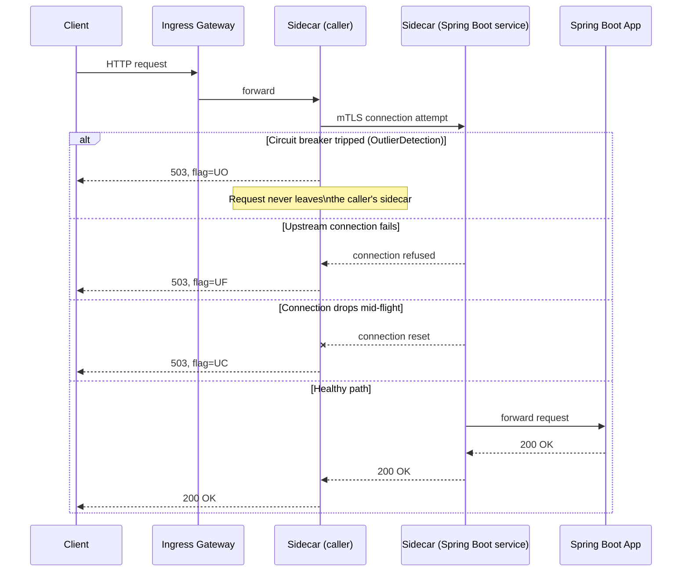

Once traffic leaves the plain kube-proxy/CNI world you studied in the last lesson and passes through an ingress controller or a service mesh sidecar, a whole new category of failure becomes possible: your Spring Boot service returns perfectly good responses, its own logs show nothing wrong, and yet clients see intermittent 503s or connection resets. The cause lives entirely in the mesh layer, Envoy rejecting or retrying a request before it ever reaches your `@RestController`. This lesson teaches you to read that layer directly instead of debugging application code that was never at fault.

This builds on the low-level networking lesson immediately before it: ingress and mesh sit one layer above kube-proxy/CNI in the request path, so you should already be comfortable ruling out plain Service/CNI issues before reaching for `istioctl`.


Complete [Low-Level Networking: CNI and kube-proxy Internals](/kubernetes/low-level-networking-cni-and-kube-proxy) first. A full Istio install (`istioctl install`) is needed to run every command in this lesson hands-on, if you don't have one available, read through for the mental model and command shapes, which the lesson's Lab section also calls out explicitly.



## Ingress controller (NGINX example)

Before service mesh, most clusters have a plainer ingress layer terminating external traffic. The same "check the controller, not just the app" instinct applies here too:

```bash
kubectl get ingress -n <ns>
kubectl describe ingress <ingress-name> -n <ns>

kubectl -n ingress-nginx get pods
kubectl -n ingress-nginx logs -l app.kubernetes.io/component=controller --tail=200

# Verify generated nginx.conf actually has the expected upstream
kubectl -n ingress-nginx exec -it <controller-pod> -- cat /etc/nginx/nginx.conf | grep -A10 <service-name>

# TLS/cert issues
kubectl get certificate -n <ns>              # if cert-manager used
kubectl describe certificate <cert-name> -n <ns>
kubectl get secret <tls-secret> -n <ns> -o jsonpath='{.data.tls\.crt}' | base64 -d | openssl x509 -text -noout
```

The `nginx.conf` grep is the step people skip and shouldn't: an `Ingress` object can look perfectly correct in `kubectl describe` while the controller's actually-generated config (which is what's really being served) is stale or missing the upstream entirely, usually because of a reload failure logged only in the controller pod's own logs.

## Istio service mesh

```bash
istioctl proxy-status
istioctl proxy-config listener <pod>.<ns>
istioctl proxy-config route <pod>.<ns>
istioctl proxy-config cluster <pod>.<ns>
istioctl proxy-config endpoint <pod>.<ns>

# Analyze config for misconfigurations (DestinationRule/VirtualService conflicts)
istioctl analyze -n <ns>

# Sidecar injection check
kubectl get pod <pod> -n <ns> -o jsonpath='{.spec.containers[*].name}'   # expect istio-proxy present
kubectl get namespace <ns> --show-labels | grep istio-injection

# mTLS issues
istioctl authn tls-check <pod>.<ns>
kubectl logs <pod> -n <ns> -c istio-proxy --tail=200
```

`istioctl proxy-status` is your first command in any mesh incident, it shows every sidecar's sync state with the control plane (`istiod`); a sidecar stuck `STALE` means that pod is running on outdated routing/cluster config and will misbehave in ways that look inexplicable until you check this. The four `proxy-config` subcommands (`listener`, `route`, `cluster`, `endpoint`) mirror Envoy's own internal config model, when a `VirtualService` or `DestinationRule` isn't behaving as written, walking down from `listener` → `route` → `cluster` → `endpoint` shows you exactly which stage the actual runtime config diverges from what you expected, rather than guessing from the YAML alone.

`istioctl analyze -n <ns>` is worth running proactively, not just reactively, it catches a large class of `DestinationRule`/`VirtualService` conflicts (e.g. two `VirtualServices` claiming the same host, or a `DestinationRule` referencing a subset that no `DestinationRule` actually defines) before they cause an incident.

### Reading Envoy access log response flags

```bash
# 503 UF/UC/UO flags in envoy access logs: decode:
# UF = upstream connection failure, UC = upstream connection termination,
# UO = upstream overflow (circuit breaker tripped)
kubectl logs <pod> -n <ns> -c istio-proxy | grep -E "UF|UC|UO|NR"
```

| Flag | Meaning |
|---|---|
| `UF` | Upstream connection failure: Envoy couldn't establish a connection to the upstream at all. |
| `UC` | Upstream connection termination: a connection was established but then torn down before completing. |
| `UO` | Upstream overflow: the circuit breaker (`OutlierDetection`/connection pool limits) tripped and rejected the request before it was ever sent upstream. |
| `NR` | No route matched: a `VirtualService`/routing configuration gap, not a runtime failure at all. |

These flags are the single fastest way to distinguish a mesh-layer failure from an application-layer one: none of them appear anywhere in your Spring Boot app's own logs, because the app never saw the request.

## Circuit breakers, retries, timeouts (mesh-induced app symptoms)

```bash
kubectl get destinationrule -n <ns> -o yaml
kubectl get virtualservice -n <ns> -o yaml
```

A Spring Boot service returning intermittent `503`/connection-reset errors that **don't appear in its own logs** is a strong signal the mesh sidecar (Envoy) is rejecting or retrying the request before it reaches the app. Always check the `istio-proxy` container's logs before assuming an application bug, this single habit eliminates a large fraction of wasted app-side debugging time in a mesh environment.



The diagram makes the key diagnostic point visual: a `UO` (circuit breaker) failure never even reaches the second sidecar, let alone the app, which is exactly why grepping the Spring Boot app's own logs for that request will always come up empty.

## Lab

This lab needs a real Istio install (`istioctl install --set profile=demo` on your `kind`/`minikube` cluster, or a managed cluster with Istio already present). If you don't have one available, read through the steps for the command shapes and reasoning, the diagnostic flow is what matters most.

1. Enable sidecar injection on your lab namespace and redeploy a simple two-service call chain (a caller service calling a downstream service):
   ```bash
   kubectl label namespace advanced-lab istio-injection=enabled --overwrite
   kubectl -n advanced-lab rollout restart deployment caller-service downstream-service
   kubectl get pod -n advanced-lab -o jsonpath='{.items[*].spec.containers[*].name}'
   ```
   Confirm `istio-proxy` appears alongside your app container in each pod.
2. Apply a `DestinationRule` on the downstream service with an aggressive `OutlierDetection` (circuit breaker) policy:
   ```bash
   kubectl apply -n advanced-lab -f - <<'EOF'
   apiVersion: networking.istio.io/v1
   kind: DestinationRule
   metadata:
     name: downstream-service
   spec:
     host: downstream-service
     trafficPolicy:
       connectionPool:
         http:
           http1MaxPendingRequests: 1
           maxRequestsPerConnection: 1
       outlierDetection:
         consecutive5xxErrors: 1
         interval: 10s
         baseEjectionTime: 30s
   EOF
   ```
3. Make the downstream service artificially slow or error-prone (e.g. an endpoint with `Thread.sleep` or one that returns 500 on every third call), then drive concurrent load from the caller so the connection pool and outlier detection trip:
   ```bash
   kubectl -n advanced-lab exec -it deploy/caller-service -- sh -c \
     'for i in $(seq 1 30); do curl -s -o /dev/null -w "%{http_code}\n" http://downstream-service/slow & done; wait'
   ```
4. Confirm the 503s are mesh-induced, not app-induced: check the downstream app's own logs first (should show little or nothing for the rejected calls), then check its `istio-proxy` sidecar logs for `UO` flags:
   ```bash
   kubectl logs deploy/downstream-service -n advanced-lab -c downstream-service --tail=50
   kubectl logs deploy/downstream-service -n advanced-lab -c istio-proxy --tail=50 | grep -E "UF|UC|UO|NR"
   ```
5. Run `istioctl analyze -n advanced-lab` and `istioctl proxy-status` to confirm no unrelated config drift is contributing, then relax the `DestinationRule` (raise `http1MaxPendingRequests` and `consecutive5xxErrors`) and re-run the load test to confirm the 503 rate drops.

## Checkpoint

- [ ] I can check sidecar injection and sync status with `istioctl proxy-status` before assuming a routing config is even being applied.
- [ ] I can decode `UF`, `UC`, `UO`, and `NR` Envoy access log flags and explain what each means operationally.
- [ ] I can explain why a mesh-induced 503 never appears in the Spring Boot app's own logs.
- [ ] I can trace a `DestinationRule`/`VirtualService` misconfiguration using `istioctl proxy-config` and `istioctl analyze`.
- [ ] I completed (or read through, if no Istio cluster was available) the lab and can distinguish a circuit-breaker-tripped 503 from an application-level 503 using sidecar logs alone.
