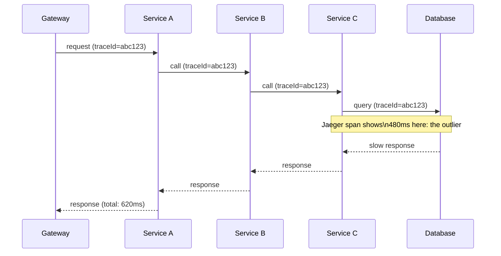

Every lesson in this module so far has assumed you already know *where* to look, a specific pod, a specific thread dump, a specific sidecar log. Real incidents rarely start that way: they start as a Grafana alert or a vague "it's slow" report with no pod name attached. This lesson covers the observability stack that gets you from "something's wrong somewhere" to "it's this exact hop in this exact service," plus the autoscaling machinery (HPA/VPA/PodDisruptionBudget) that either absorbs load automatically or, when misconfigured, becomes the incident itself.

This builds on every prior lesson in this module: metrics and traces are how you'll usually *discover* which of the thread-dump, heap-dump, GC, or mesh scenarios you're facing before you ever run a single `kubectl exec`.


Complete [Service Mesh Troubleshooting with Istio](/kubernetes/service-mesh-troubleshooting-istio) first. Familiarity with basic Prometheus/Grafana concepts from Intermediate is assumed but not required in depth.



## Centralized logging (EFK/ELK/Loki)

If you have no central logging yet, you can still aggregate across replicas ad hoc:

```bash
# If no central logging, aggregate quickly across replicas yourself:
kubectl logs -n <ns> -l app=<app-label> --all-containers --prefix --tail=500 --since=15m

# Loki (via logcli)
logcli query '{namespace="<ns>", app="<app-label>"} |= "ERROR"' --since=1h

# Elasticsearch/Kibana equivalent query via curl
curl -s -X GET "es-host:9200/logs-*/_search" -H 'Content-Type: application/json' -d '{
  "query": {"bool": {"must": [
    {"match": {"kubernetes.pod_name": "<pod>"}},
    {"match": {"log": "ERROR"}}
  ]}}, "sort": [{"@timestamp": "desc"}], "size": 50
}'
```

`kubectl logs -l app=<label> --all-containers --prefix` is the move worth remembering even with no logging stack installed at all: `-l` selects every pod matching the label (not just one replica), `--prefix` tags each line with its source pod so you can tell them apart, and `--all-containers` catches sidecar output (like `istio-proxy`) in the same stream. It won't survive pod restarts or scale to real production volume, but it's zero-setup and often enough for a fast first look.

## Prometheus/Grafana and PromQL for JVM/Spring workloads

```bash
kubectl -n monitoring port-forward svc/prometheus-server 9090:80

# Useful PromQL for Java/Spring workloads (via Micrometer)
# JVM heap usage:      jvm_memory_used_bytes{area="heap", pod="<pod>"}
# GC pause time:       rate(jvm_gc_pause_seconds_sum[5m])
# HTTP error rate:     rate(http_server_requests_seconds_count{status=~"5.."}[5m])
# Request latency p99: histogram_quantile(0.99, rate(http_server_requests_seconds_bucket[5m]))
# HikariCP pool usage: hikaricp_connections_active / hikaricp_connections_max
# Pod restarts:        kube_pod_container_status_restarts_total

kubectl -n monitoring port-forward svc/grafana 3000:80
```

These five PromQL patterns cover the majority of first-look questions in a Java incident, and they map directly onto lessons earlier in this module: `jvm_memory_used_bytes` and GC pause rate are your heap-dump and GC-tuning triggers; `hikaricp_connections_active / hikaricp_connections_max` approaching 1.0 is the metric-level early warning for the pool exhaustion you'd otherwise only discover from a thread dump; and a p99 latency spike with no matching GC pause is exactly the CFS-throttling signature from the GC tuning lesson, check `cpu.stat` before touching JVM flags.

## Distributed tracing (Jaeger/Zipkin/Tempo via Micrometer Tracing / Sleuth)

```bash
kubectl -n observability port-forward svc/jaeger-query 16686:16686
# Search by trace ID logged in application logs (correlation ID / traceId field) to follow
# a single request across microservice boundaries: fastest way to find WHERE in a call
# chain latency or an error was introduced.
```

A trace ID is the thread that ties everything in this lesson together: it's logged by every hop in a call chain (via Micrometer Tracing/Sleuth instrumentation), so once you have it from an error log or a slow-request report, searching for it in Jaeger shows you the entire multi-service call graph for that one request, with per-hop timing. This is the single fastest way to answer "which of these four microservices actually introduced the latency" without guessing or checking each service one at a time.



In this shape, a Grafana dashboard tells you total latency is elevated; only the trace tells you 480 of the 620ms happened in `Service C`'s database call specifically, not in `Service A` or `Service B`'s own processing, which is precisely the kind of question you cannot answer from aggregate metrics or any single service's own logs.

## `kubectl` as an ad hoc metrics source

```bash
kubectl top pods -A --sort-by=memory
kubectl top pods -A --sort-by=cpu
kubectl get --raw /apis/metrics.k8s.io/v1beta1/pods | jq .
```

Useful when Prometheus itself is the thing that's down, or for a fast cluster-wide sanity check before diving into dashboards.

## Autoscaling and resource right-sizing

Observability tells you something is wrong; autoscaling is often the thing that should have absorbed the load automatically, and its own misconfiguration is a common root cause in its own right.

```bash
# Requests/limits vs actual usage
kubectl describe pod <pod> -n <ns> | grep -A10 Limits
kubectl top pod <pod> -n <ns> --containers

# ResourceQuota / LimitRange blocking deployment
kubectl get resourcequota -n <ns>
kubectl describe resourcequota -n <ns>
kubectl get limitrange -n <ns>
kubectl describe limitrange -n <ns>

# HPA status and why it's not scaling
kubectl get hpa -n <ns>
kubectl describe hpa <hpa-name> -n <ns>
kubectl top pods -n <ns> -l app=<app-label>       # confirm metrics-server is reporting

# VPA (if installed)
kubectl get vpa -n <ns>
kubectl describe vpa <vpa-name> -n <ns>

# PodDisruptionBudget blocking rollout/drain
kubectl get pdb -n <ns>
kubectl describe pdb <pdb-name> -n <ns>

# Cluster Autoscaler (why new nodes aren't showing up)
kubectl -n kube-system logs -l app=cluster-autoscaler --tail=200 | grep -i <deployment-name>
```

Each of these answers a distinct question: **HPA** ("why isn't it scaling out") almost always traces back to `kubectl describe hpa` showing it can't read its target metric, either `metrics-server`/Prometheus Adapter is down, or (for custom metrics) the metric name/query in the `HorizontalPodAutoscaler` spec doesn't match what's actually being exported. **VPA** gives sizing *recommendations* based on observed usage, useful for right-sizing requests/limits, but running it in `Auto` mode alongside HPA on the same resource is a well-known anti-pattern since both will fight over the same dimension. **PodDisruptionBudget** protects availability during voluntary disruptions (node drains, rolling updates) but a too-strict `minAvailable` can itself block a drain or rollout indefinitely, check `kubectl describe pdb` for `Disruptions allowed: 0` when a drain seems stuck. **Cluster Autoscaler** logs are the only way to see *why* a new node didn't get added, commonly a pod's resource request exceeds every available node type's capacity, or a taint isn't tolerated by anything pending.

Common Java-workload-specific resourcing mistake: setting CPU **limits** too low causes CFS throttling, which shows up as latency spikes, not OOM, this is exactly the [GC-tuning-vs-throttling distinction](/kubernetes/gc-tuning-and-cpu-throttling) from earlier in this module, and it's worth checking `cpu.stat` again here whenever HPA scaling on CPU utilization looks erratic, since throttled pods report misleadingly low "usable" CPU.

## Lab

1. Given only a Grafana dashboard URL and a Jaeger trace ID (no direct pod access allowed for this step), identify which service in a 4-hop call chain introduced added latency:
   ```bash
   kubectl -n monitoring port-forward svc/grafana 3000:80 &
   kubectl -n observability port-forward svc/jaeger-query 16686:16686 &
   ```
   Open Grafana, find the elevated p99 latency panel for the entry-point service, grab a slow request's `traceId` from its logs, then search that trace ID in the Jaeger UI. Identify the single span with the largest self-time (not cumulative, a parent span's duration includes its children's).
2. Confirm your finding by checking that service's own PromQL metrics directly:
   ```bash
   # in the Prometheus UI, port-forwarded per the section above
   histogram_quantile(0.99, rate(http_server_requests_seconds_bucket{job="<suspect-service>"}[5m]))
   ```
3. Configure an HPA on a custom Micrometer metric instead of CPU, e.g. queue depth or active thread count, assuming Prometheus Adapter is installed:
   ```bash
   kubectl apply -n advanced-lab -f - <<'EOF'
   apiVersion: autoscaling/v2
   kind: HorizontalPodAutoscaler
   metadata:
     name: worker-service
   spec:
     scaleTargetRef:
       apiVersion: apps/v1
       kind: Deployment
       name: worker-service
     minReplicas: 2
     maxReplicas: 10
     metrics:
       - type: Pods
         pods:
           metric:
             name: http_server_active_requests
           target:
             type: AverageValue
             averageValue: "10"
   EOF
   kubectl get hpa worker-service -n advanced-lab -w
   ```
4. Drive enough concurrent load at `worker-service` to push active requests per pod above the target of 10, and confirm the HPA scales out:
   ```bash
   kubectl -n advanced-lab port-forward svc/worker-service 8080:8080 &
   hey -z 120s -c 50 http://localhost:8080/work
   kubectl describe hpa worker-service -n advanced-lab
   ```
5. Apply a `PodDisruptionBudget` with `minAvailable` equal to the current replica count, then attempt a node drain and observe it block:
   ```bash
   kubectl apply -n advanced-lab -f - <<'EOF'
   apiVersion: policy/v1
   kind: PodDisruptionBudget
   metadata:
     name: worker-service-pdb
   spec:
     minAvailable: 2
     selector:
       matchLabels:
         app: worker-service
   EOF
   kubectl drain <node-name> --ignore-daemonsets --delete-emptydir-data
   ```
   Confirm the drain stalls, then check `kubectl describe pdb worker-service-pdb -n advanced-lab` for `Disruptions allowed: 0` as the explanation.

## Checkpoint

- [ ] I can aggregate logs across all replicas of a service with a single `kubectl logs -l` command even with no logging stack installed.
- [ ] I can write and explain at least the five core PromQL queries for JVM heap, GC pause, HTTP error rate, latency percentile, and HikariCP pool usage.
- [ ] I can use a trace ID to find which specific hop in a multi-service call chain introduced latency, distinguishing self-time from cumulative time.
- [ ] I can diagnose why an HPA isn't scaling and explain the anti-pattern of running HPA and VPA on the same resource dimension.
- [ ] I completed the lab: found the slow hop from a trace, configured a custom-metric HPA that scaled under load, and reproduced a PodDisruptionBudget blocking a drain.
