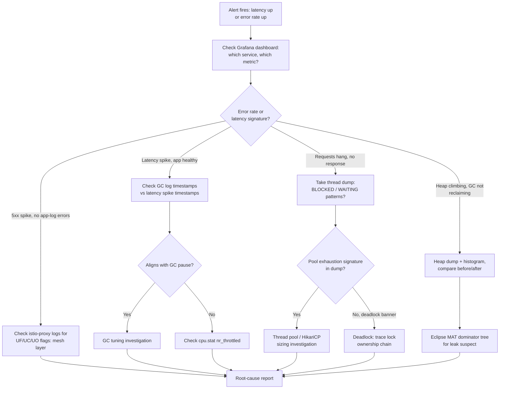

This is where the eight lessons in this module stop being separate skills and become one skill: diagnosing a real, unannounced incident under the same pressure and ambiguity a 2 a.m. page brings. You'll load-test a Spring Boot microservice until it genuinely breaks, then work backward to root cause using nothing but the tools this module taught you, thread dumps, heap dumps, GC/throttling analysis, Actuator, async-profiler, networking/CNI checks, mesh diagnostics, and the observability stack. The point isn't to follow a script; it's to practice choosing *which* tool to reach for first when you don't yet know what's wrong.

This is the capstone for the entire Advanced module, it deliberately does not tell you in advance which failure mode you're looking at, the same way a real page doesn't.


Complete all eight prior lessons in this module, from [Thread Dumps and Deadlock Analysis](/kubernetes/thread-dumps-and-deadlock-analysis) through [Observability: Metrics, Logs, Traces, and Autoscaling](/kubernetes/observability-metrics-logs-traces). This capstone assumes fluency with every tool introduced across them.



## What you're building toward

Pick **two** of the following four failure modes to induce and diagnose (all four is a great stretch goal, but two done rigorously teaches more than four done superficially):

1. **Memory leak**: an unbounded cache or listener registration that leads to climbing heap usage and eventually `OutOfMemoryError`.
2. **Thread pool exhaustion**: an undersized or misconfigured executor (HikariCP, `@Async`, or a reactive scheduler) that saturates under load and stalls request processing.
3. **GC pause spike**: allocation-heavy code or an undersized heap driving long GC pauses that show up as latency, easily confusable with CFS CPU throttling if you don't check both.
4. **Mesh circuit-breaker trip**: an `OutlierDetection`/connection-pool policy on a `DestinationRule` that starts rejecting requests under load, producing 503s that never reach the application.

You will produce a full root-cause report for each failure mode you choose, using **only** the diagnostic tools from this module's earlier lessons, no reading the fault-injection source code as a shortcut. Treat the injected fault the way you'd treat an actual incident: you don't get to look at the answer key.

## Setting up the exercise

1. Create a dedicated capstone namespace, separate from earlier per-lesson labs, so nothing interferes:
   ```bash
   kubectl create namespace capstone
   kubectl config set-context --current --namespace=capstone
   ```
2. Deploy a small multi-component Spring Boot system, at minimum a gateway/caller service and one or two downstream services, each instrumented with Micrometer/Actuator, so the observability tooling from Lesson 8 has something real to show:
   ```bash
   kubectl apply -f capstone-deployment.yaml
   kubectl get pods -w
   ```
3. If you're including the mesh-induced scenario, enable sidecar injection on this namespace:
   ```bash
   kubectl label namespace capstone istio-injection=enabled --overwrite
   kubectl rollout restart deployment -n capstone
   ```
4. Confirm your observability stack (Prometheus/Grafana, and Jaeger if available) can see this namespace before you start breaking things, you want a clean baseline dashboard, not one you're debugging for the first time mid-incident:
   ```bash
   kubectl -n monitoring port-forward svc/prometheus-server 9090:80 &
   kubectl -n monitoring port-forward svc/grafana 3000:80 &
   ```
5. Have a partner (or a second terminal session acting as "past you") inject **one** of the two chosen fault scenarios without telling "incident-response you" which one, by toggling a feature flag, environment variable, or Deployment patch that only they control. If working solo, script the fault injection into a file you deliberately don't reread until after you've filed your root-cause report.

## Expected troubleshooting flow

You won't know in advance which tool applies, so the flow itself is the skill. A reasonable incident-response order, mirroring how you'd actually triage a live page:



Use this only as a starting skeleton, real incidents branch in ways a single diagram can't fully capture, which is exactly why the report below asks you to narrate your actual path, including dead ends.

## Producing the root-cause report

For each failure mode you diagnosed, write a report with these sections:

- **Symptom as first observed**: what a Grafana alert or user report would have said, with no diagnosis attached yet.
- **Investigation timeline**: the actual sequence of tools you reached for and why, including any dead ends (e.g. "checked GC logs first, ruled out, pauses didn't align with latency spikes, moved to `cpu.stat`"). This is the most valuable part of the report; a real postmortem values honesty about the path over a clean narrative.
- **Root cause**: the specific code pattern, configuration value, or policy responsible, stated precisely (e.g. "`spring.datasource.hikari.maximum-pool-size=5` against 40 concurrent long-held connections from a slow downstream call").
- **Evidence**: the actual command output, thread dump excerpt, flame graph, PromQL query result, or Envoy log line that proves the root cause, not just an assertion.
- **Fix**: the concrete change (code, config, resource limit, mesh policy) that resolves it, and how you validated the fix (re-run the same load test, confirm the symptom is gone).
- **Prevention**: what dashboard panel, alert threshold, or automated check would have caught this earlier next time.

## Lab

1. Complete the setup steps above in a fresh `capstone` namespace on your local `kind`/`minikube` cluster (substitute a real cluster with Istio if you're including the mesh scenario and don't have Istio locally).
2. Have your fault injected (or inject it yourself into a script you don't reread) for your first chosen failure mode. Start a load test immediately, sized enough to trigger the fault within a few minutes:
   ```bash
   hey -z 180s -c 30 http://localhost:8080/<relevant-endpoint>
   ```
3. Work the incident live: watch Grafana first, then branch into thread dumps, heap dumps, GC logs, `cpu.stat`, sidecar logs, or traces as the evidence leads you, not in a fixed order.
4. Once you've identified root cause, apply the fix, redeploy, and re-run the identical load test to confirm the symptom is gone and capture that as your validation evidence.
5. Write the full root-cause report per the template above.
6. Repeat steps 2-5 for your second chosen failure mode.
7. Optional stretch: attempt a third or fourth failure mode, or combine two simultaneously (e.g. a memory leak that eventually also causes GC pause spikes) and practice untangling which symptom belongs to which root cause.

## Checkpoint

- [ ] I induced and diagnosed at least two of the four failure modes without reading the fault-injection source ahead of time.
- [ ] For each, I can show real command/tool evidence (thread dump, heap dump, GC log, flame graph, PromQL result, or Envoy access log) that proves, not just asserts, the root cause.
- [ ] I wrote an investigation timeline that honestly includes at least one dead end or ruled-out hypothesis per incident.
- [ ] I validated each fix by re-running the same load test and confirming the symptom disappeared.
- [ ] I can articulate, for each incident, what dashboard panel or alert would have caught it earlier, this is the mindset the [Expert level](/kubernetes/incident-command-and-postmortems) builds on next.
