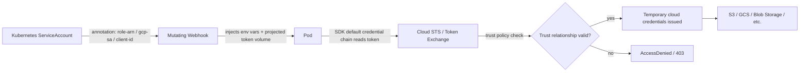

Almost nobody runs self-managed Kubernetes in production anymore, you're overwhelmingly likely to be on EKS, GKE, or AKS, and each of them replaces pieces of what you've learned so far with a cloud-managed equivalent that behaves *almost* but not exactly the same. This lesson covers the three things that most commonly break in ways specific to managed clusters: identity federation between Kubernetes ServiceAccounts and cloud IAM (IRSA on AWS, Workload Identity on GCP and Azure), how each provider's autoscaler actually decides to add or remove nodes, and where to find control-plane logs when you don't have etcd or API server access at all.

This is squarely in the on-call-lead skillset because "my Spring Boot pod can't talk to S3/GCS/Blob Storage" is one of the most common production pages a Java team gets, and the root cause is almost never the AWS SDK, it's a broken trust relationship between the pod's ServiceAccount and the cloud IAM role three configuration layers away. You built the RBAC and admission-control mental model in the last two lessons; this lesson is that same mental model applied to cloud IAM instead of Kubernetes RBAC.


This builds on [Low-Level Networking and Packet Capture](/kubernetes/low-level-networking-and-packet-capture). You should already understand ServiceAccounts and RBAC from Intermediate, and admission webhook mechanics from the [Admission Control](/kubernetes/admission-control-and-webhook-failures) lesson in this level, since IRSA and Workload Identity are themselves implemented via mutating webhooks.



## The shared pattern: pod identity federation

Before the cloud-specific detail, understand the pattern all three providers use, because it's the same shape everywhere: a Kubernetes ServiceAccount is annotated to reference a cloud IAM identity, a mutating webhook injects credentials-related environment variables and/or a projected volume into any pod using that ServiceAccount, and the cloud SDK inside your Spring Boot app picks those up automatically via its default credential provider chain, with zero application code changes required, which is exactly why it's easy to configure wrong and hard to notice until a pod actually tries to make a call.



The failure almost always happens at the trust-relationship check (`E` in the diagram), the Kubernetes side looks perfectly correct (ServiceAccount exists, pod is running, environment variables are injected) but the cloud IAM side's trust policy doesn't match: wrong OIDC provider, wrong namespace/ServiceAccount name in the condition, or wrong audience.

## AWS EKS: IRSA

IAM Roles for Service Accounts (IRSA) is AWS's implementation of this pattern, built on OIDC federation between EKS's OIDC issuer and IAM.

```bash
aws eks describe-cluster --name <cluster-name>
aws eks describe-nodegroup --cluster-name <cluster> --nodegroup-name <ng>

# IRSA (IAM Roles for Service Accounts) issues: common Spring Boot + AWS SDK failure
kubectl get sa <sa-name> -n <ns> -o yaml | grep eks.amazonaws.com/role-arn
kubectl exec -it <pod> -n <ns> -- env | grep AWS
kubectl logs <pod> -n <ns> | grep -i "Unable to load AWS credentials\|AccessDenied"

# CloudWatch Logs / Container Insights
aws logs tail /aws/containerinsights/<cluster>/application --follow --filter-pattern "ERROR"

# EKS control plane logs (must be enabled)
aws logs tail /aws/eks/<cluster>/cluster --follow
```

The `env | grep AWS` check is the fastest way to confirm the webhook actually injected credentials: you're looking for `AWS_ROLE_ARN` and `AWS_WEB_IDENTITY_TOKEN_FILE`. If those are missing entirely, the pod's ServiceAccount either lacks the `eks.amazonaws.com/role-arn` annotation or the webhook (`pod-identity-webhook`) isn't running: this is the same webhook-health check you learned to do in the admission control lesson. If those env vars are present but you still get `AccessDenied`, the problem has moved to the IAM side: the role's trust policy condition on `sub` (which encodes namespace and ServiceAccount name) doesn't match, or the role's permissions policy doesn't grant the action being attempted. Note that EKS control plane logs (API server, audit, authenticator) are **opt-in**: if they were never enabled for the cluster, `aws logs tail /aws/eks/<cluster>/cluster` will simply return nothing, which itself is diagnostic information you need during an incident (don't waste time assuming the command is broken).

## Google GKE: Workload Identity

GKE's equivalent binds a Kubernetes ServiceAccount to a Google Cloud service account via an IAM policy binding, rather than an annotation-driven webhook trust policy:

```bash
gcloud container clusters describe <cluster> --zone <zone>
gcloud container node-pools list --cluster <cluster>

# Workload Identity issues (GCP equivalent of IRSA)
kubectl describe sa <sa-name> -n <ns>
kubectl exec -it <pod> -n <ns> -- curl -H "Metadata-Flavor: Google" \
  "http://metadata.google.internal/computeMetadata/v1/instance/service-accounts/default/token"

# Cloud Logging query
gcloud logging read 'resource.type="k8s_container" AND resource.labels.pod_name="<pod>" AND severity>=ERROR' --limit 50 --format json
```

The metadata-server `curl` is your direct proof point: if it returns a valid token, Workload Identity is correctly wired end-to-end for that pod, and any remaining `AccessDenied` is a pure GCP IAM permissions problem (the bound GSA lacks the role), not a Kubernetes-side misconfiguration. If the `curl` itself fails or returns a permission error from the metadata server, the binding between the KSA and GSA (`iam.gke.io/gcp-service-account` annotation plus the `roles/iam.workloadIdentityUser` IAM policy binding) is what's broken, check both directions, since it's a two-sided binding unlike IRSA's one-sided trust policy.

## Azure AKS: Azure AD Workload Identity

```bash
az aks show --name <cluster> --resource-group <rg>
az aks nodepool list --cluster-name <cluster> --resource-group <rg>

# Azure AD Workload Identity
kubectl describe sa <sa-name> -n <ns>

# Azure Monitor / Container Insights (KQL via portal or CLI)
az monitor log-analytics query --workspace <workspace-id> --analytics-query \
  "ContainerLogV2 | where PodName == '<pod>' and LogMessage contains 'ERROR' | take 50"
```

AKS's model uses federated identity credentials on an Azure AD application/managed identity, matched against the ServiceAccount's issuer/subject/audience via OIDC federation, conceptually closest to IRSA's trust-policy approach among the three. The KQL query above via `az monitor log-analytics query` is your entry point into Azure Monitor when you don't have portal access mid-incident; get comfortable writing basic `ContainerLogV2` filters ahead of time rather than during a page.

## Comparing the three at a glance

| Concept | AWS EKS | Google GKE | Azure AKS |
|---|---|---|---|
| Feature name | IRSA | Workload Identity | Azure AD Workload Identity |
| Binding mechanism | SA annotation + IAM trust policy (OIDC) | SA annotation + IAM policy binding (two-sided) | Federated identity credential + OIDC |
| Fast "is it wired up" check | `env \| grep AWS` in pod | `curl` to GCP metadata server from pod | `kubectl describe sa` + federated credential check |
| Control plane logs | CloudWatch, opt-in | Cloud Logging, on by default | Azure Monitor / Container Insights |
| Cluster describe command | `aws eks describe-cluster` | `gcloud container clusters describe` | `az aks show` |

## Cloud-specific autoscaler behavior

Each provider's managed node autoscaler has quirks that don't show up in generic Kubernetes documentation. EKS managed node groups scale via an underlying AWS Auto Scaling Group, so autoscaler decisions interact with ASG-level settings (min/max/desired) that can silently cap scaling even when the Kubernetes-level Cluster Autoscaler wants more nodes. GKE's node auto-provisioning can create *entirely new node pools* with different machine types automatically, which is powerful but means "why is there a node pool I don't recognize" is a legitimate first question during a cost or capacity incident. AKS's cluster autoscaler integrates with virtual machine scale sets and has provider-specific scale-down eligibility rules around PodDisruptionBudgets and local storage that mirror but don't exactly match the open-source Cluster Autoscaler defaults. In all three cases, always check the cloud-native scaling group/pool status (`aws autoscaling describe-auto-scaling-groups`, `gcloud container node-pools describe`, `az aks nodepool show`) *in addition to* `kubectl get nodes`, the Kubernetes view and the cloud infrastructure view can disagree, and when they do, the cloud view is authoritative for why a node didn't appear.

## Where this points next

| Finding | Go to |
|---|---|
| IAM/Workload Identity trust relationship is wrong | Review the [Admission Control](/kubernetes/admission-control-and-webhook-failures) webhook health checks: the injection webhook must be healthy first |
| Cloud storage (EBS/PD/Disk) CSI driver issue | Advanced/Intermediate storage material |
| GitOps deploy changed the ServiceAccount annotation | [GitOps, Progressive Delivery & Rollback](/kubernetes/gitops-progressive-delivery-and-rollback) |

## Lab

This lab **genuinely requires a real cloud account**: IRSA/Workload Identity/Azure AD Workload Identity cannot be meaningfully simulated on kind/minikube, since the entire mechanism depends on the cloud provider's OIDC issuer, IAM, and metadata services. Pick whichever cloud your organization actually uses; a free-tier or personal-account EKS/GKE/AKS cluster is sufficient (be mindful of cost, tear down the cluster after the lab).

1. Provision a small managed cluster on your chosen cloud with Workload Identity/IRSA enabled at cluster creation time.
2. Create a cloud IAM role/service-account with read-only access to a single storage bucket, and correctly bind it to a Kubernetes ServiceAccount.
3. Deploy a pod using that ServiceAccount that attempts to read from the bucket using the cloud SDK (a simple Spring Boot app or even an AWS/gcloud/az CLI-based busybox-style pod is fine) and confirm it works.
4. Break the trust relationship deliberately: change the namespace or ServiceAccount name in the trust policy condition (AWS), remove the IAM policy binding (GCP), or alter the federated credential's subject (Azure).
5. Redeploy the pod and observe the exact failure, capture the log line, not just "it failed."
6. Run the "is it wired up" fast check for your cloud (env vars for AWS, metadata curl for GCP, describe for Azure) and confirm it tells you which side of the problem you're on.
7. Fix the trust relationship and confirm recovery.
8. Separately, without breaking anything, run the cluster-describe command for your cloud and find the control-plane log location/setting, confirm whether it's enabled by default or opt-in.

## Checkpoint

- [ ] I can draw the shared identity-federation pattern (ServiceAccount → webhook → cloud STS → trust check) from memory.
- [ ] I know the one command per cloud that tells me fastest whether the SA-to-cloud-identity binding is wired up at all.
- [ ] I can explain why EKS control plane logs might return empty even when the cluster is healthy.
- [ ] I understand why GKE's Workload Identity binding is two-sided while IRSA's trust policy is effectively one-sided.
- [ ] I can name one cloud-specific autoscaler quirk that isn't visible from `kubectl get nodes` alone.
